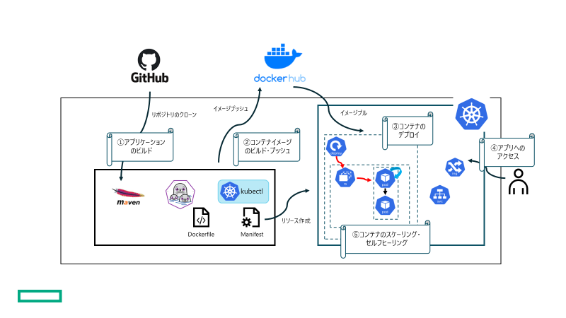
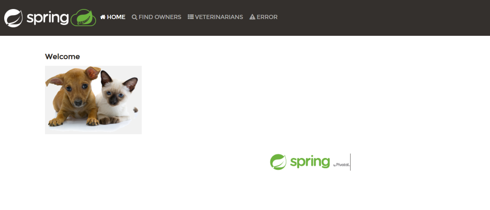
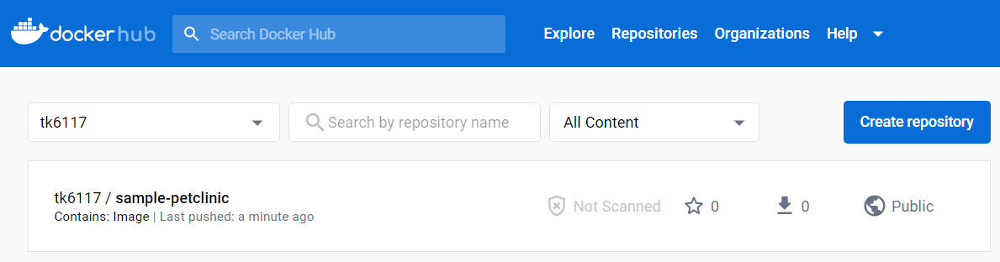

# 第一回ハンズオン・ワークショップ

## 概要

本ハンズオンは、サンプルJavaアプリケーションを利用したコンテナ・Kubernetesの基礎ハンズオンです。



コンテナ・Kubernetesの基礎知識習得を目的に以下のトピックを実施します。

- Dockerfileによるコンテナイメージのビルド
- Kubernetes Manifestファイルによるコンテナデプロイ
- コンテナのスケーリング・セルフヒーリング

### 前提

- Docker Hubアカウントが作成済みであること
- ハンズオン実施マシンに`java`が導入済みであること
- ハンズオン実施マシンに`git`コマンドが導入済みであること
- ハンズオン実施マシンに`podman`コマンドが導入済みであること
- Kubernetesクラスタが導入済みであること

### 留意事項

- 本資料では Kubernetesの導入手順については説明しません。
- 本資料では AWSのリソース導入手順については説明しません。

本ハンズオンの実施内容はこちら

- サンプルアプリケーションのビルド
- サンプルアプリケーションコンテナイメージのビルド
- Kubernetesへのサンプルアプリケーションのデプロイ
- サンプルアプリケーションのセルフヒーリング・スケーリング

### bastionサーバ環境確認
1. ログインしたユーザ名、ホームディレクトリ、java、Podmanが使用できることを確認します。

   ```shell
   whoami
   java -version
   echo $JAVA_HOME
   podman version
   ```

## サンプルアプリケーションのビルド

ハンズオンでは、[こちら](https://github.com/spring-projects/spring-petclinic)のJavaアプリケーションを使用します。

1. 作業用ディレクトリの作成

   ```shell
   mkdir ws-1
   cd ws-1
   ```

2. リポジトリのクローン

   ```shell
   git clone https://github.com/spring-projects/spring-petclinic.git
   ```

3. Maven ビルド

   ```shell
   cd spring-petclinic
   ./mvnw package
   ```

   実行結果

   ```shell
   [INFO] Building jar: /home/tkoike/k8slab-work/handson-work/ws-1/spring-petclinic/target/spring-petclinic-3.0.0-SNAPSHOT.jar
   [INFO]
   [INFO] --- spring-boot-maven-plugin:3.0.1:repackage (repackage) @ spring-petclinic ---
   [INFO] Replacing main artifact with repackaged archive
   [INFO] ------------------------------------------------------------------------
   [INFO] BUILD SUCCESS
   [INFO] ------------------------------------------------------------------------
   [INFO] Total time:  07:08 min
   [INFO] Finished at: 2023-01-16T02:02:23Z
   [INFO] ------------------------------------------------------------------------
   ```
   
   ビルド後、targetディレクトリにアプリケーションが作成されます。
   
   
   
4. サンプルアプリケーション起動確認（オプション）

   ```shell
   java -jar target/*.jar --server.port=188[user_postfix]
   ```
   同一サーバ上で起動するので、ポート番号の重複を避けるため、参加者各自で異なるポート番号を指定します。
   
   （例）user18の場合
   ```
   java -jar target/*.jar --server.port=18818
   ```

   起動確認後、Ctrl+Cで停止します。

## サンプルアプリケーションコンテナイメージのビルド

`podman`コマンドでコンテナイメージのビルドを行います。

1. Dockerfileの作成

   `spring-petclinic`ディレクトリに以下の内容のDockerfileを作成します。

    Dockerfile

   ```dockerfile
   FROM openjdk:17
   
   COPY target/ /app
   EXPOSE 8080
   WORKDIR /app
   CMD java -jar spring-petclinic-3.0.0-SNAPSHOT.jar
   ```

2. コンテナイメージのビルド

   ```shell
   podman image build -t [Your Dockerhub ID]/sample-petclinic:v0.1 .
   ```

   実行結果

   ```shell
   STEP 1/5: FROM openjdk:17
   ? Please select an image:
       registry.fedoraproject.org/openjdk:17
       registry.access.redhat.com/openjdk:17
     ▸ docker.io/library/openjdk:17
       quay.io/openjdk:17
   ```

   Base Imageの取得先を指定してEnterを押します。

   ```shell
   STEP 1/5: FROM openjdk:17
   ✔ docker.io/library/openjdk:17
   Trying to pull docker.io/library/openjdk:17...
   Getting image source signatures
   Copying blob de849f1cfbe6 done
   Copying blob a7203ca35e75 done
   Copying blob 38a980f2cc8a done
   Copying config 5e28ba2b4c done
   Writing manifest to image destination
   Storing signatures
   STEP 2/5: COPY target/ /app
   --> 1761c3375b4
   STEP 3/5: EXPOSE 8080
   --> 64e97d87ed5
   STEP 4/5: WORKDIR /app
   --> 0b3612206ce
   STEP 5/5: CMD java -jar spring-petclinic-3.0.0-SNAPSHOT.jar
   COMMIT tk6117/sample-petclinic:v0.1
   --> e257189eea3
   Successfully tagged localhost/tk6117/sample-petclinic:v0.1
   e257189eea3318c0020948c220741eb3763d2a957b3bc0af2762507e7fa711e7
   ```
   
   `[Your Dockerhub ID]`は作成いただいたDocker HubアカウントIDを入力ください。
   
   作業用マシンのローカルディレクトリにビルドしたコンテナイメージが存在することを確認します。
   
   ```shell
   podman image ls
   ```
   
   実行結果
   
   ```shell
   REPOSITORY                         TAG         IMAGE ID      CREATED         SIZE
   localhost/tk6117/sample-petclinic  v0.1        e257189eea33  46 seconds ago  535 MB
   docker.io/library/openjdk          17          5e28ba2b4cdb  8 months ago    475 MB
   ```
   
   ビルドしたコンテナイメージからコンテナを作成します。
   
   ```shell
   podman container run -itd --name sample-petclinic -p 188[user_postfix]:8080 tk6117/sample-petclinic:v0.1
   ```
   同一サーバ上で起動するので、ポート番号の重複を避けるため、参加者各自で異なるポート番号を指定します。
   
   （例）user18の場合
   ```shell
   podman container run -itd --name sample-petclinic -p 18818:8080 tk6117/sample-petclinic:v0.1
   ```

   作業用マシンのポート18818に転送したパケットをコンテナのポート8080に転送します。
   作成したコンテナを確認します。
   
   ```shell
   podman container ls
   ```
   
   実行結果
   
   ```shell
   CONTAINER ID  IMAGE                                   COMMAND               CREATED        STATUS            PORTS                    NAMES
   bda161e93fb1  localhost/tk6117/sample-petclinic:v0.1  /bin/sh -c java -...  4 seconds ago  Up 4 seconds ago  0.0.0.0:18801->8080/tcp  sample-petclinic
   ```
   
   ブラウザよりアクセスします。（IPアドレスはトレーニング中にお伝えします。）
   
   
   作成したコンテナを停止、削除します。
   
   ```shell
   podman container stop sample-petclinic
   podman container rm sample-petclinic
   ```
   
3. コンテナイメージのプッシュ

   作成したコンテナイメージをDockerHubにプッシュします。
   podmanコマンドでログインします。

   ```shell
   podman login docker.io
   ```

   実行結果

   ```shell
   Username: [Your Dockerhub ID]
   Password:
   Login Succeeded!
   ```

   `[Your Dockerhub ID]`は作成いただいたDocker HubアカウントIDを入力ください。

   ビルドしたコンテナイメージをプッシュして、Docker Hubイメージレジストリに格納します。

   ```shell
   podman image push tk6117/sample-petclinic:v0.1
   ```

   実行結果

   ```shell
   Getting image source signatures
   Copying blob 363b26a6504d done
   Copying blob a7203ca35e75 skipped: already exists
   Copying blob de849f1cfbe6 skipped: already exists
   Copying blob 38a980f2cc8a skipped: already exists
   Copying config e257189eea done
   Writing manifest to image destination
   Storing signatures
   ```
   
   Docker Hub上でもプッシュされたことが確認できます。
   

## サンプルアプリケーションのKubernetesへのデプロイ

イメージレジストリへプッシュしたコンテナイメージを使用してKubernetesにデプロイを行います。
本ハンズオンでは、ManifestファイルでKubernetesリソースを定義して`kubectlコマンドでデプロイします。

以下の手順は、`spring-petclinic`ディレクトリで実施します。

1. Kubernetesへのアクセス確認

   `kubectl`コマンドでKubernetesクラスタへアクセスできることを確認します。

   ```shell
   kubectl config get-context
   ```

2. Manifestファイル（Deployment）の作成

   Deploymentリソースを作成するために以下のManifestファイルを作成します。
   ファイル名：sample-petclinic-deployment.yaml

   ```yaml
   apiVersion: apps/v1
   kind: Deployment
   metadata:
     name: sample-petclinic-app
     labels:
       app: sample-petclinic-app
   spec:
     replicas: 1
     selector:
       matchLabels:
         app: sample-petclinic-app
     template:
       metadata:
         labels:
           app: sample-petclinic-app
       spec:
         containers:
         - name: sample-petclinic
           image: [Your Dockerhub ID]/sample-petclinic:v0.1
           livenessProbe:
             httpGet:
               path: /actuator/health
               port: 8080
             initialDelaySeconds: 30
             periodSeconds: 15
           readinessProbe:
             httpGet:
               path: /actuator/health
               port: 8080
             initialDelaySeconds: 30
             periodSeconds: 15
           ports:
           - containerPort: 8080
   ```

   主な設定項目

   - spec.replicas	Podを何個作成するかを定義

   - spec.selector　DeploymentでどのPodを管理するのかを定義。PodのLabelを指定

   - spec.template.metadata.labels　PodのLabelを定義

   - spec.template.spec.containers　Podのコンテナを定義
     - spec.template.spec.containers.image　コンテナイメージを定義
     
       ※`[Your Dockerhub ID]`は作成いただいたDockerHub IDに置き換えてください。

4. Manifestファイル（Service）の作成

   Serviceリソースを作成するために以下のManifestファイルを作成します。
   ファイル名：sample-petclinic-svc.yaml

   ```yaml
   apiVersion: v1
   kind: Service
   metadata:
     name: sample-petclinic-svc
     labels:
       app: sample-petclinic-svc
   spec:
     type: ClusterIP
     selector:
       app: sample-petclinic-app
     ports:
     - name: http
       port: 8080
       protocol: TCP
       targetPort: 8080
   ```

   主な設定項目

   - spec.selector　Serviceで管理するPodを定義
   - spec.ports　Serviceで処理する通信を定義

5. Manifestファイル（Ingress）の作成

   Ingressリソースを作成するために以下のManifestファイルを作成します。
   ファイル名：sample-petclinic-ingress.yaml

   ```yaml
   apiVersion: networking.k8s.io/v1
   kind: Ingress
   metadata:
     name: sample-petclinic-ingress
   spec:
     rules:
     - host: [Your username]-sample-petclinic.ext01.k8slabhpe.net
       http:
         paths:
         - path: /
           pathType: Prefix
           backend:
             service:
               name: sample-petclinic-svc
               port:
                 number: 8080
     ingressClassName: nginx
   ```

   [Your username]は割り当てられたユーザ名を入力します。
   主な設定項目

   - spec.rules[].host　外部からアクセスするホスト名
   - spec.rules[].http　http通信の処理方法。Ingressから転送するServiceなどを定義

5. アプリケーションリソースのデプロイ

   Deploymentの作成

   ```shell
   kubectl apply -f sample-petclinic-deployment.yaml
   ```

   実行結果

   ```shell
   deployment.apps/sample-petclinic-app created
   ```

   Deploymentを作成すると、管理下のReplicaSetやPodも作成されます。

   Deploymentの確認

   ```shell
   kubectl get deployment
   ```

   実行結果

   ```shell
   NAME                   READY   UP-TO-DATE   AVAILABLE   AGE
   sample-petclinic-app   1/1     1            1           4m29s
   ```

   Replicasetの確認

   ```shell
   kubectl get replicaset
   ```

   実行結果

   ```shell
   NAME                              DESIRED   CURRENT   READY   AGE
   sample-petclinic-app-59656c98c8   1         1         1       5m3s
   ```

   Podの確認

   ```shell
   kubectl get pod
   ```

   実行結果

   ```shell
   NAME                                    READY   STATUS    RESTARTS   AGE
   sample-petclinic-app-59656c98c8-l6fp8   1/1     Running   0          5m27s
   ```

   Serviceの作成

   ```shell
   kubectl apply -f sample-petclinic-svc.yaml
   ```

   実行結果

   ```shell
   service/sample-petclinic-svc created
   ```

   Serviceの確認

   ```shell
   kubectl get service
   ```

   実行結果

   ```shell
   NAME                   TYPE        CLUSTER-IP       EXTERNAL-IP   PORT(S)    AGE
   sample-petclinic-svc   ClusterIP   172.108.44.252   <none>        8080/TCP   3m31s
   ```

   Ingressの作成

   ```shell
   kubectl apply -f sample-petclinic-ingress.yaml
   ```

   実行結果

   ```shell
   ingress.networking.k8s.io/sample-petclinic-ingress created
   ```

   Ingressの確認

   ```shell
   kubectl get ingress
   ```

   実行結果例

   ```shell
   NAME                       CLASS   HOSTS                                            ADDRESS                                        PORTS   AGE
   sample-petclinic-ingress   nginx   [Your username]-sample-petclinic.ext01.k8slabhpe.net   192.168.20.156,192.168.20.211,192.168.20.217   80      53s
   ```

   払い出されたホスト名（上記HOSTS）にブラウザからアクセスしてみます。
   

## サンプルアプリケーションのセルフヒーリング・スケーリング

### セルフヒーリング

サンプルアプリケーションPodに障害が発生した際の動作を確認します。

1. 現在稼働中のPodの確認

   ```shell
   kubectl get pods
   
   NAME                                    READY   STATUS    RESTARTS   AGE
   sample-petclinic-app-59656c98c8-l6fp8   1/1     Running   0          24m
   ```

2. 上記のPodを削除します

   ```shell
   kubectl delete pod sample-petclinic-app-59656c98c8-l6fp8
   
   pod "sample-petclinic-app-59656c98c8-l6fp8" deleted
   ```

3. Podの情報を表示するコマンドを実行します

   削除後、すぐに以下のコマンドを実行します。

   ```shell
   watch kubectl get pod
   ```

   実行結果

   ```shell
   Every 2.0s: kubectl get pods                                                               
   
   NAME                                    READY   STATUS    RESTARTS   AGE
   sample-petclinic-app-59656c98c8-rnxgd   0/1     Running   0          18s
   ```

   ```shell
   Every 2.0s: kubectl get pods                                                               
   
   NAME                                    READY   STATUS    RESTARTS   AGE
   sample-petclinic-app-59656c98c8-rnxgd   1/1     Running   0          69s
   ```

   削除後、1.で確認したPod名とは別のPodが自動的に起動します。

### スケーリング

Podの数を手動で変更してスケーリングを確認します。
スケーリングには以下の2つの方法があります。

- Manifestファイルを書き換えて`kubectl apply`の実行
- `kubectl scale`コマンドの実行

#### Manifestファイルの変更

1. DeploymentのManifestファイルのspec.replicasを変更します。

   ```yaml
   apiVersion: apps/v1
   kind: Deployment
   metadata:
     name: sample-petclinic-app
     labels:
       app: sample-petclinic-app
   spec:
     replicas: 2  # 1 -> 2 に変更
     selector:
       matchLabels:
         app: sample-petclinic-app
     template:
       metadata:
         labels:
           app: sample-petclinic-app
       spec:
         containers:
         - name: sample-petclinic
           image: [Your Dockerhub ID]/sample-petclinic:v0.1
           livenessProbe:
             httpGet:
               path: /actuator/health
               port: 8080
             initialDelaySeconds: 30
             periodSeconds: 15
           readinessProbe:
             httpGet:
               path: /actuator/health
               port: 8080
             initialDelaySeconds: 30
             periodSeconds: 15
           ports:
           - containerPort: 8080
   ```

2. 変更後、`oc apply`コマンドを実行し、変更を適用します。

   ```shell
   kubectl apply -f sample-petclinic-deployment.yaml
   ```

   実行結果

   ```shell
   deployment.apps/sample-petclinic-app configured
   ```

   Podを確認すると、新たにPodが作成されます。

   ```shell
   Every 2.0s: kubectl get pods                                                               
   
   NAME                                    READY   STATUS    RESTARTS   AGE
   sample-petclinic-app-59656c98c8-rnxgd   1/1     Running   0          18m
   sample-petclinic-app-59656c98c8-svlsn   0/1     Running   0          21s
   ```
   

#### `kubectl scale`コマンドによるスケーリング

1. 以下のコマンドを実行してPod数を5に増やします。

   ```shell
   kubectl scale deployment sample-petclinic-app --replicas=5
   ```

2. Pod数が増えていることが確認できます。

   ```shell
   Every 2.0s: kubectl get pod                                                                
   
   NAME                                    READY   STATUS              RESTARTS   AGE
   sample-petclinic-app-59656c98c8-5ftnf   0/1     Running             0          11s
   sample-petclinic-app-59656c98c8-nrfbh   0/1     Running             0          11s
   sample-petclinic-app-59656c98c8-rnxgd   1/1     Running             0          21m
   sample-petclinic-app-59656c98c8-slspm   0/1     ContainerCreating   0          11s
   sample-petclinic-app-59656c98c8-svlsn   1/1     Running             0          2m35s
   ```

3. スケールダウン

   以下のコマンドを実行してPod数を1に減らします。

   ```shell
   kubectl scale deployment sample-petclinic-app --replicas=1
   ```

   実行後、不要なPodが削除されてれレプリカ数1になったことが確認できます。

   ```shell
   kubectl get pod
   NAME                                    READY   STATUS    RESTARTS   AGE
   sample-petclinic-app-59656c98c8-slspm   1/1     Running   0          105s
   ```
   

## 	リソースの削除

1. Ingressの削除

   ```shell
   kubectl delete ingress sample-petclinic-ingress
   ```

2. Serviceの削除

   ```shell
   kubectl delete service sample-petclinic-svc
   ```

3. Deploymentの削除

   ```shell
   kubectl delete deployment sample-petclinic-app
   ```

   Deploymentを削除すると、それに紐づくReplicaSet、Podも削除されます。

   リソースの確認

   ```shell
   kubectl get all
   ```

   実行結果例

   ```shell
   No resources found in [Your namespace] namespace.
   ```


以上で、本ハンズオンは終了です。
