# 第四回ハンズオン・ワークショップ

## 概要

第四回ハンズオンのテーマは、Kubernetesのモニタリングです。

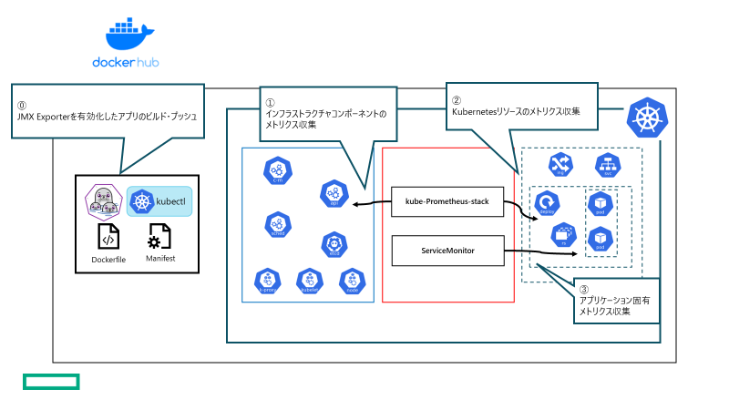

- インフラ管理者によるクラスタのモニタリング
- アプリ開発者によるワークロードのモニタリング

本ハンズオンでは、インフラ視点でのモニタリングと、第一回ハンズオンで使用したサンプルアプリケーションにJMX Exporterを追加してアプリ視点でのモニタリングを行います。

### 前提

- Docker Hubアカウントが作成済みであること
- ハンズオン実施マシンに`java`が導入済みであること
- ハンズオン実施マシンに`git`コマンドが導入済みであること
- ハンズオン実施マシンに`podman`コマンドが導入済みであること
- Kubernetesクラスタが導入済みであること

### 留意事項

- 本資料では Kubernetesの導入手順については説明しません。
- 本資料では AWSのリソース導入手順については説明しません。

## ハンズオン環境モニタリングソリューション

本ハンズオン環境は、helmにより`kube-prometheus-stack`を導入済みです。

`kube-prometheus-stack`は`Prometheus`を中心としたクラウドネイティブ環境に必要なモニタリングスタック一式をオーケストレーションしたパッケージです。

https://github.com/prometheus-community/helm-charts/tree/main/charts/kube-prometheus-stack

- [Prometheus Operator](https://github.com/prometheus-operator/prometheus-operator)
- [Prometheus](https://prometheus.io/)
- [Alertmanager](https://github.com/prometheus/alertmanager)
- [Prometheus node-exporter](https://github.com/prometheus/node_exporter)
- [Prometheus Adapter for Kubernetes Metrics APIs](https://github.com/kubernetes-sigs/prometheus-adapter)
- [kube-state-metrics](https://github.com/kubernetes/kube-state-metrics)
- [Grafana](https://grafana.com/)

メトリクスを取得するための設定や、アラート、ダッシュボードがあらかじめ用意されているので、比較的手軽にモニタリングを始めることが可能です。

`Prometheus Operator`により各リソースが管理され、`Prometheus`や`Alertmanager`などのコンポーネント自体や、`ServiceMonitor`や`PodMonitor`などのスクレイピング設定が、Kubernetesのカスタムリソースとして定義されているので、他のKubernetesリソースと同様に宣言的に管理できるのが特徴です。

Promethuesエコシステムは、OpenShiftやRancherなどのディストリビューションでも採用されています。

### Grafana

`grafana`は、様々なデータソースのデータをダッシュボードとして可視化するソリューションです。

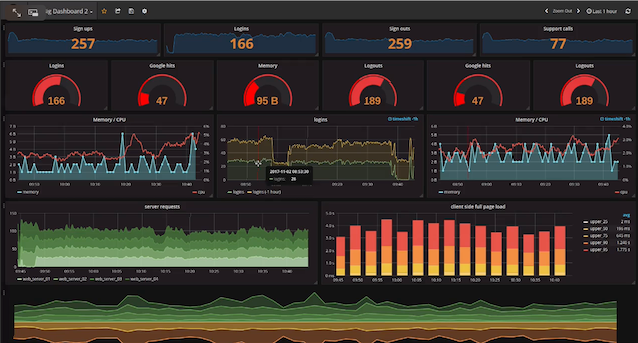

https://grafana.com/

`kube-prometheus-stack`では、デフォルトでGrafanaが組み込まれていて、データソースとしてPrometheusが設定済みです。さらにあらかじめ多くの場面で使用可能な各種ダッシュボードが用意されています。

本ハンズオンでは、Grafanaを使用して、インフラやアプリのメトリクスをダッシュボードで確認します。

### Kubernetes モニタリングにおけるメトリクス

- The Four Golden Signals
  - Google SRE book Chapter 6.( https://sre.google/sre-book/monitoring-distributed-systems/ )
  - Latency / Traffic / Errors / Saturation

「Four Golden Singnals」は基本的な考え方を提示している。より具体化したものとして以下の2つのメソッドが提唱されています。

- REDメソッド

  - サービス視点

    - Rate ・・・ スループット、秒間リクエスト数

    - Error Rate ・・・ エラー率

    - Duration ・・・ レイテンシー

      https://grafana.com/blog/2018/08/02/the-red-method-how-to-instrument-your-services/

- USEメソッド

  - インフラ視点

    - Utilization ・・・ 使用率

    - Saturation ・・・ 飽和度。ロードアベレージ

    - Error ・・・ エラーイベント

      https://www.brendangregg.com/usemethod.html

| **種別** | **対象**                        | **メトリクス**                                               | **確認観点**                                                 |
| -------- | ------------------------------- | ------------------------------------------------------------ | ------------------------------------------------------------ |
| サービス | クライアント                    | スループット<br />レイテンシー<br />エラー率                 | クライアント（ユーザ）から見て想定通り正常にサービスが提供されているか |
| サービス | システム                        | スループット<br />レイテンシー<br />エラー率                 | システムとして想定通りのパフォーマンスで正常にサービスが提供しているか |
| リソース | Kubernetes オーケストレーション | API Server/Controller Manager/Scheduler/etcd/kube-proxy/Kubelet/CoreDNS<br />Kubernetesリソースメトリクス（Deployment数、Podステータスetc...） | Kubernetesオーケストレーション自体が正常に稼働しているか     |
| リソース | APP/MW                          | APP/MWメトリクス                                             | APP/MWレベルのメトリクスは想定通りか                         |
| リソース | Pod/Container                   | CPU/Memory/NW/Disk<br />レイテンシー<br />エラーログ<br />オートスケーラログ | 各Pod/Containerのリソース使用状況は想定通りか<br />想定外のエラーログが発生していないか<br />オートスケールは想定通り実行されているか |
| リソース | Node                            | CPU/Memory/NW/Disk                                           | 各Nodeのリソース使用状況は想定通りか                         |
| リソース | Cluster                         | CPU/Memory/NW/Disk                                           | Clusterのリソース使用状況は想定通りか                        |
| リソース | PV                              | IOPS、スループット、使用量                                   | PersistentVolumeで使用するバックエンドストレージの使用状況は想定通りか |

## ①ハンズオン手順（インフラ）

### 1. Grafana ダッシュボード確認

Grafanaダッシュボードでインフラ観点でのメトリクス・グラフ確認を行います。

Kubernetesを活用したクラウドネイティブな環境は動的かつ頻繁に変化し続けるので、システムに何が起きていてサービスにどう影響しているか把握したり、事象の原因を素早く特定するために必要な情報に的確にアクセスすることは困難です。

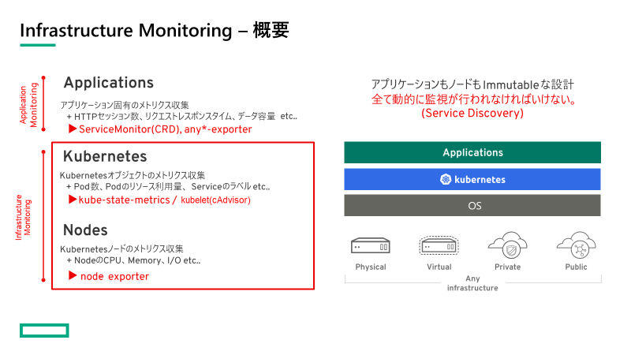

クラスタを構成するNodeや、API ServerやDeploymentなどのKubernetesリソースなどインフラ管理者目線のモニタリングを行います。

1. Grafanaへのアクセス

   講師より以下のアクセス情報を提供しますので、各自ブラウザよりGrafanaへアクセスしてください。

   - GrafanaのURL
   - ユーザ情報

   アクセスするとGrafanaのホーム画面が表示されます。

   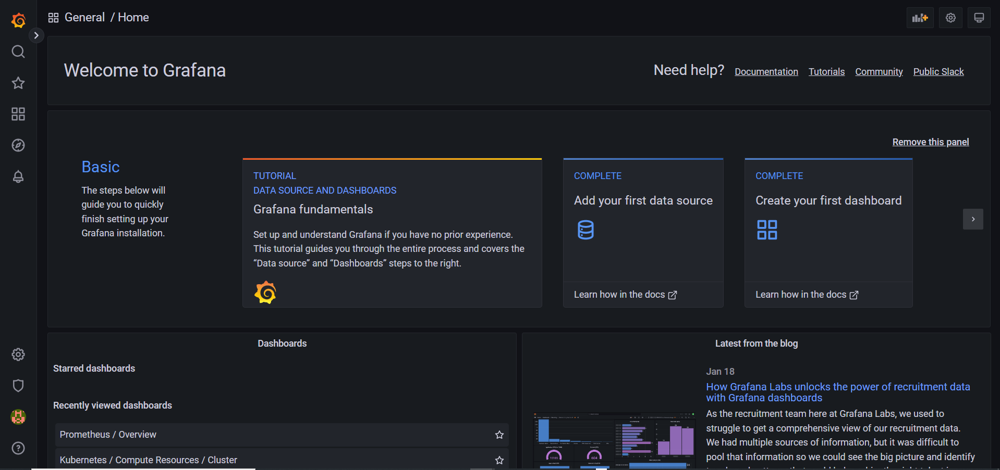

2. ダッシュボード一覧への移動

   画面左のメニューで「Browse」をクリックします。

   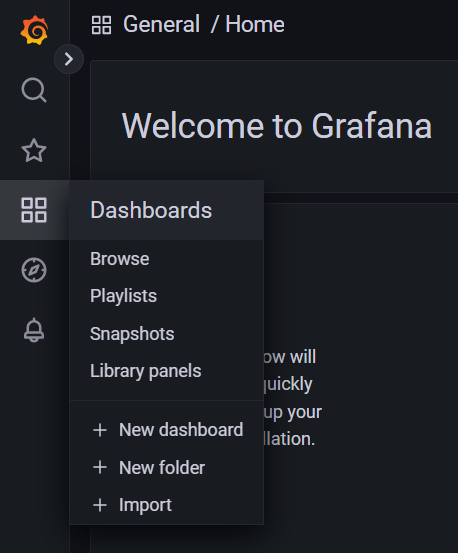

   Dashboards画面が表示されます。

   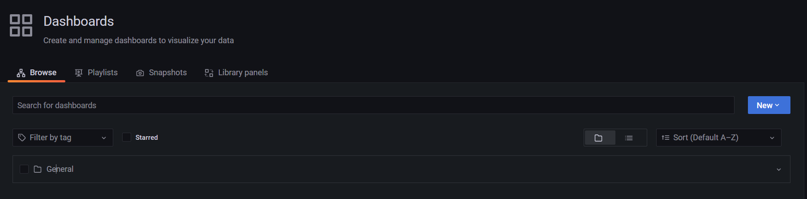

   Generalフォルダを開くと、ダッシュボード一覧を確認することができます。

   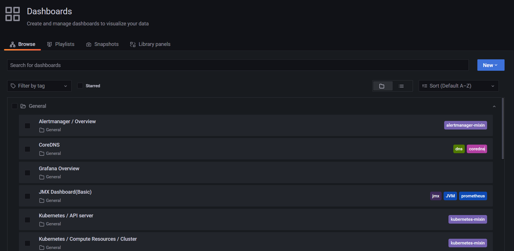

3. ダッシュボードの確認

   - Cluster

     ダッシュボード **Node Exporter / USE Method / Cluster**

     Cluster全体でのリソース使用状況を確認します。`Node Exporter`によってメトリクスを取得します。

     `Node Exporter`は、DaemonSetとして稼働するクラスタの各ノードで動作するモニタリングエージェントです。
     ノードのCPU、Memory、DiskIO、NetworkなどのOSレベルのメトリクスを取得し、Prometheusに送信します。

     Cluster全体のCPU、Memoryのメトリクス

     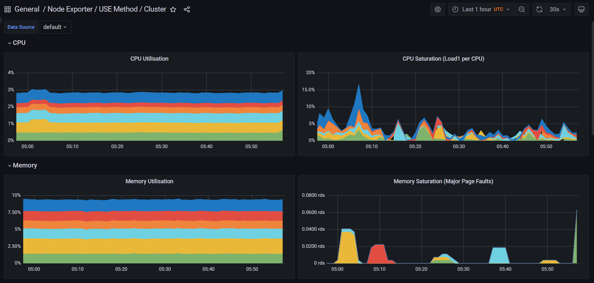

     Cluster観点のDiskやNetworkのメトリクス

     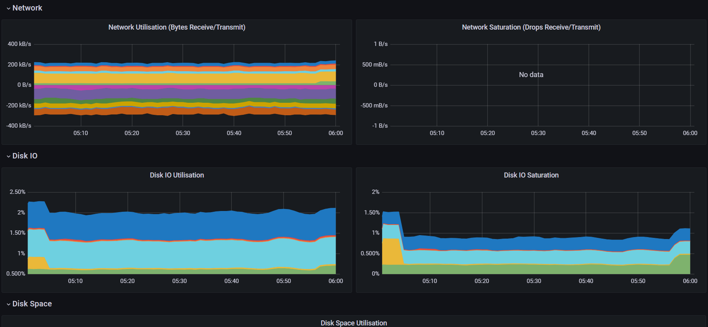

   - Node

     ダッシュボード **Node Exporter / USE Method / Node**

     クラスタを構成する各Node単位でのリソース使用状況を確認します。`Node Exporter`によってメトリクスを取得します。

     画面上部の`instance`で確認対象のNodeを選択します。

     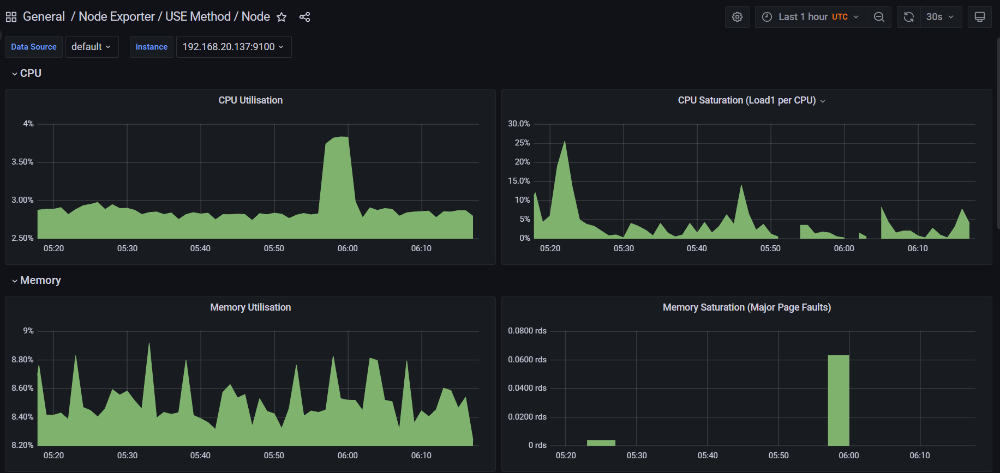

     NodeごとのNetwork、Diskのメトリクス

     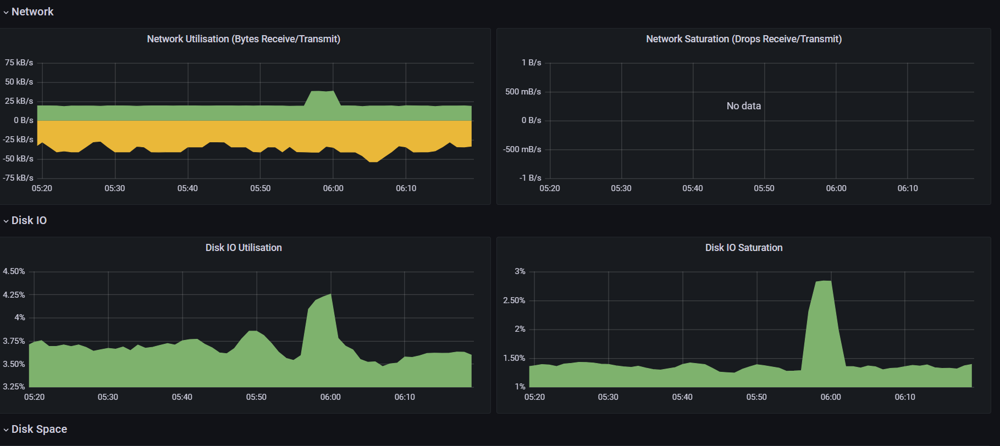

   - コンテナオーケストレーションレイヤ(kubernetes)

     コンテナオーケストレーションレイヤでは、Control Planeコンポーネント（API Server / Controller Manager / Scheduler / etcd / kube-proxy / CoreDNS）や、Kubernetesオブジェクトのモニタリングを行います。

     Control Plane コンポーネントは各コンポーネントのメトリクスエンドポイントからメトリクスを取得します。

     Kubernetesオブジェクトは、DeploymentやPodなどのKubernetesリソースの状態などのメトリクスで、`kube-state-metrics`からメトリクスを取得します。

     https://github.com/kubernetes/kube-state-metrics/tree/main/docs

     ダッシュボード **Kubernetes / API server**

     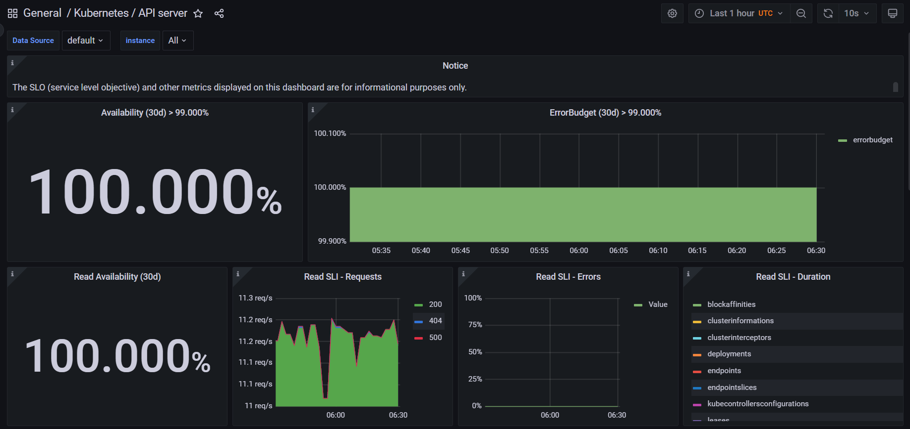

     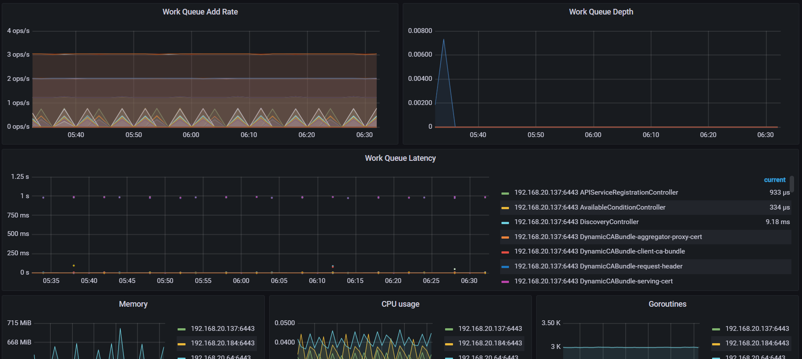

     ダッシュボード **Kubernetes / Controller Manager**

     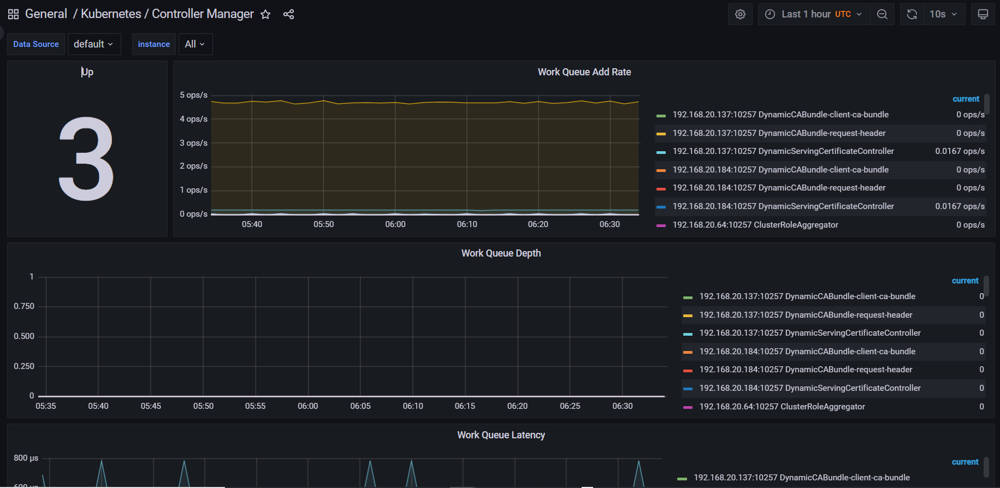

     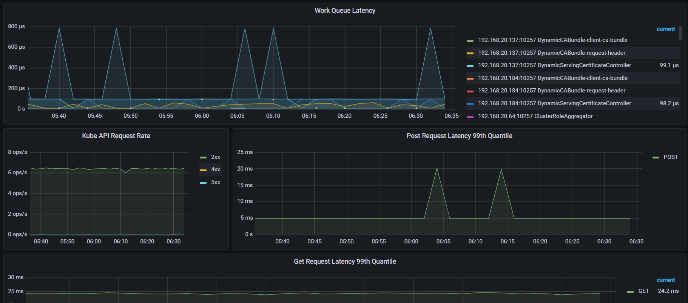

     

   - Pod/Container

     Pod/Containerで使用しているCPUやMemoryなどのリソース使用状況をモニタリングします。

     kubeletに組み込まれているcAdvisorからPod/Containerのリソース使用率などのメトリクスを取得します。

     ダッシュボード **Kubernetes / Compute Resources / Namespace(Pods)**

     特定のNamespace配下のリソース使用状況

     

     Memory使用量

     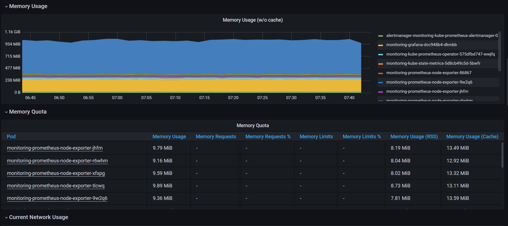

     CPU/Memory Utilisationにfrom requests/From limitsとあります。
     これは、各コンテナに設定したリソース要求・制限を元にした使用率です。（Pod Templateのspec.containers[].resources）
     各メトリクスの「Explore」ボタンをクリックするとどのようなクエリで値を取得しているのか確認できます。

     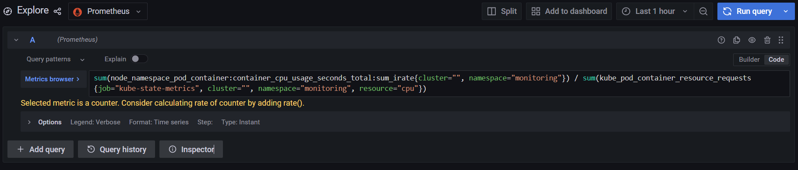

     ダッシュボードではこのクエリを使用しています。

     ```shell
     sum(node_namespace_pod_container:container_cpu_usage_seconds_total:sum_irate{cluster="", namespace="monitoring"}) / sum(kube_pod_container_resource_requests{job="kube-state-metrics", cluster="", namespace="monitoring", resource="cpu"})
     ```

     指定のNamespace内のPodに設定されているCPU要求を取得し、実際のCPU使用量を割ることによって、リソース使用要求に対する利用率を取得しています。

     ※コンテナに対するリソース要求・制限は以下のように定義します。

     ```yaml
               resources:
                 requests:
                   cpu: 200m
                   memory: 400Mi
                 limits:
                   cpu: 500m
                   memory: 1000Mi
     ```

## ②ハンズオン手順（ワークロード）

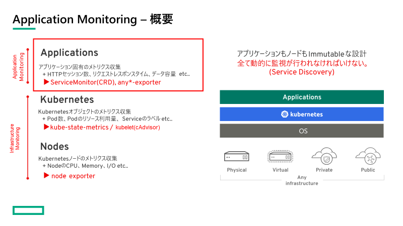

ユーザが作成するアプリケーションに対するモニタリング機能を提供します。
Podのメトリクスは、`kube-prometheus-stack`のデフォルト設定で取得することができますが、アプリケーションやミドルウェアのレイヤでメトリクスを取得する場合は、カスタムメトリクスを追加します。

本ハンズオンでは、JMX Exporterを組み込んだサンプルアプリケーションを対象に、ServiceMonitorを定義してJVMのメトリクスを取得します。

- JMX Exporterを組み込んだサンプルアプリケーションのイメージビルド
- ServiceMonitorの定義
- Grafana Dashboard によるメトリクス確認

**JMX Exporterとは**

JMXのmBeanを対象に、Prometheusで認識可能な形でメトリクスを取得するエージェント（https://github.com/prometheus/jmx_exporter）

**ServiceMonitorとは**


### 1. bastionサーバログイン

1. bastionサーバへログインし、ユーザなどを確認します。

   ```shell
   whoami
   ```

2. 作業用ディレクトリへ移動

   本ハンズオンでは、第一回でビルドしたJavaアプリケーションを使用します。

   ```shell
   cd ws-1/spring-petclinic/
   ```

### 2. JMX Exporterを組み込んだサンプルアプリケーションのイメージビルド・K8sクラスタへのデプロイ

第一回目ハンズオンで作成した作業用ディレクトリを使用します。（$HOME/ws-1/spring-petclinic）
前回ビルドしたアプリケーションを使用してJMX exporterを組み込んだコンテナイメージを作成します。

JMX Exporterを作業ディレクトリにダウンロードして、Exporterや設定ファイルを組み込んだコンテナイメージを作成します。

1. JMX Exporter のダウンロード

   ```shell
   wget https://repo1.maven.org/maven2/io/prometheus/jmx/jmx_prometheus_javaagent/0.17.2/jmx_prometheus_javaagent-0.17.2.jar
   ```

2. JMX Exporterの設定ファイル作成
   `config.yaml`

   ```shell
   username:
   password:
   
   rules:
   - pattern: ".*"
   ```

   開発者のローカル環境を想定してJMX Exporterを含めてアプリケーションを起動し取得できるメトリクスを確認します。

   ```shell
   java -javaagent:./jmx_prometheus_javaagent-0.17.2.jar=194[user_postfix]:config.yaml -jar target/*.jar --server.port=188[user_postfix] &
   ```

   同一サーバ上で起動するので、ポート番号の重複を避けるため、参加者各自で異なるポート番号を指定します。

   （例）user18の場合

   ```shell
   java -javaagent:./jmx_prometheus_javaagent-0.17.2.jar=19418:config.yaml -jar target/*.jar --server.port=18818 &
   ```

   ホスト名:194[user_postfix]/metricsにアクセスすると、取得可能なメトリクスを確認可能です

   ```shell
   curl localhost:194[user_postfix]/metrics
   ```
   
   実行例（ユーザ名：`user18`の場合）
   
   ```shell
   curl localhost:19418/metrics
   # HELP jvm_buffer_pool_used_bytes Used bytes of a given JVM buffer pool.
   # TYPE jvm_buffer_pool_used_bytes gauge
   jvm_buffer_pool_used_bytes{pool="mapped",} 0.0
   jvm_buffer_pool_used_bytes{pool="direct",} 131071.0
   # HELP jvm_buffer_pool_capacity_bytes Bytes capacity of a given JVM buffer pool.
   # TYPE jvm_buffer_pool_capacity_bytes gauge
   jvm_buffer_pool_capacity_bytes{pool="mapped",} 0.0
   jvm_buffer_pool_capacity_bytes{pool="direct",} 131071.0
   # HELP jvm_buffer_pool_used_buffers Used buffers of a given JVM buffer pool.
   # TYPE jvm_buffer_pool_used_buffers gauge
   jvm_buffer_pool_used_buffers{pool="mapped",} 0.0
   jvm_buffer_pool_used_buffers{pool="direct",} 15.0
   # HELP jvm_memory_objects_pending_finalization The number of objects waiting in the finalizer queue.
   # TYPE jvm_memory_objects_pending_finalization gauge
   jvm_memory_objects_pending_finalization 0.0
   # HELP jvm_memory_bytes_used Used bytes of a given JVM memory area.
   # TYPE jvm_memory_bytes_used gauge
   jvm_memory_bytes_used{area="heap",} 1.08122904E8
   jvm_memory_bytes_used{area="nonheap",} 1.13697528E8
   # HELP jvm_memory_bytes_committed Committed (bytes) of a given JVM memory area.
   # TYPE jvm_memory_bytes_committed gauge
   jvm_memory_bytes_committed{area="heap",} 2.36978176E8
   jvm_memory_bytes_committed{area="nonheap",} 1.18894592E8
   # HELP jvm_memory_bytes_max Max (bytes) of a given JVM memory area.
   # TYPE jvm_memory_bytes_max gauge
   jvm_memory_bytes_max{area="heap",} 3.0932992E9
   jvm_memory_bytes_max{area="nonheap",} -1.0
   # HELP jvm_memory_bytes_init Initial bytes of a given JVM memory area.
   # TYPE jvm_memory_bytes_init gauge
   jvm_memory_bytes_init{area="heap",} 1.95035136E8
   jvm_memory_bytes_init{area="nonheap",} 7667712.0
   # HELP jvm_memory_pool_bytes_used Used bytes of a given JVM memory pool.
   # TYPE jvm_memory_pool_bytes_used gauge
   jvm_memory_pool_bytes_used{pool="CodeHeap 'non-nmethods'",} 1429248.0
   jvm_memory_pool_bytes_used{pool="Metaspace",} 7.6481856E7
   jvm_memory_pool_bytes_used{pool="CodeHeap 'profiled nmethods'",} 1.8967552E7
   jvm_memory_pool_bytes_used{pool="Compressed Class Space",} 1.0182072E7
   jvm_memory_pool_bytes_used{pool="G1 Eden Space",} 6.3963136E7
   jvm_memory_pool_bytes_used{pool="G1 Old Gen",} 3.577116E7
   jvm_memory_pool_bytes_used{pool="G1 Survivor Space",} 8388608.0
   jvm_memory_pool_bytes_used{pool="CodeHeap 'non-profiled nmethods'",} 6636800.0
   # HELP jvm_memory_pool_bytes_committed Committed bytes of a given JVM memory pool.
   # TYPE jvm_memory_pool_bytes_committed gauge
   jvm_memory_pool_bytes_committed{pool="CodeHeap 'non-nmethods'",} 2555904.0
   jvm_memory_pool_bytes_committed{pool="Metaspace",} 7.933952E7
   jvm_memory_pool_bytes_committed{pool="CodeHeap 'profiled nmethods'",} 1.900544E7
   jvm_memory_pool_bytes_committed{pool="Compressed Class Space",} 1.1309056E7
   jvm_memory_pool_bytes_committed{pool="G1 Eden Space",} 1.40509184E8
   jvm_memory_pool_bytes_committed{pool="G1 Old Gen",} 8.8080384E7
   jvm_memory_pool_bytes_committed{pool="G1 Survivor Space",} 8388608.0
   jvm_memory_pool_bytes_committed{pool="CodeHeap 'non-profiled nmethods'",} 6684672.0
   # HELP jvm_memory_pool_bytes_max Max bytes of a given JVM memory pool.
   # TYPE jvm_memory_pool_bytes_max gauge
   jvm_memory_pool_bytes_max{pool="CodeHeap 'non-nmethods'",} 5836800.0
   jvm_memory_pool_bytes_max{pool="Metaspace",} -1.0
   jvm_memory_pool_bytes_max{pool="CodeHeap 'profiled nmethods'",} 1.22908672E8
   jvm_memory_pool_bytes_max{pool="Compressed Class Space",} 1.073741824E9
   jvm_memory_pool_bytes_max{pool="G1 Eden Space",} -1.0
   jvm_memory_pool_bytes_max{pool="G1 Old Gen",} 3.0932992E9
   jvm_memory_pool_bytes_max{pool="G1 Survivor Space",} -1.0
   jvm_memory_pool_bytes_max{pool="CodeHeap 'non-profiled nmethods'",} 1.22912768E8
   ～以下略～
   ```
   
   確認後、サンプルアプリケーションのPIDを確認し、killコマンドで停止します。
   
3. Dockerfile作成

   ダウンロードしたJMX Exporterと作成した設定ファイルをコピーし、アプリケーション起動時にJMX Exporterを組み込んだ形で起動するコンテナイメージを作成します。
   `Dockerfile-monitoring`（第一回ハンズオンで作成したDockerfileとは別名にしてください）

   ```dockerfile
   FROM openjdk:17
   
   COPY target/ /app
   COPY ./jmx_prometheus_javaagent-0.17.2.jar /app
   COPY ./config.yaml /app
   EXPOSE 8080
   EXPOSE 9404
   WORKDIR /app
   ENTRYPOINT java -javaagent:./jmx_prometheus_javaagent-0.17.2.jar=9404:config.yaml -jar spring-petclinic-3.0.0-SNAPSHOT.jar
   ```

4. コンテナイメージビルド・プッシュ

   ```shell
   podman image build -t [Your Dockerhub ID]/monitoring-sample-petclinic:v0.1 -f Dockerfile-monitoring .
   ```

   ```shell
   podman image puth [Your DockerHub ID]/monitoring-sample-petclinic:v0.1
   ```

   **`[Your Dockerhub ID]`は作成いただいたDocker HubアカウントIDを入力ください。**

5. サンプルアプリケーションのデプロイ

   Manifestファイルを作成しビルドしたサンプルアプリケーションをKubernetesクラスタへデプロイします。

   `monitoring-sample-petclinic.yaml`

   ```yaml
   apiVersion: apps/v1
   kind: Deployment
   metadata:
     name: monitoring-sample-petclinic
     labels:
       app: monitoring-demo
   spec:
     replicas: 1
     selector:
       matchLabels:
         app: monitoring-demo
     template:
       metadata:
         labels:
           app: monitoring-demo
       spec:
         containers:
         - name: monitoring-demo
           image: [Your DockerHub ID]/monitoring-sample-petclinic:v0.1
           livenessProbe:
             httpGet:
               path: /actuator/health
               port: 8080
             initialDelaySeconds: 90
             periodSeconds: 15
           readinessProbe:
             httpGet:
               path: /actuator/health
               port: 8080
             initialDelaySeconds: 90
             periodSeconds: 15
           ports:
           - containerPort: 8080
             name: http
           - containerPort: 9404
             name: metrics
   ```

   **`[Your Dockerhub ID]`は作成いただいたDocker HubアカウントIDを入力ください。**

   containers[].ports[]でメトリクス取得用のポートを設定しています。（ポート名：`metrics`）

   サンプルアプリケーションをデプロイします。

   ```shell
   kubectl apply -f monitoring-sample-petclinic.yaml
   ```

   デプロイされたことを確認します。

   ```shell
   kubectl get deployment,pod
   ```

### 3. ServiceMonitorの作成

デプロイしたサンプルアプリケーションに対してPrometheusからメトリクスを取得するためのスクレイピング設定を`ServiceMonitor`で行います。

1. メトリクス用Serviceの作成

   PrometheusからExporterへスクレイピングを行うためにServiceリソースを作成します。

   `monitoring-sample-petclinic-metrics.yaml`

   ```yaml
   apiVersion: v1
   kind: Service
   metadata:
     name: [Your User Name]-monitoring-sample-petclinic-metrics
     labels:
       app: monitoring-demo
   spec:
     type: ClusterIP
     selector:
       app: monitoring-demo
     ports:
     - name: metrics
       port: 9404
       protocol: TCP
       targetPort: 9404
   ```

   **Serviceリソース名はこのあとのダッシュボード確認時に使用するので各自で一意となる名前を付けます。[Your User Name]は割り当てられたユーザ名に置き換えてください。**

   Deploymentで定義したJMX Exporterがメトリクスをエクスポートするエンドポイントを指定しています。

   ```shell
   kubectl apply -f monitoring-sample-petclinic-metrics.yaml
   ```

2. ServiceMonitorの定義

   以下のManifestファイルでServiceMonitorの定義をします。

   `monitoring-sample-petclinic-servicemonitor.yaml`

   ```yaml
   apiVersion: monitoring.coreos.com/v1
   kind: ServiceMonitor
   metadata:
     name: monitoring-sample-petclinic-servicemonitor
     labels:
       release: monitoring
   spec:
     endpoints:
     - interval: 30s
       port: metrics
       scheme: http
     selector:
       matchLabels:
        app: monitoring-demo
   ```

   `spec.selector`でモニタリング対象のServiceをフィルタリングします。先ほど作成したメトリクス用Serviceでは対象になるようにラベルの設定を行いました。

   `spec.endpoints`では、フィルタリングしたServiceに対して、どのようなプロトコル・ポート番号でスクレイピングを行うのか指定します。`interval`ではスクレイピング間隔を指定することができます。

   ```shell
   kubectl apply -f monitoring-sample-petclinic-servicemonitor.yaml
   ```

   作成したServiceMonitorを確認します。

   ```shell
   kubectl get servicemonitor
   ```

### 4. Grafana Dashboard によるメトリクス確認

サンプルアプリケーションをデプロイし、Prometheusからのスクレイピング設定を行いましたので、取得したJMXのメトリクスを確認します。

1. Grafana へアクセスし、ダッシュボード一覧へ移動します。

   

2. JMX Dashboardを選択します。

   このダッシュボードは`kube-prometheus-stack`に組み込まれているダッシュボードではなく、インストールしたあとに追加したダッシュボードです。

   `JMX Dashboard (Basic)`

   https://grafana.com/grafana/dashboards/14845-jmx-dashboard-basic/

   grafana.comには他にも様々な目的で使用できるダッシュボードが用意されています。1から作成することなくこれらのダッシュボードをカスタマイズして使用することも可能です。

   https://grafana.com/grafana/dashboards/

3. ダッシュボードの確認

   JVMのヒープやスレッドのメトリクスを確認することができます。

   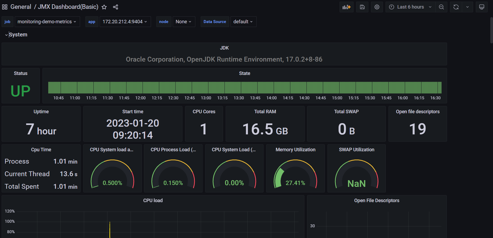

   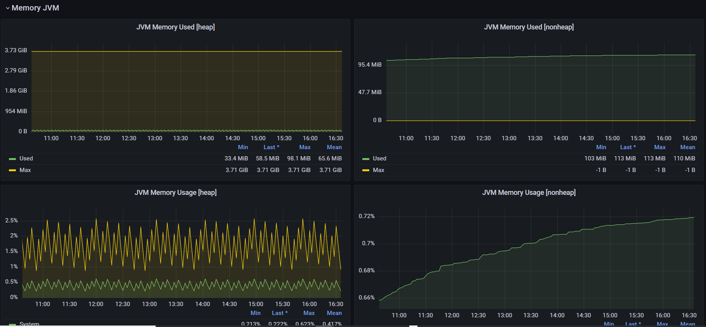

   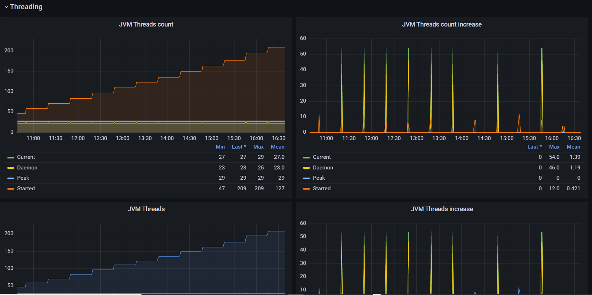

以上で、本ハンズオンは終了です。


