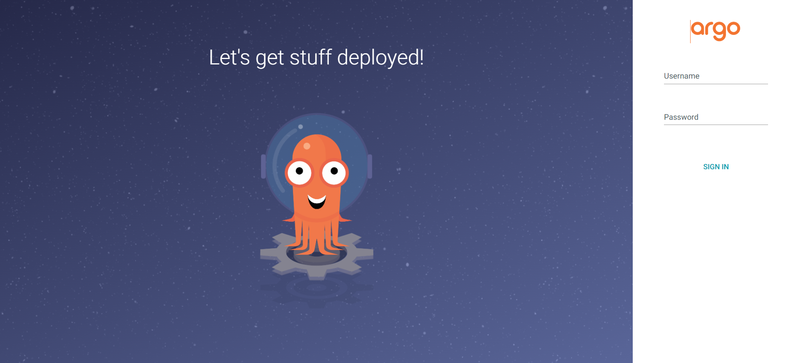
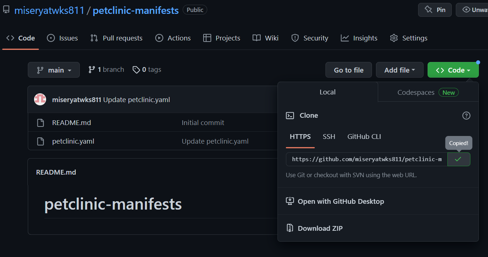
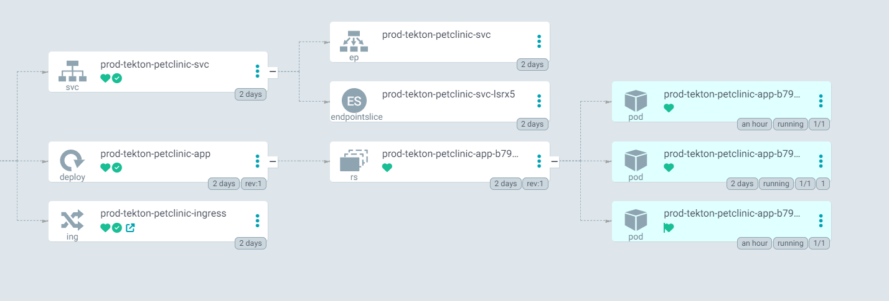

# 第五回ハンズオン・ワークショップ

## 概要


本ハンズオンは大きく分けて、Tekton PipelineによるCIとArgoCDによるCDの2つのハンズオンから構成されます。

ハンズオン内容

- ハンズオン①
  - ソースコードを書いてリポジトリにコミットすると、パイプラインが実行されてKubernetesクラスタへデプロイしブラウザでアクセス確認を行う。
  - ソースコードを修正してコミットするたびにユニットテスト・イメージビルド・動作確認を繰り返すことで早期に修正点を発見・修正
- ハンズオン②
  - パイプラインでビルドされたコンテナイメージURLをマニフェストファイルに差し替えてプッシュするとArgoCDにより自動同期されてクラスタに展開
  - マニフェストリポジトリの内容変更時にArgoCDの自動同期により即座にクラスタ上の状態が変更される

## Tekton

### Tekton概要

TektonはKubernetesリソースを活用したCI/CDソリューションです。(https://tekton.dev/)

Tektonプロジェクトはいくつかのコンポーネントから構成されています。
以下は代表的なコンポーネントです。

| コンポーネント   | 概要                                                         |
| ---------------- | ------------------------------------------------------------ |
| Tekton Pipelines | CI/CDパイプラインを提供するコンポーネント                    |
| Tekton Triggers  | イベント駆動型でパイプライン実行を自動化するコンポーネント   |
| Tekton DashBoard | Webベースのグラフィカル・インターフェイスを提供するコンポーネント |

### Tekton Pipelines基礎

Tekton Pipelinesでは、TaskやPipelineといったCustom Resourceを使用してパイプラインを作成します。

Tekton Pipelinesの主なCustom Resource

| Custom Resource | 概要                                                   |
| --------------- | ------------------------------------------------------ |
| Task            | コードのコンパイル、イメージのビルドやデプロイ等を定義 |
| Pipeline        | 1つまたは複数のTaskをまとめてパイプラインとして定義    |
| TaskRun         | Taskをインスタンス化して実際の処理を実行する           |
| PipelineRun     | Pipelineをインスタンス化して実際の処理を実行する       |

Tekton Pipelinesでは、実行内容の定義と実際に実行する内容を別リソースとして扱う「設定と実行環境の分離」が重要視されています。
設定と実行環境の分離によって、設定の再利用性の向上やパイプラインの標準化を目指している点が特徴です。

以下、それぞれのCustom Resourceの特徴を説明します。

#### Task

特定の作業（コンパイル、テスト、コンテナイメージの構築など）を実行する、再利用可能で疎結合なリソースです。
Taskは1つ以上のStepから構成することができます。

Stepは、コマンドの実行単位で、実行コンテナイメージと実行コマンドを定義します。

TaskはPodとして構成されて、各StepはPod内のコンテナとして実行されます。

Manifest例

```yaml
apiVersion: tekton.dev/v1beta1
kind: Task
metadata:
  name: gradle
spec:
  workspaces:		#Taskで共有するデータの保存先
    - name: output
      description: "Contents processed by Gradle"
  params:		#Taskに渡すことのできるパラメータ
    - name: GRADLEOPTS
      description: "Task applied by built-in and most major Gradle plugins"
      type: array
      default: ["tasks"]
    - name: CONTEXTDIR
      description: "The context directory within the repository for sources"
      default: reviews
  steps:		#各stepの定義
    - name: gradle-task
      image: gradle:6-jdk8		#stepで使用するコンテナイメージ
      workingDir: "/workspace/output/$(inputs.params.CONTEXTDIR)"
      command: ["gradle"]
      args: ["$(inputs.params.GRADLEOPTS)"]
```

#### TaskRun

特定のTaskを実行するためのリソースです。
実行したいTaskや実行時のTaskのパラメータ値を指定します。

```yaml
apiVersion: tekton.dev/v1beta1
kind: TaskRun
metadata:
  generateName: gradle-build-reviews-run-
spec:
  taskRef:		#TaskRunで参照するTask
    name: gradle
  workspaces:		#TasuRunで使用するデータの保存先
    - name: output
      persistentVolumeClaim:
        claimName: bookinfo
  params:		#Taskに渡すパラメータ
    - name: GRADLEOPTS
      value: ["clean", "build"]
    - name: CONTEXTDIR
      value: reviews
```

#### Pipeline

実行したい一連のTaskの実行順序を定義したリソースです。
特定のTaskの後に別のTaskを実行したり、特定の条件に該当する場合にTaskを実行したりと、Taskの実行順序の制御を行うことが可能です。

```yaml
apiVersion: tekton.dev/v1beta1
kind: Pipeline
metadata:
  name: git-clone-repos
spec:
  workspaces:		#Pipelineで使用するデータ保存先。Task間で共有可能
  - name: bookinfo
    description: Git Repo for BookInfo Apps
  - name: bookinfo-manifests
    description: Git Repo for BookInfo Manifests
  params:		#Pipelineに渡すパラメータ定義。デフォルト値指定可
  - name: bookinfo-url
    type: string
    description: Git Repo URL for BookInfo Apps
  - name: bookinfo-revision
    type: string
    description: Git Repo Revision for BookInfo Apps
  - name: bookinfo-manifests-url
    type: string
    description: Git Repo URL for BookInfo Manifests
  - name: bookinfo-manifests-revision
    type: string
    description: Git Repo Revision for BookInfo Manifests
  tasks:		#Pipelineを構成するTask参照
  - name: git-clone-bookinfo
    taskRef:		#参照するTask名
      name: git-clone
    params:
    - name: url		#Task（この場合はgit-clone）で定義されているパラメータの指定
      value: $(params.bookinfo-url)		#Pipelineで定義したパラメータへの参照
    - name: revision
      value: $(params.bookinfo-revision)
    workspaces:		#Taskで使用するworkspace
    - name: output		#Task（この場合はgit-clone）で使用されているworkspace名を指定
      workspace: bookinfo		#Pipelineで定義されているworkspace名を指定

  - name: git-clone-bookinfo-manifests
    taskRef:
      name: git-clone
    params:
    - name: url
      value: $(params.bookinfo-manifests-url)
    - name: revision
      value: $(params.bookinfo-manifests-revision)
    workspaces:
    - name: output
      workspace: bookinfo-manifests
```

#### PipelineRun

Pipelineを実行するためのリソースです。
実行したいPipelineや実行時のパラメータ値を指定します。

```yaml
apiVersion: tekton.dev/v1beta1
kind: PipelineRun
metadata:
  generateName: git-clone-repos-run-
spec:
  serviceAccountName: tekton-admin		#実行時のServiceAccount
  params:
  - name: bookinfo-url		#Pipelineで定義したパラメータ名
    value: https://gitlab.com/___GITLAB_USER___/bookinfo.git
  - name: bookinfo-revision
    value: main
  - name: bookinfo-manifests-url
    value: https://gitlab.com/___GITLAB_USER___/bookinfo-manifests.git
  - name: bookinfo-manifests-revision
    value: main
  workspaces:		#PipelineRunで使用するデータの保存先
  - name: bookinfo
    persistentVolumeClaim:
      claimName: bookinfo
  - name: bookinfo-manifests
    persistentVolumeClaim:
      claimName: bookinfo-manifests
  pipelineRef:		#PipelineRunで参照するPipeline
    name: git-clone-repos
```

Task/TaskRun、Pipeline/PipelineRunの関係


#### PipelineにおけるTasks間のデータ共有

**results**

- Taskの実行結果を提供。他のTaskから参照可能
- コンテナイメージのダイジェストやCommitIDなど

```yaml
  results:
    - description: The precise commit SHA that was fetched by this Task.
      name: commit
    - description: The precise URL that was fetched by this Task.
      name: url
```

**workspaces**

- volumeマウントとしてデータ共有
  - PersistentVolumeClaim（Task間で共有化）
  - emptyDir（Task内のContainer間で共有化）
  - ConfigMap
  - Secret
- バージョン管理システムからcloneしたソースなど

### Tekton Triggers基礎

Tekton Triggersは、イベント駆動型でパイプライン実行を自動化するTektonプロジェクトのコンポーネントです。
特定のイベントソースからWebhookを受け取り、TaskRunやPipelineRunを実行することが可能です。
Tekton TriggersにおいてもCustom Reourceを活用して、Webhook受信のインターフェイスや実行するPipelineRunを定義します。

主なCustom Reource

| Custom Resource | 概要                                                         |
| --------------- | ------------------------------------------------------------ |
| TriggerTemplate | EventListenerが受け取った外部イベントを契機に、実行するパイプラインを定義 |
| TriggerBinding  | TriggerTemplateで利用するパラメータを定義                    |
| EventListener   | 動的にPipelineを実行するための、外部イベントを受け取るPodを定義 |

#### TriggerTemplate

PipelineRunやTaskRunを呼び出すためのリソースです。TriggerTemplateには、TriggerBindingから受け取るパラメータや、実行するPipelineRunやTaskRunの内容を定義します。

```yaml
apiVersion: triggers.tekton.dev/v1beta1
kind: TriggerTemplate
metadata:
  name: build-deploy-bookinfo-template
spec:
  params:		#TriggerTemplateで使用するパラメータ定義
  - name: TARGET-APP		#TriggerBindingで定義されたパラメータ名
    description: Target deployment service name in BookInfo
  - name: GITLAB-PROJECT-PATH
    description: Your registry project path
  - name: BOOKINFO-URL
    description: Git registry URL for building BookInfo services
  - name: BOOKINFO-REVISION
    description: Git revision name/ID for building BookInfo services
  resourcetemplates:		#実行するPipelineRun/TaskRunの定義（実行環境の定義）
  - apiVersion: tekton.dev/v1beta1
    kind: PipelineRun
    metadata:
      generateName: build-deploy-bookinfo-run-
    spec:
      serviceAccountName: tekton-admin
      params:		#PipelineRunで指定する実行時のパラメータ
      - name: target-app		#Pipelineで定義されたパラメータ名
        value: $(tt.params.TARGET-APP)		#TriggerTemplateで定義されたパラメータ名
      - name: imageurl
        value: registry.gitlab.com/$(tt.params.GITLAB-PROJECT-PATH)
      - name: bookinfo-url
        value: $(tt.params.BOOKINFO-URL)
      - name: bookinfo-revision
        value: $(tt.params.BOOKINFO-REVISION)
      - name: bookinfo-manifests-url
        value: https://gitlab.com/$(tt.params.GITLAB-PROJECT-PATH)-manifests.git
      - name: bookinfo-manifests-revision
        value: main
      workspaces:		#PipelineRunで使用するデータの保存先
      - name: bookinfo
        persistentVolumeClaim:
          claimName: bookinfo
      - name: bookinfo-manifests
        persistentVolumeClaim:
          claimName: bookinfo-manifests
      - name: vul-cache
        emptyDir: {}
      pipelineRef:
        name: build-deploy-reviews		#PipelineRunで参照するPipeline名
```

#### TriggerBinding

Webhookで送られるJSON形式のデータを解析し、TriggerTemplateのParametersと紐づけるリソースです。

```yaml
apiVersion: triggers.tekton.dev/v1beta1
kind: TriggerBinding
metadata:
  name: build-deploy-reviews-binding
spec:
  params:		##Webhookから受け取るパラメータとTriggerTemplateで使用するパラメータの紐づけ
  - name: TARGET-APP		#TriggerTemplateで使用するパラメータ名
    value: reviews
  - name: GITLAB-PROJECT-PATH
    value: $(body.project.path_with_namespace)		#Webhookで定義されるパラメータ。イベントソースごとに異なる
  - name: BOOKINFO-URL
    value: $(body.repository.git_http_url)
  - name: BOOKINFO-REVISION
    value: $(body.checkout_sha)
```

#### EventListener

TriggerTemplateとTriggerBindingを結び付けて、Webhookイベントを受信するためのリソースです。
EventListenerリソースを作成すると、EventListener用のPod、Serviceが作成されます。（OpenShiftではIngressも作成されます。）

```yaml
apiVersion: triggers.tekton.dev/v1beta1
kind: EventListener
metadata:
  name: reviews-topic-listener
spec:
  serviceAccountName: tekton-admin		#EventListenerが使用するServiceAccount
  triggers:
  - name: push-events-topic-branches
    interceptors:
      - ref:
          name: "gitlab"		#イベントソースの種類
          kind: ClusterInterceptor
        params:
        - name: "secretRef"
          value:
            secretName: gitlab-webhook-token
            secretKey: secretToken
        - name: "eventTypes"		#受け付けることができるイベントタイプ
          value: ["Push Hook"]
    template:		#参照するTriggerTemplate名
      ref: build-deploy-bookinfo-template
    bindings:		#参照するTriggerBinding名
      - ref: build-deploy-reviews-binding
```

## ArgoCD

### ArgoCD基礎

ArgoCDは、Gitリポジトリで定義されたアプリケーション定義と構成を継続的に監視し、それらの構成情報と、クラスタ上のリソース状態を比較するコントローラーとして実装されています。

ArgoCDの主なカスタムリソースは以下の通りです。

| Custom Resource | 概要                                                     |
| --------------- | -------------------------------------------------------- |
| Application     | ArgoCDが展開するアプリケーションのデプロイメントの定義   |
| AppProject      | ArgoCDで管理するマニフェストリポジトリやデプロイ先の定義 |

#### Application

Applicationリソースは、ArgoCDで管理・展開するアプリケーションを定義するリソースです。

主に、sourceとdestinationのフィールドから構成されます。

```yaml
apiVersion: argoproj.io/v1alpha1
kind: Application
metadata:
  name: stg-reviews
  namespace: argocd
spec:
  destination:
    namespace: stg
    server: https://kubernetes.default.svc
  project: stg-sample
  source:
    kustomize:
    path: deploy/overlays/stg
    repoURL: https://github.com/sample-repo/hogehoge.git
    targetRevision: stg
```

sourceフィールドでは、マニフェストリポジトリのURLやリビジョン、デプロイ対象のマニフェストファイルのディレクトリパスを定義します。

targetフィールドでは、デプロイ先クラスタのkubernetes api serverのURLや名前空間を定義します。

#### AppProject

AppProjectリソースは、ArgoCDでデプロイ可能なマニフェストファイルリポジトリやデプロイ先クラスタや名前空間を制限するリソースです。

```yaml
apiVersion: argoproj.io/v1alpha1
kind: AppProject
metadata:
  name: stg-sample
  namespace: argocd
spec:
  descripion: "Sample App for Staging env"
  destinations:
  - namespace: stg
    server: https://kubernetes.default.svc
  sourceRepos:
  - https://github.com/sample-repo/hogehoge.git
```

AppProjectでは主に以下のことを制限できます。

- 利用可能なマニフェストリポジトリ
- デプロイ可能なクラスタと名前空間
- デプロイ可能なKubernetesリソース
- 操作可能なリソースの制限（RBAC）

## ハンズオン①

本ハンズオンでは、はじめにTekton Pipelineを利用してサンプルアプリケーションをビルド・デプロイするパイプラインを構成します。その後、Tekton Triggersを利用して、Gitリポジトリの変更をトリガーとしたパイプラインの自動実行を構成します。


詳細①　手動Pipeline実行


詳細②　Triggerによる自動Pipeline実行


1. bastionサーバログイン
2. サンプルアプリケーションのフォーク
3. Dockerfile・マニフェストファイルの作成
4. PersistentVolumeClaimの作成
5. Dockrehubプッシュ用Secretの作成
6. ServiceAccountの作成
7. Tekton Pipelineを使用したサンプルアプリケーションビルド・デプロイのパイプラインの構成
8. Tekton TriggersによるGithub連携

第1、4回で使用したサンプルアプリケーションを使用します。（https://github.com/spring-projects/spring-petclinic）

### 1. bastionサーバログイン

1. bastionサーバへログインし、ユーザなどを確認します。

   ```shell
   whoami
   ```

2. 作業用ディレクトリ作成・移動

   本ハンズオンでは、第一回でビルドしたJavaアプリケーションを使用します。

   ```shell
   mkdir ws-5
   cd ws-5
   ```

### 2. サンプルアプリケーションのフォーク

1. spring-petclinicのリポジトリにアクセスします。

   **GitHubアカウント名「miseryatwks811」での実行例です。**適宜各自のアカウント名に置き換えてください。

   https://github.com/spring-projects/spring-petclinic

   画面右上のForkをクリックします。

   

   - `Owner`には、**作成いただいたGitHubアカウントを選択してください。**

   - `Repository name`は「petclinic-cicd」と入力してください

     その他はデフォルトのままで「Create fork」をクリックしてください

   

   サンプルアプリケーションリポジトリのフォークが完了しました。

   	

### 3. Dockerfile・マニフェストファイルの作成

フォークしたリポジトリ内にDockerfileとマニフェストファイルを作成します。これらのファイルは後程作成するPipeline内でコンテナイメージビルドやサンプルアプリケーションをKubernetesクラスタへデプロイするために使用します。

1. Dockerfileの作成

   パイプライン内でコンテナイメージビルドを行うためにあらかじめDockerfileを作成します。

   フォークしたリポジトリのルートディレクトリを表示した状態（下記の状態）で「Add file」→「Create new file」をクリックします。

   

   

   ファイル名入力欄に「Dockerfile」と入力します。

   

   「Edit new file」に以下の内容を入力します。（第一回ハンズオンで使用したDockerfileと同様の内容です）

   ```dockerfile
   FROM openjdk:17
   
   COPY target/ /app
   EXPOSE 8080
   WORKDIR /app
   CMD java -jar spring-petclinic-3.0.0-SNAPSHOT.jar
   ```

   

   Dockerfileの内容を入力したら、画面下部の「Commit new file」をクリックします。

   

2. マニフェストファイルの作成

   パイプライン内でサンプルアプリケーションイメージのデプロイを行うためにあらかじめマニフェストファイルを作成します。

   フォークしたリポジトリのルートディレクトリを表示した状態（下記の状態）で「Add file」→「Create new file」をクリックします。

   

   

   ファイル名入力欄に「test-deploy.yaml」と入力します。

   

   「Edit new file」に以下の内容を入力します。

   ```yaml
   ---
   apiVersion: apps/v1
   kind: Deployment
   metadata:
     name: tekton-petclinic-app
     labels:
       app: tekton-petclinic-app
   spec:
     replicas: 1
     selector:
       matchLabels:
         app: tekton-petclinic-app
     template:
       metadata:
         labels:
           app: tekton-petclinic-app
       spec:
         containers:
         - name: tekton-petclinic
           image: CHANGEME
           livenessProbe:
             httpGet:
               path: /actuator/health
               port: 8080
             initialDelaySeconds: 30
             periodSeconds: 15
           readinessProbe:
             httpGet:
               path: /actuator/health
               port: 8080
             initialDelaySeconds: 30
             periodSeconds: 15
           ports:
           - containerPort: 8080
   ---
   apiVersion: v1
   kind: Service
   metadata:
     name: tekton-petclinic-svc
     labels:
       app: tekton-petclinic-svc
   spec:
     type: ClusterIP
     selector:
       app: tekton-petclinic-app
     ports:
     - name: http
       port: 8080
       protocol: TCP
       targetPort: 8080
   ---
   apiVersion: networking.k8s.io/v1
   kind: Ingress
   metadata:
     name: tekton-petclinic-ingress
   spec:
     rules:
     - host: [Your User Name]-tekton-petclinic.ext01.k8slabhpe.net
       http:
         paths:
         - path: /
           pathType: Prefix
           backend:
             service:
               name: tekton-petclinic-svc
               port:
                 number: 8080
     ingressClassName: nginx
   ```

   ***！！Attetntion！！***

   - `CHANGEME`は変更しないでください。パイプライン内でプッシュするイメージに置換します。

   - [Your User Name] は各自に割り当てられユーザ名（**bastionサーバのユーザ名**）に置き換えてください。

     （例）user18の場合

     ```yaml
     apiVersion: networking.k8s.io/v1
     kind: Ingress
     metadata:
       name: tekton-petclinic-ingress
     spec:
       rules:
       - host: user18-tekton-petclinic.ext01.k8slabhpe.net
         http:
           paths:
     ```

   

   マニフェストファイルの内容を入力したら、画面下部の「Commit new file」をクリックします。

   

### 4. PersistentVolumeClaimの作成

`Pipeline`内の`Task`間でデータを共有するために`PersistentVolumeClaim`を作成します。`PersistentVolumeClaim`でPodで使用する永続ボリュームを要求します。今回は2種類の`PersistentVolumeClaim`を作成します。（<u>以下`PersistentVolumeClaim`の略をPVCとする</u>）

- リポジトリ資材用PVC

  アプリケーションリポジトリの資材を各Task間で共有するために使用します。クローンしたリポジトリの資材に対してアプリケーションビルド・コンテナイメージビルド・イメージプッシュ・アプリケーションデプロイを行います。Taskの実体はPodなのでPod間でデータを共有するために永続ボリュームを使用します。

- キャッシュ用PVC

  アプリケーションビルドで使用するMavenパッケージを保存します。大量のパッケージをダウンロードするので、複数回`Pipeline`を実行する場合2度目以降の実行時間短縮のために使用します。

1. マニフェストファイルの作成

   2種類のPVCを作成するため以下のマニフェストファイルを作成します。

   `shared-data-pvc.yaml`

   ```yaml
   apiVersion: v1
   kind: PersistentVolumeClaim
   metadata:
     name: data-pvc
   spec:
     resources:
       requests:
         storage: 2Gi
     accessModes:
     - ReadWriteMany
     selector:
       matchLabels:
         user: [Your User Name]
         for: data
   ```

   `cache-pvc.yaml`

   ```yaml
   apiVersion: v1
   kind: PersistentVolumeClaim
   metadata:
     name: cache-pvc
   spec:
     resources:
       requests:
         storage: 2Gi
     accessModes:
     - ReadWriteMany
     selector:
       matchLabels:
         user: [Your User Name]
         for: cache
   ```

2. マニフェストファイルの適用

   作成したマニフェストファイルを適用してPVCを作成します。

   ```shell
   kubectl apply -f shared-data-pvc.yaml
   kubectl apply -f cache-pvc.yaml
   ```

   以下のコマンドで作成したPVCを確認します。

   ```shell
   kubectl get pvc
   ```

   STATUSがBoundとなっていることを確認します。

<u>**※補足**</u>

本ハンズオンでは、ユーザの権限上あらかじめ`PersistentVolume`を作成した状態でハンズオンを実施しております。PVは以下のようなマニフェストファイルで作成しております。（<u>以下`PersistentVolume`の略をPVとする</u>）

```yaml
apiVersion: v1
kind: PersistentVolume
metadata:
  name: user01-data-pv
  labels:
    user: user01
    for: data
spec:
  capacity:
    storage: 2Gi
  accessModes:
  - ReadWriteMany
  persistentVolumeReclaimPolicy: Delete
  nfs:
    server: 192.168.10.189
    path: /data/nfs/user01/app
---
apiVersion: v1
kind: PersistentVolume
metadata:
  name: user01-cache-pv
  labels:
    user: user01
    for: cache
spec:
  capacity:
    storage: 2Gi
  accessModes:
  - ReadWriteMany
  persistentVolumeReclaimPolicy: Delete
  nfs:
    server: 192.168.10.189
    path: /data/nfs/user01/cache
```

PVのバックエンドストレージはbastionサーバのNFS領域です。

### 5. Dockrehubプッシュ用Secretの作成

`Pipeline`内でコンテナイメージレジストリ（DockerHub）へイメージプッシュを行うためにDockerHubの認証情報が必要です。`Pipeline`内の`Task`に認証上を渡すために`Secret`リソースを作成します。

1. 認証情報ファイルの作成

   `Secret`リソース作成に必要な認証情報用ファイルを作成します。

   `auth.json`

   ```json
   {"auths": {"https://index.docker.io/v1/": { "auth": "[Your Account pass encoded]"}}}
   ```

   `auth`キーの、`[Your Account pass encoded]`はDockerHubのアカウント名とパスワードを「:」（コロン）でつないだ文字列をBase64エンコードした文字列です。Base64エンコードした文字列の作成方法は以下の通りです。

   ユーザ名を`pascal`　パスワードを`hogehoge!!watawata`とした例です。

   ```shell
   echo -n 'pascal:hogehoge!!watawata' | base64
   cGFzY2FsOmhvZ2Vob2dlISF3YXRhd2F0YQ==
   ```

   `auth.json`

   ```json
   {"auths": {"https://index.docker.io/v1/": { "auth": "cGFzY2FsOmhvZ2Vob2dlISF3YXRhd2F0YQ=="}}}
   ```

   Base64エンコードした文字列は、ダブルクォーテーションの間に置き換えてください。（[]は入力しないでください）

2. Secretの作成

   以下のコマンドを実行して`Secret`を作成します。

   ```shell
   kubectl create secret generic petclinic-dockercfg --from-file=config.json=./auth.json
   ```

   `Secret`リソースが作成されたことを確認します。

   ```shell
   kubectl get secret
   ```

### 6. ServiceAccountの作成

`Pipeline`内でサンプルアプリケーションをKubernetesクラスタへデプロイするためにリソースを作成するための権限が必要です。そのため、`Task`に割り当てるServiceAccountをあらかじめ作成し、権限を割り当てます。

1. ServiceAccountの作成

   以下のコマンドを実行してServiceAccountを作成します。

   ```shell
   kubectl create serviceaccount tekton-sa
   ```

   ServiceAccountが作成されたことを確認します。

   ```shell
   kubectl get serviceaccount
   ```

2. 権限の割り当て（RoleBindingの作成）

   `RoleBinding`リソースを作成してServiceAccountに対して権限を割り当てます。

   ```shell
   kubectl create rolebinding tekton-sa-binding --clusterrole=admin --serviceaccount=[Your Namespace]:tekton-sa
   ```

   ***！！Attetntion！！***

   [Your Namespace] は割り当てられたNamespace名に置き換えてください。（各ユーザにbastionユーザ名と同名のNamespaceが割り当てられています）

   （例）user18の場合

   ```shell
   kubectl create rolebinding tekton-sa-binding --clusterrole=admin --serviceaccount=user18:tekton-sa
   ```

   `RoleBinding`が作成されたことを確認します。

   ```shell
   kubectl get rolebinding
   ```

### 7. Tekton Pipelineを使用したサンプルアプリケーションビルド・デプロイのパイプラインの構成

サンプルアプリケーションのイメージ・デプロイを行うパイプラインを作成します。

#### Taskの作成

`Pipeline`を作成するにあたっては、`Task`リソースをまずは作成します。`Task`リソースの作成方法は以下の2通りあります。

- TektonHubからインポート
- マニフェストファイルによる作成

上記の2つの方法で`Task`リソースを作成していきます。

1. `git-clone`Taskの作成

   Githubのリポジトリのクローンを行うTaskを作成します。リポジトリ上の資材をパイプライン内でビルドなどを行うための準備としてクローンします。

   TektonHubに用意されているTaskを使用します。

   TektonHub（https://hub.tekton.dev/）にアクセスし、画面右上の「Search for resources..」に「git-clone」と入力しEnterを押します。

   

   git-clone taskを選択します。こちらの画面ではTaskの使い方や注意点、Task定義のYAMLなどを確認することが可能です。

   

   画面右側の「Install」をクリックします。git-clone taskのインストール方法が表示されます。

   

   1つ目の「Install using kubectl」のコマンドの右側の「Copy to clipboard」を押してインストールコマンドをコピーします。

   コピー後、bastionサーバのプロンプトに戻り、以下のようにコマンドを実行してgit-clone taskをインストールします。

   ```shell
   kubectl apply -f https://raw.githubusercontent.com/tektoncd/catalog/main/task/git-clone/0.9/git-clone.yaml
   ```

2. `maven-build`Taskの作成

   第一回ハンズオンでは、クローンしてきたリポジトリで`mvnw package`コマンドを実行してサンプルアプリケーションのビルドを行いました。今回は、この作業をパイプライン内で自動化するために、`maven-build`Taskを作成します。

   このTaskはTektonHubからインポートするのではなくマニフェストファイルを記述して作成します。Taskの作成は実施内容に応じてすでに用意されているTektonHubからインポートすることも、自身で内容を定義して作成することも可能です。

   以下のマニフェストファイルを作成しクラスタに適用します。

   `maven-build-task.yaml`

   ```yaml
   apiVersion: tekton.dev/v1
   kind: Task
   metadata:
     name: maven-build
   spec:
     steps:
     - name: java-build
       image: openjdk:17
       workingDir: /workspace/output
       script: |
         #!/usr/bin/env sh
         ./mvnw package
     workspaces:
     - name: output
     - name: cache
       mountPath: /root/.m2
   ```

   | フィールド名            | 説明                                                         |
   | ----------------------- | ------------------------------------------------------------ |
   | spec.steps[]            | Task内で実行する処理を定義                                   |
   | spec.steps[].workingDir | Task内の処理を実行するディレクトリ                           |
   | spec.steps[].script     | stepで実施する処理内容。シェルスクリプトとして記載           |
   | spec.workspaces         | Taskを実行するPodにマウントする永続ボリューム（ストレージ）<br />Task間でデータを共有・連携するため |

   ```shell
   kubectl apply -f maven-build-task.yaml
   ```

3. `kaniko`Taskの作成

   mavenビルドを行い作成したサンプルアプリケーション（jarファイル）を使用してコンテナイメージのビルドとイメージレジストリ（DockerHub）へのプッシュを行う`kaniko`Taskを作成します。

   `kaniko`TaskはTektonHubからインポートして作成します。

   TektonHub（https://hub.tekton.dev/）にアクセスし、画面右上の「Search for resources..」に「kaniko」と入力しEnterを押します。

   

   「Build and upload container image using Kaniko」をクリックします。

   

   「Install」をクリックし、1つ目の「Install using kubectl」のコマンドの右側の「Copy to clipboard」を押してインストールコマンドをコピーします。

   

   コピー後、bastionサーバのプロンプトに戻り、以下のようにコマンドを実行して`kaniko` Taskをインストールします。

   ```shell
   kubectl apply -f https://raw.githubusercontent.com/tektoncd/catalog/main/task/kaniko/0.6/kaniko.yaml
   ```

4. `kubernetes-action`Taskの作成

   ビルド・プッシュしたコンテナイメージをKubernetesクラスタへデプロイするために`kubernetes-actions`Taskを作成します。このTaskはパイプライン内で`kuberctl`コマンドを実行することが可能なので、第一回ハンズオンなどのようにKubernetesクラスタへアプリケーションをデプロイするために、`kubectl apply`コマンドなどの実行を行うことができます。

   `kubernetes-actions`TaskはTektonHubからインポートして作成します。

   TektonHub（https://hub.tekton.dev/）にアクセスし、画面右上の「Search for resources..」に「kubectl」と入力しEnterを押します。

   

   「kubernetes actions」をクリックします。

   

   「Install」をクリックし、1つ目の「Install using kubectl」のコマンドの右側の「Copy to clipboard」を押してインストールコマンドをコピーします。

   

   コピー後、bastionサーバのプロンプトに戻り、以下のようにコマンドを実行して`kubernetes-actions` Taskをインストールします。

   ```shell
   kubectl apply -f https://raw.githubusercontent.com/tektoncd/catalog/main/task/kubernetes-actions/0.2/kubernetes-actions.yaml
   ```

   以上でPipelineで使用するTaskの作成が完了しました。

#### Pipelineの作成・実行

作成したTaskを使用してPipelineリソースを作成します。

1. Pipelineリソースマニフェストファイルの作成

   以下のマニフェストファイルを作成します。

   `petclinic-pipeline.yaml`

   ```shell
   apiVersion: tekton.dev/v1
   kind: Pipeline
   metadata:
     name: petclinic-pipeline
   spec:
     params:
     - name: repo-url
       type: string
     - name: revision
       type: string
     - name: image-repo
       type: string
     - name: image-name
       type: string
     workspaces:
     - name: shared-data
     - name: shared-cache
     - name: dockerconfig
     tasks:
     - name: fetch-source
       taskRef:
         name: git-clone
       workspaces:
       - name: output
         workspace: shared-data
       params:
       - name: url
         value: $(params.repo-url)
       - name: revision
         value: $(params.revision)
     - name: app-build
       taskRef:
         name: maven-build
       runAfter:
       - fetch-source
       workspaces:
       - name: output
         workspace: shared-data
       - name: cache
         workspace: shared-cache
     - name: image-build-and-push
       taskRef:
         name: kaniko
       runAfter:
       - app-build
       workspaces:
       - name: source
         workspace: shared-data
       - name: dockerconfig
         workspace: dockerconfig
       params:
       - name: IMAGE
         value: $(params.image-repo)/$(params.image-name):$(tasks.fetch-source.results.commit)
     - name: test-deploy-to-k8s
       taskRef:
         name: kubernetes-actions
       runAfter:
       - image-build-and-push
       workspaces:
       - name: manifest-dir
         workspace: shared-data
       params:
       - name: script
         value: |
           echo "change test-deploy.yaml image name & deploy to k8s."
           sed -e 's/CHANGEME/$(params.image-repo)\/$(params.image-name):$(tasks.fetch-source.results.commit)/g' test-deploy.yaml | kubectl apply -f -
   ```

   - パラメータの定義

     `spec.params`フィールドでは、`Pipeline`で使用するパラメータを定義します。`PipelineRun`や`TriggerTemplate`リソースのような`Pipeline`を実行するためのリソースからパラメータを渡す際にこの`Pipeline`で定義したパラメータを使用します。

     ```yaml
       params:
       - name: repo-url		# GitHubリポジトリのURL。アプリケーション資材を配置
         type: string
       - name: revision		# GitHubリポジトリのリビジョン。ブランチやタグ
         type: string
       - name: image-repo	# コンテナイメージレジストリ内のリポジトリ名
         type: string
       - name: image-name	# ビルド・プッシュするコンテナイメージ名
         type: string
     ```

   - Workspaceの定義

     `spec.workspaces`フィールドでは、`Pipeline`で使用するWorkspaceを定義します。`Pipeline`で実行する`Task`間でデータを共有するために使用します。

     ```yaml
       workspaces:
       - name: shared-data		# Githubリポジトリの資材を保存するworkspace（ボリューム）
       - name: shared-cache		# ダウンロードしたMavenパッケージを保存するworkspace（ボリューム）
       - name: dockerconfig		# DockerHubの認証情報。イメージプッシュ時に使用
     ```

   - Taskの定義

     `Pipeline`リソースは複数の`Task`リソースを組み合わせて構成し1つのCICDパイプラインとして構築します。`spec.tasks`フィールドは`Pipeline`を構成する各`Task`を定義します。

     ```yaml
       tasks:
       - name: fetch-source				# Pipeline内でのTask名
         taskRef:
           name: git-clone				# 参照するTaskの指定
         workspaces:						# Taskで使用するworkspace
         - name: output					# Taskで定義されているworkspace名（あらかじめTask内で定義済み）
           workspace: shared-data		# Pipeline内で定義したworkspace名
         params:							# Task実行時に渡すパラメータ
         - name: url						# Task内で定義されたパラメータ名。
           value: $(params.repo-url)		# Pipelineで定義したパラメータを渡している
         - name: revision
           value: $(params.revision)
       - name: app-build
         taskRef:
           name: maven-build
         runAfter:						# Pipeline内のTask実行制御
         - fetch-source					# fetch-source Task実行後に、app-build Taskを実行
         workspaces:
         - name: output
           workspace: shared-data
         - name: cache
           workspace: shared-cache
       （中略）
       - name: test-deploy-to-k8s
         taskRef:
           name: kubernetes-actions
         runAfter:
         - image-build-and-push
         workspaces:
         - name: manifest-dir
           workspace: shared-data
         params:
         - name: script	# kubectlで実行する内容をvalueで定義（スクリプト形式）
           value: |
             echo "change test-deploy.yaml image name & deploy to k8s."
             sed -e 's/CHANGEME/$(params.image-repo)\/$(params.image-name):$(tasks.fetch-source.results.commit)/g' test-deploy.yaml | kubectl apply -f -
         # クローンしたリポジトリに置いたテストデプロイ用のマニフェストファイル内のイメージ指定の箇所を、sedで「リポジトリ名/イメージ名:コミットハッシュ」に置き換えている
     ```
     
     `runAfter`で各Taskが直列に（前のTask実行完了後に次のTaskが）実行されるように制御してます。このような制御がない場合は、Pipeline実行後、各Taskは並行して実行されます。

2. Pipelineリソースの作成

   マニフェストファイルを作成したらクラスタへ適用します。

   ```shell
   kubectl apply -f petclinic-pipeline.yaml
   ```

3. PipelineRunリソースマニフェストの作成

   petclinic-pipeline pipeline を作成したら`PipelineRun`リソースを作成して、パイプラインを実行します。以下のマニフェストファイルを作成します。

   `petclinic-pipelinerun.yaml`

   ```yaml
   apiVersion: tekton.dev/v1
   kind: PipelineRun
   metadata:
     generateName: petclinic-pipelinerun-
   spec:
     pipelineRef:
       name: petclinic-pipeline
     workspaces:
     - name: shared-data
       persistentVolumeClaim:
         claimName: data-pvc
     - name: shared-cache
       persistentVolumeClaim:
         claimName: cache-pvc
     - name: dockerconfig
       secret:
         secretName: petclinic-dockercfg
     params:
     - name: repo-url
       value: https://github.com/[Your GitHub Account Name]/petclinic-cicd.git
     - name: revision
       value: main
     - name: image-repo
       value: [Your DockerHub Account Name]
     - name: image-name
       value: petclinic-app
     taskRunSpecs:
     - pipelineTaskName: test-deploy-to-k8s
       serviceAccountName: tekton-sa
   ```

   - `PipelineRun`リソース名の定義

     `PipelineRun`リソースは`Pipeline`リソースを実行するためのリソースで、繰り返し実行することを想定しているため、毎回異なる名前で生成する必要があります。そのため、`PipelineRun`リソースの名前は、`metadata.generateName`フィールドを使用し、毎回異なる名前（接尾辞にランダムな文字列を追加）で生成します。

   - `Pipeline`リソースの参照

     `spec.pipelineRef`フィールドで実行する`Pipeline`リソースを指定します。

   - 使用するWorkspaceの指定

     `spec.workspaces`フィールドで`Pipeline`実行時に実際に使用するボリュームやSecretを指定します。

     ```yaml
       workspaces:
       - name: shared-data					# Pipelineで定義したshared-dataに渡すボリュームの指定。Githubリポジトリの資材を保存する
         persistentVolumeClaim:				# shared-data workspaceで使用するPVCの指定
           claimName: data-pvc
       - name: shared-cache					# Pipelineで定義したshared-cacheに渡すボリュームの指定。Mavenパッケージをキャッシュする
         persistentVolumeClaim:				# shared-cache workspaceで使用するPVCの指定
           claimName: cache-pvc
       - name: dockerconfig					# Pipelineで定義したdockerconfigに渡すSecretの指定
         secret:
           secretName: petclinic-dockercfg
     ```

   - 実行時のパラメータの指定

     `spec.params`フィールドで`Pipeline`実行時に受け渡すパラメータを指定します。

     ```yaml
       params:
       - name: repo-url			# Pipelineで定義したrepo-urlパラメータへ1行下のvalueを渡す
         value: https://github.com/[Your GitHub Account Name]/petclinic-cicd.git
       - name: revision
         value: main
       - name: image-repo
         value: [Your DockerHub Account Name]
       - name: image-name
         value: petclinic-app
     ```

     ***！！Attetntion！！***

     - [Your GitHub Account Name] は作成いただいたGitHubアカウント名に置き換えてください

     - [Your DockerHub Account Name] は作成いただいたDockerHubアカウント名に置き換えてください

       （例）

       ```yaml
         params:
         - name: repo-url			# Pipelineで定義したrepo-urlパラメータへ1行下のvalueを渡す
           value: https://github.com/hpe-koike-takumi/petclinic-cicd.git	# Githubアカウント名へ置き換え
         - name: revision
           value: main
         - name: image-repo
           value: tk6117			# DockerHubアカウント名へ置き換え
         - name: image-name
           value: petclinic-app
       ```

   - Task実行時の制御

     今回実行する`Pipeline`内の`test-deploy-to-k8s`taskは、`kubernetes-action`Taskを使用してKubernetesクラスタへアプリケーションなどをデプロイします。Kube API Serverへ`kubectl`で指示を出すにあたって、`test-deploy-to-k8s`taskにはKubernetesリソースを扱う権限が必要です。そのため、以前の手順で作成したServiceAccountを使用して`test-deploy-to-k8s`taskを実行するように設定を行います。（ServiceAccountにRoleBindingで権限を付与してます）

     `spec.taskRunSpecs`フィールドでTaskごとの実行制御を行っています。

     ```yaml
       taskRunSpecs:
       - pipelineTaskName: test-deploy-to-k8s		# 実行制御対象のTask名
         serviceAccountName: tekton-sa				# test-deploy-to-k8s Taskで使用するServiceAccount名
     ```

4. Pipelineの実行（PipelineRunリソースの作成）

   マニフェストファイルを作成したらクラスタへ適用します。

   ***！！Attetntion！！***

   作成時のkubectlのサブコマンドは、`apply`ではなく、***`create`***を使用してください。

   ```shell
   kubectl create -f petclinic-pipelinerun.yaml
   ```

   マニフェストを適用したら、以下のコマンドで`PipelineRun`が作成されていることを確認します。REASONがRunningとなっていれば実行中です。

   ```shell
   kubectl get pipelinerun
   ```

5. Pipeline実行状況の確認

   `Pipeline`を構成する各`Task`の実体は`Pod`なので、上記`kubectl get pipeline`以外に、以下のコマンドでPodの実行状況を確認することも可能です。

   ※初回実行時は初期設定用コンテナイメージなどのダウンロードなどでしばらく時間がかかります。

   ```shell
   kubectl get pods
   # もしくは、watch kubectl get pods
   ```

   上記コマンドを実行すると`Task`ごとに`Pod`が作成されて処理が完了すると`Completed`状態になることが確認できます。また、以下のようにTekton DashboardというツールでGUI上で実行状況を確認することも可能です。

   **Tekton Dashboardによる実行状況確認**

   1. Tekton Dashboardにアクセスします

      トレーニング中に講師よりアクセスURLを共有します。ブラウザでそのURLへアクセスします。

      

   2. 画面右上のNamespace選択欄で各自のNamespaceを選択します。

      

   3. Namespace選択後、画面左メニューのPipelineRunをクリックします。

      

   4. 実行したPipelineRunが表示されているので選択します。

      

   5. 各Taskの実行状況を確認することができます。

      

6. Pipeline実行後の確認

   今回の`Pipeline`では最後の`Task`でKubernetesクラスタへDeployment、Service、Ingressリソースを作成しています。以下のコマンドで作成されているか確認します。

   ```shell
   kubectl get deployment,pod,service,ingress
   ```

   IngressリソースのHOSTS列に表示されているURLへブラウザでアクセスし、正常にデプロイされていることを確認します。

### 8. Tekton TriggersによるGithub連携

Githubのアプリケーションリポジトリの変更を契機に先の手順で作成した`Pipeline`を自動実行できるように`Tekton Trigger`の設定を行います。

Github上でPushイベントが発生すると、Kubernetesクラスタに用意したエンドポイントにWebhookが送信されます。`Tekton Trigger`によるGithub連携を行うために以下の手順を実施します。

1. TriggerTemplateの作成
2. TriggerBindingの作成
3. EventListenerの作成

本節では、これまで作成したPipelineとGIthubを連携させるためのTekton Triggers関連リソースを作成していきます。


#### TriggerTemplateの作成

`TriggerTemplate`リソースにGithubからWebhookを受信した際に実行するPipelineRunを定義します。

1. `TriggerTemplate`用マニフェストファイルの作成

   `TriggerTemplate`を定義したマニフェストファイルを作成します。

   `petclinic-triggertemplate.yaml`

   ```yaml
   apiVersion: triggers.tekton.dev/v1beta1
   kind: TriggerTemplate
   metadata:
     name: petclinic-triggertemplate
   spec:
     params:
     - name: repo-url
       description: "GitHub URL"
     - name: revision
     resourcetemplates:
     - apiVersion: tekton.dev/v1beta1
       kind: PipelineRun
       metadata:
         generateName: petclinic-pipelinerun-
       spec:
         pipelineRef:
           name: petclinic-pipeline
         workspaces:
         - name: shared-data
           persistentVolumeClaim:
             claimName: data-pvc
         - name: shared-cache
           persistentVolumeClaim:
             claimName: cache-pvc
         - name: dockerconfig
           secret:
             secretName: petclinic-dockercfg
         params:
           - name: repo-url
             value: $(tt.params.repo-url)
           - name: revision
             value: $(tt.params.revision)
           - name: image-repo
             value: [Your DockerHub Account Name]
           - name: image-name
             value: petclinic-app
         taskRunSpecs:
         - pipelineTaskName: test-deploy-to-k8s
           taskServiceAccountName: tekton-sa
   ```

   - パラメータの定義

     `spec.params`フィールドでGithubのWebhookから受け取るパラメータを定義します。`Pipeline`に渡すパラメータは`resourcetemplates.spec.params`で実際に渡す値を定義します。

     ```yaml
       params:
       - name: repo-url				# Webhookで受け取るパラメータをrepo-urlという名前で定義
         description: "GitHub URL"
       - name: revision				# Webhookで受け取るパラメータをrevisionという名前で定義
     ```

   - `PipelineRun`の定義

     Webhook受信時に`Pipeline`を実行するための`PipelineRun`リソースを定義します。`spec.resourcetemplates`フィールドに`PipelineRun`リソースの内容を記載します。

     ```yaml
       resourcetemplates:
       - apiVersion: tekton.dev/v1beta1
         kind: PipelineRun
         metadata:
           generateName: petclinic-pipelinerun-
         spec:
           pipelineRef:
             name: petclinic-pipeline
           workspaces:
           - name: shared-data
             persistentVolumeClaim:
               claimName: data-pvc
           - name: shared-cache
             persistentVolumeClaim:
               claimName: cache-pvc
           - name: dockerconfig
             secret:
               secretName: petclinic-dockercfg
           params:
             - name: repo-url					# Pipelineで定義したrepo-urlへvalueの値を渡す
               value: $(tt.params.repo-url)		 # TriggerTemplateで定義したrepo-urlの値を渡す（ttはtriggertemplateの略）
             - name: revision					# Pipelineで定義したrevisionへvalueの値を渡す
               value: $(tt.params.revision)		 # TriggerTemplateで定義したrevisionの値を渡す（ttはtriggertemplateの略）
             - name: image-repo					# Pipelineで定義したimage-repoへvalueの値を渡す
               value: [Your DockerHub Account Name]		# image-repoにはWebhookから受け取った値は使用せずPipelineRun内で定義
             - name: image-name					# Pipelineで定義したimage-nameへvalueの値を渡す
               value: petclinic-app				# image-nameにはWebhookから受け取った値は使用せずPipelineRun内で定義
           taskRunSpecs:
           - pipelineTaskName: test-deploy-to-k8s
             taskServiceAccountName: tekton-sa
     ```

     ***！！Attetntion！！***

     - [Your DockerHub Account Name] は作成いただいたDockerHubアカウント名に置き換えてください

       （例）

       ```yaml
             params:
               - name: repo-url
                 value: $(tt.params.repo-url)
               - name: revision
                 value: $(tt.params.revision)
               - name: image-repo
                 value: tk6117
               - name: image-name
                 value: petclinic-app
       ```

2. `TriggerTemplate`の作成

   マニフェストファイルを適用します。

   ```shell
   kubectl apply -f petclinic-triggertemplate.yaml
   ```

   `TriggerTemplate`リソースが作成されたことを確認します。

   ```shell
   kubectl get triggertemplate
   ```

#### TriggerBindingの作成

`TriggerBinding`リソースでWebhookで受け取ったパラメータと、`TriggerTemplate`で定義したパラメータを紐付けます。

1. `TriggerBinding`用マニフェストファイルの作成

   `TriggerBinding`を定義したマニフェストファイルを作成します。

   `petclinic-triggerbinding.yaml`

   ```yaml
   apiVersion: triggers.tekton.dev/v1beta1
   kind: TriggerBinding
   metadata:
     name: petclinic-triggerbinding
   spec:
     params:
     - name: revision
       value: $(body.head_commit.id)
     - name: repo-url
       value: $(body.repository.url)
   ```

   - パラメータの紐づけの定義

     `spec.params`フィールドの配列にTriggerTemplateで定義したパラメータとWebhookで受け取ったパラメータを対応付けます。

     ```yaml
       params:
       - name: revision					# TriggerTemplateで定義したrevisionパラメータ
         value: $(body.head_commit.id)		# Webhookのリクエストボディのhead_commit.idの値
       - name: repo-url					# TriggerTemplateで定義したrepo-urlパラメータ
         value: $(body.repository.url)		# Webhookのリクエストボディのrepository.urlの値
     ```

2. `TriggerBinding`の作成

   マニフェストファイルを適用します。

   ```shell
   kubectl apply -f petclinic-triggerbinding.yaml
   ```

   `Triggerbinding`リソースが作成されたことを確認します。

   ```shell
   kubectl get triggerbinding
   ```

#### EventListenerの作成

`EventListener`リソースで`TriggerTemplate`リソースと`TriggerBinding`リソースを関連付けます。また、`EventListener`リソースを作成すると、Webhookを受信するために、`Pod`と`Service`リソースが自動で作成されます。GithubからのWebhook通信を受信するために`Ingress`リソースも作成します。

1. `EventListener`用マニフェストファイルの作成

   `EventListener`を定義したマニフェストファイルを作成します。

   `petclinic-eventlistener.yaml`

   ```yaml
   apiVersion: triggers.tekton.dev/v1beta1
   kind: EventListener
   metadata:
     name: petclinic-eventlistener
   spec:
     serviceAccountName: trigger-sa
     triggers:
     - bindings:
       - ref: petclinic-triggerbinding
       template:
         ref: petclinic-triggertemplate
   ```

   - ServiceAccountの指定

     `EventListener`Podが正常に動作するためにServiceAccountを指定します。

     ```yaml
     spec:
       serviceAccountName: trigger-sa
     ```

   - `TriggerBinding`と`TriggerTemplate`の関連付け

     `spec.triggers`フィールドで`TriggerBinding`と`TriggerTemplate`の関連付けを定義します。`TriggerBinding`でWebhookで受信したリクエストボディの値を`TriggerTemplate`で定義したパラメータに置き換えて`PipelineRun`作成時に`Pipeline`へパラメータを渡します。

     ```yaml
       triggers:
       - bindings:
         - ref: petclinic-triggerbinding
         template:
           ref: petclinic-triggertemplate
     ```

2. `EventListener`の作成

   マニフェストファイルを適用します。

   ```shell
   kubectl apply -f petclinic-eventlistener.yaml
   ```

   `EventListener`リソースが作成されたことを確認します。

   ```shell
   kubectl get eventlistener
   ```

   Webhook受信用のPodとServiceが作成されたことを確認します。

   ```shell
   kubectl get pod,service
   ```

3. `Ingress`リソースの作成

   Webhook受信用のエンドポイントをクラスタ外に作成するため`Ingress`リソースを作成します。以下のマニフェストファイルを作成します。

   `petclinic-eventlistener-ingress.yaml`

   ```yaml
   apiVersion: networking.k8s.io/v1
   kind: Ingress
   metadata:
     name: petclinic-el-ingress
   spec:
     ingressClassName: nginx
     rules:
     - host: [Your User Name]-el-petclinic-hook.ext01.k8slabhpe.net
       http:
         paths:
         - backend:
             service:
               name: el-petclinic-eventlistener
               port:
                 number: 8080
           path: /
           pathType: Prefix
   ```

   自動作成された`EventListener`のServiceを指定します。

   ***！！Attetntion！！***

   - [Your User Name] は割り当てられたユーザ名（bastionサーバのユーザ名）に置き換えてください。

     （例）user18の場合

     ```yaml
     spec:
       ingressClassName: nginx
       rules:
       - host: user18-el-petclinic-hook.ext01.k8slabhpe.net
         http:
     ```

   マニフェストファイルを作成したらクラスタへ適用します。

   ```shell
   kubectl apply -f petclinic-eventlistener-ingress.yaml
   ```

   Ingressリソースが作成されたことを確認します。

   ```shell
   kubectl get ingress
   ```

   HOST列はのちの作業で使用するのでメモします。

#### Github Webhookの設定

フォークしたリポジトリにWebhookの設定を行います。上記手順でフォークしたリポジトリに移動します。（petclinic-cicd リポジトリ）

1. リポジトリの「Settings」へ移動します。左メニューの「Webhooks」へさらに移動し、「Add webhook」をクリックします。

   

   「Confim access」の画面が表示された場合はパスワードを入力してください。

   

2. Webhookの設定

   必要な情報を入力します。

   - Payload URL：作成した`Ingress`リソースのHOST列の値に、「http://」を先頭につけたURL

     （例）user18の場合：http://user18-el-petclinic-hook.ext01.k8slabhpe.net

   - Content type： application/json を選択します

   - Which events would you like to trigger this webhook?：「Just the `push` event.」にチェックを付けたまま

   - Active：チェックを付けたまま

   

   「Add webhook」をクリックしてWebhookを設定します。

   Webhook作成後、自動的にアクセス確認を行い問題なければ緑チェックマークが表示されます。

   

#### TriggerによるPipeline実行

フォークしたGIthubリポジトリを編集して、pushイベント時にpiplineが実行されることを確認します。上記手順でフォークしたリポジトリに移動します。（petclinic-cicd リポジトリ）

1. リポジトリの「src/main/resources/templates/welcome.html」へ移動します。

   

2. 画面右上の編集ボタン（鉛筆のマーク)をクリックします。

   h2タグを編集します。（h2タグ内の「th:text～」を削除して、メッセージ本体を編集してください）

   	

   適当なメッセージを入力して、「Commit changes」をクリックします。

   	

   「Commit changes」をクリックします。

3. `Pipeline`実行の確認

   `kubectl`コマンドもしくは`Teknton Dashboard`を使用して`Pipeline`実行状況を確認します。最後までエラーなく`Pipeline`が実行完了したことを確認します。

   ```shell
   kubectl get pipelinerun
   ```

   SUCCEEDED列がTrueになることを確認します。

   サンプルアプリケーションがデプロイされていることを確認します。

   ```shell
   kubectl get deployment,pod,service,ingress
   ```

4. サンプルアプリケーションへのアクセス確認

   サンプルアプリケーション用IngressのHOST列に表示されるURLへアクセスします。

   		

編集したメッセージが表示されていることを確認できます。

## ハンズオン②

本ハンズオンでは、ハンズオン①でビルドしたコンテナイメージを使用して、ArgoCDによるアプリケーションデプロイを行います。

1. コンテナイメージURLの確認
2. マニフェストリポジトリの準備
3. ArgoCD Applicationの作成
4. マニフェストファイルの更新


詳細


開発者が開発環境で繰り返しビルド・テストを行ったコンテナイメージを、運用者がArgoCDにより本番環境へデプロイするイメージです。

### 1. コンテナイメージURLの確認

前の手順でTriggerによりビルドしたコンテナイメージのURLを確認します。マニフェストリポジトリに配置するマニフェストファイルにそのURLを記載します。

リソース名やイメージ名は適宜置き換えてください。

1. コンテナイメージURLの確認

   `Tekton Dashboard`へアクセスします。先ほど実行した一番新しい`PipelineRun`を選択します。

   

   「image-build-and-push」Taskをクリックします。

   

   「結果」タブを開きます。

   

   `IMAGE_URL`の値をコピーします。例えば以下のような形になります。（注：長いので右スクロールしてハッシュ値を全部コピーしてください）

   ```shell
   tk6117/petclinic-app:3e7d58894ef1c13cb86a56f80b4995a54d8575d0
   ```

### 2. マニフェストリポジトリの準備

1. マニフェストファイル用リポジトリの作成

   作成いただいたGithubアカウントへログインします。

   

   画面右上のアカウント情報をクリックし、「Your repositories」をクリックします。

   

   「New」ボタンをクリックします。

   

   - Owner：ご自身のアカウントが選択されていることを確認します
   - Repository name：「petclinic-manifests」と入力します
   - 「Add a README file」のチェックを入れます

   その他はデフォルトのままで「Create repository」をクリックします。

   

   

2. マニフェストファイルの作成

   以下の同期対象のマニフェストファイルをリポジトリに作成します。

   - petclinic.yaml

   作成したリポジトリで、「Add file」→「Create new file」をクリックします。

   

   ファイル名を入力します。`petclinic.yaml`

   

   以下の内容を入力します。

   `petclinic.yaml`

   ```yaml
   ---
   apiVersion: apps/v1
   kind: Deployment
   metadata:
     name: prod-tekton-petclinic-app
     labels:
       app: prod-tekton-petclinic-app
   spec:
     replicas: 1
     selector:
       matchLabels:
         app: prod-tekton-petclinic-app
     template:
       metadata:
         labels:
           app: prod-tekton-petclinic-app
       spec:
         containers:
         - name: prod-tekton-petclinic
           image: __IMAGE__
           livenessProbe:
             httpGet:
               path: /actuator/health
               port: 8080
             initialDelaySeconds: 30
             periodSeconds: 15
           readinessProbe:
             httpGet:
               path: /actuator/health
               port: 8080
             initialDelaySeconds: 30
             periodSeconds: 15
           ports:
           - containerPort: 8080
   ---
   apiVersion: v1
   kind: Service
   metadata:
     name: prod-tekton-petclinic-svc
     labels:
       app: prod-tekton-petclinic-svc
   spec:
     type: ClusterIP
     selector:
       app: prod-tekton-petclinic-app
     ports:
     - name: http
       port: 8080
       protocol: TCP
       targetPort: 8080
   ---
   apiVersion: networking.k8s.io/v1
   kind: Ingress
   metadata:
     name: prod-tekton-petclinic-ingress
   spec:
     rules:
     - host: [Your User Name]-prod-tekton-petclinic.ext01.k8slabhpe.net
       http:
         paths:
         - path: /
           pathType: Prefix
           backend:
             service:
               name: prod-tekton-petclinic-svc
               port:
                 number: 8080
     ingressClassName: nginx
   ```

   ***！！Attetntion！！***

   - `__IMAGE__`は「コンテナイメージURLの確認」でコピーしたコンテナイメージURLに置き換えます。

     ```yaml
         spec:
           containers:
           - name: prod-tekton-petclinic
             image: tk6117/petclinic-app:3e7d58894ef1c13cb86a56f80b4995a54d8575d0	# __IMAGE__をコピーしたイメージ名に置き換えます
             livenessProbe:
               httpGet:
                 path: /actuator/health
                 port: 8080
               initialDelaySeconds: 30
               periodSeconds: 15
     ```
   
   - [Your User Name] は各自に割り当てられユーザ名（**bastionサーバのユーザ名**）に置き換えてください。
   
     （例）user18の場合
   
     ```yaml
     apiVersion: networking.k8s.io/v1
     kind: Ingress
     metadata:
       name: tekton-petclinic-ingress
     spec:
       rules:
       - host: user18-prod-tekton-petclinic.ext01.k8slabhpe.net
         http:
           paths:
     ```
   
   
   
   「Commit new file」をクリックします。
   
   

### 3. ArgoCD Applicationの作成

マニフェストリポジトリの内容をクラスタに同期するためにArgoCDの設定を行います。

1. ArgoCDへのアクセス

   講師より以下の情報を共有するので、ArgoCD UIにアクセスします。

   - ArgoCDのURL
   - 認証情報
     - ユーザ名は、割り当てられたユーザ名です。（bastionサーバのユーザ名）

   	

   | 項目     | 値                                 |
   | -------- | ---------------------------------- |
   | Username | 各自のユーザ名                     |
   | Password | トレーニング中お伝えしたパスワード |

   アクセスすると以下のような画面が表示されます。

   

2. `Application`の作成

   ArgoCDのカスタムリソース`Application`を作成することで、マニフェストリポジトリと同期し、サンプルアプリケーションをクラスタへデプロイします。

   左メニューの「Applications」を選択していることを確認します。「+ NEW APP」をクリックします。

   1. GENERALの設定

      - Application Naｍe：[Your User Name]-prod-petclinic-app

        ***！！Attention！！***

        - [Your User Name] は各自に割り当てられているユーザ名に置き換えてください。（bastionサーバのユーザ名）

          例）user18の場合：user18-prod-petclinic-app

      - Project Name：ユーザ名（bastionサーバのユーザ名）と同名のプロジェクトを選択してください。

      - SYNC POLICY：「Automatic」に選択してください。「PRUNE RESOURCES」と「SELF HEAL」にチェックを入れてください。

      そのほかはデフォルトのままにします。

      

   2. SOURCEの設定

      - Repository URL：マニフェストリポジトリのURL

        作成したマニフェストリポジトリのトップ画面に移動して、「<> Code」をクリックし、「HTTPS」になっていることを確認して右のコピーボタンを押してURLをコピーします。

        

      - Path： . （コロン）（マニフェストリポジトリのルートディレクトリ）

      そのほかはデフォルトのままにします。

      

   3. DESTINATIONの設定

      - Cluster URL：「https://kubernetes.default.svc」を選択します。
      - Namespace：ユーザ名（bastionサーバのユーザ名）と同名のNamespaceを入力してください。

      

   Directoryはデフォルトのままにします。画面上部の「CREATE」をクリックし、`Application`を作成します。

3. `Application`作成の確認

   前の手順でCREATEをクリックすると、以下のように`Application`リソースの作成が始まります。

   

   Statusが、「Healthy」でかつ「Synced」になると作成完了です。

   

   作成した`Application`のパネルをクリックします。`Application`で同期して作成したリソース一覧などを確認することができます。

   

   bastionサーバ上でもリソースが作成されたことを確認します。

   ```shell
   kubectl get pod,service,ingress
   ```

   `Ingress`リソースのHOST列に表示されるURLにアクセスしてアプリケーションリポジトリに加えた変更が反映されていることを確認します。

   

### 4. マニフェストリポジトリの変更

マニフェストリポジトリを変更することで、ArgoCDにより自動同期が実行されることを確認します。今回は、`Deployment`リソースのレプリカ数を変更します。

1. レプリカ数の変更

   `petclinic-manifests`リポジトリに移動し、`petclinic.yaml`を編集します。変更前のレプリカ数は1ですが、こちらを3に変更します。

   `petclinic.yaml`

   ```yaml
   apiVersion: apps/v1
   kind: Deployment
   metadata:
     name: prod-tekton-petclinic-app
     labels:
       app: prod-tekton-petclinic-app
   spec:
     replicas: 3	# 1 -> 3 に変更
     selector:
       matchLabels:
         app: prod-tekton-petclinic-app
   ```

   「Commit changes」をクリックします。

2. 同期の確認

   マニフェストリポジトリの内容が変更されたので、しばらくすると変更した内容に従ってArgoCDによりクラスタの状態が更新されます。ArgoCDにログインし、先ほど作成した`Application`リソースを確認します。

   

   `prod-tekton-petclinic-app`Deployment管理下のPodの数がマニフェストリポジトリの変更内容と同じように3になっていることが確認できます。

   同様にkubectlコマンドでもレプリカ数が増えていることが確認できます。

   ```shell
   kubectl get pods
   NAME                                           READY   STATUS    RESTARTS      AGE
   prod-tekton-petclinic-app-b796b9967-86tcx      1/1     Running   0             49m
   prod-tekton-petclinic-app-b796b9967-jjzhm      1/1     Running   1 (64m ago)   42h
   prod-tekton-petclinic-app-b796b9967-wqdqp      1/1     Running   0             49m
   ```

### リソースクリーンアップ

### ArgoCDリソースの削除

1. ArgoCD UIへのログイン

   上記手順を参考にArgoCD UIへログインします。

2. ArgoCD Applicationリソースの削除

   作成したApplicationリソースの「DELETE」ボタンをクリックします。

   

   Application名を入力し、「OK」をクリックします。

   

   削除完了まで待ちます。

### Tektonリソースの削除

#### Webhook設定解除

1. アプリケーションリポジトリ`petclinic-cicd`のSettings→Webhooksへ移動し、作成したWebhookを削除します。「Delete」をクリックします。

   

   「Yes, delete webhook」をクリックします。

   

#### Trigger系リソース削除

1. EventListener用Ingress削除

   ```shell
   kubectl delete -f petclinic-eventlistener-ingress.yaml
   ```

2. EventListener削除

   ```shell
   kubectl delete -f petclinic-eventlistener.yaml
   ```

3. TriggerBinding、TriggerTemplate削除

   ```shell
   kubectl delete -f petclinic-triggerbinding.yaml -f petclinic-triggertemplate.yaml
   ```

#### Pipeline系リソース削除

1. PipelineRun削除

   ```shell
   kubectl get pipelinerun
   ```

   NAME列に出力されるPipelineRunリソースを削除します。

   （実行例）

   ```shell
   kubectl get pipelinerun
   NAME                          SUCCEEDED   REASON      STARTTIME   COMPLETIONTIME
   petclinic-pipelinerun-k4pbc   True        Succeeded   38m         37m
   petclinic-pipelinerun-rnqhk   True        Succeeded   61m         54m
   kubectl delete pipelinerun petclinic-pipelinerun-k4pbc petclinic-pipelinerun-rnqhk
   ```

   ※上記例では手動によるPipelineRun作成と、TriggerによるPipelineRun作成の2つのリソースが表示されています。

#### サンプルアプリケーションの削除

パイプラインでデプロイしたサンプルアプリケーションを削除します。以下のコマンドでリソース名を確認し、それぞれ削除します。

```shell
kubectl get deployment,service,ingress
kubectl delete deployment tekton-petclinic-app
kubectl delete service tekton-petclinic-svc
kubectl delete ingress tekton-petclinic-ingress
```

以上で、本ハンズオンは終了です。	
