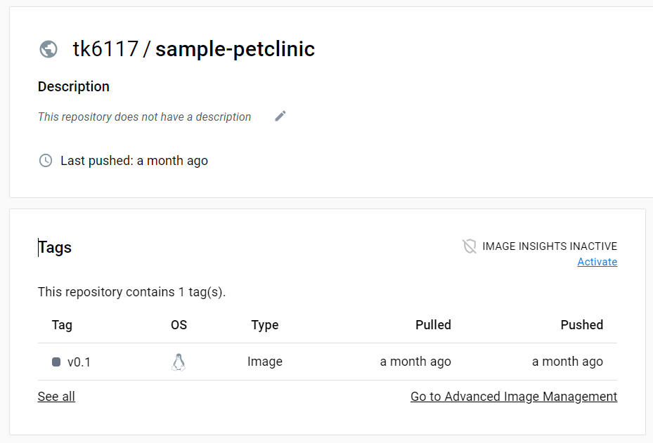

# 第七回ハンズオン・ワークショップ

## 概要

本ハンズオンでは、Kubernetesのセキュリティに関連して以下の内容を実施します。

- Security Context と Pod Security Admission の動作確認
- Trivy によるセキュリティスキャン
- OPA Gatekeeper によるポリシー管理

## Trivy

### Trivy 概要

Trivy は、OSSのセキュリティスキャンツールです。以下の主な機能があります。

| 機能                           | 内容                                                         | スキャン対象                                                 |
| :----------------------------- | :----------------------------------------------------------- | :----------------------------------------------------------- |
| 1.脆弱性のスキャン             | CVE-IDが割り振られたパッケージやライブラリの脆弱性を検知する | コンテナイメージ、ファイルシステム、Gitリポジトリ            |
| 2.設定ファイルのスキャン       | 推奨される設定と比較して設定の誤りや問題点を指摘する         | Terraform、Dockerfile、Kubernetesマニフェスト、AWS CloudFormation、Helmチャート |
| 3.シークレット情報のスキャン   | ハードコーディングされた機密情報を検知する                   | コンテナイメージ、ファイルシステム、Gitリポジトリ            |
| 4.Kubernetesクラスタのスキャン | クラスタ内のリソースを対象にコンテナイメージの脆弱性スキャン、Kubernetesマニフェストのスキャン、シークレット情報のスキャンを行う | Kubernetesクラスタ                                           |

Trivy は日本人開発者が個人で開発を進めていたものを、Aqua Seciruty社に譲渡されたOSSです。

https://knqyf263.hatenablog.com/entry/2019/08/20/120713

HarborやGitlabのデフォルトスキャナーとしても採用されています。

## Open Policy Agent / OPA Gatekeeper

### Open Policy Agent 概要

Open Policy Agent(OPA)は、汎用ポリシーエンジンです。ポリシーに基づいてデータの検証を行います。

ポリシー・・・システムを安全・効率よく利用するために定義されたルール

OPAで定義するポリシーとして以下のような例が挙げられます。

- どのユーザーがどのリソースにアクセスできるか
- どのサブネットへのEgressトラフィックを許可するか
- ワークロードをどのクラスタにデプロイしなければならないか
- どのレジストリからバイナリをダウンロードできるか
- コンテナが実行可能なOSの機能はどれか
- どの時間帯にシステムにアクセスできるか


OPAは、バイナリとしてLinux/Windowsで動かすことも、コンテナイメージを使用してDocker/Podmanで動かすことも可能です。

### OPA Gatekeeper 概要

OPA Gatekeeper は、Kubernetes でOPAを利用するためのソリューションです。Kubernetes の Admission Controller と連携して利用します。


ポリシーを Kubernetes のカスタムリソースとして定義します。

| カスタムリソース     | 説明                                                    |
| -------------------- | ------------------------------------------------------- |
| `ConstraintTemplate` | Rego によるポリシー定義。`Constraint`リソースを生成する |
| `Constraint`         | ポリシー適用対象とパラメータ定義                        |

`ConstraintTemplate`リソースにより個々の個々の`Constraint`リソースを生成し、`Constraint`でポリシー適用対象とパラメータを定義します。

## ハンズオン

### bastionサーバ確認

ハンズオン実施前にbastionサーバへログインします。

1. ログインしたユーザ名、ホームディレクトリ、java、Podmanが使用できることを確認します。

   ```shell
   whoami
   ```

## ハンズオン①

本ハンズオンでは、SecurityContextによる挙動の確認と、PodSecurityAdmissionによるポリシー強制を行います。

### SecurityContext による挙動確認

1. テストPodデプロイ

   SecurityContext の設定を行ったテスト用Podをデプロイします。

   `sc-sample.yaml`

   ```yaml
   apiVersion: v1
   kind: Pod
   metadata:
     name: sc-sample-pod
   spec:
     securityContext:
       runAsUser: 1000
       runAsGroup: 3000
       fsGroup: 2000
       runAsNonRoot: true
     containers:
     - name: sc-sample
       image: nginxinc/nginx-unprivileged
       securityContext:
         readOnlyRootFilesystem: true
       volumeMounts:
       - name: var-vol
         mountPath: /var/log/nginx
       - name: tmp-vol
         mountPath: /tmp
     volumes:
     - name: var-vol
       emptyDir: {}
     - name: tmp-vol
       emptyDir: {}
   ```

   上記マニフェストファイルを適用します。

   ```shell
   kubectl apply -f sc-sample.yaml
   ```

   PodがRunning状態であることを確認します。

   ```shell
   kubectl get pods
   ```

   以降、Pod内で確認を行うのでシェルに接続します。

   ```shell
   kubectl exec -it sc-sample-pod -- /bin/bash
   ```

2. 実行ユーザ・グループの確認

   `id`コマンドを実行します。

   ```shell
   id
   ```

   （実行例）

   ```shell
   I have no name!@sc-sample-pod:/$ id
   uid=1000 gid=3000 groups=3000,2000
   ```

   uid、gidが、`runAsUser`、`runAsGroup`で設定した値に、groupsが`runAsGroup`、`fsGroup`で設定した値であることが確認できます。

   ※補足

   `runAsUser`で実行ユーザの指定を行わなかった場合、`nginxinc/nginx-unprivileged`コンテナイメージは、デフォルトでUID：101(nginx)で起動します。

   ```shell
   nginx@sc-sample-pod:/$ id
   uid=101(nginx) gid=101(nginx) groups=101(nginx)
   ```

3. パーミッションの確認

   以下のコマンドを実行しマウントしたボリュームのパーミッションを確認します。

   ```shell
   ls -ld /var/log/nginx
   ls -l /var/log/nginx
   ls -ld /tmp
   ls -l /tmp
   ```

   （実行例）

   ```shell
   I have no name!@sc-sample-pod:/$ ls -ld /var/log/nginx
   drwxrwsrwx 2 root 2000 4096 Mar  4 01:54 /var/log/nginx
   I have no name!@sc-sample-pod:/$ ls -l /var/log/nginx
   total 4
   -rw-r--r-- 1 1000 2000   0 Mar  4 01:54 access.log
   -rw-r--r-- 1 1000 2000 619 Mar  4 01:54 error.log
   I have no name!@sc-sample-pod:/$ ls -ld /tmp
   drwxrwsrwx 7 root 2000 4096 Mar  4 01:54 /tmp
   I have no name!@sc-sample-pod:/$ ls -l /tmp
   total 24
   drwx--S--- 2 1000 2000 4096 Mar  4 01:54 client_temp
   drwx--S--- 2 1000 2000 4096 Mar  4 01:54 fastcgi_temp
   -rw-r--r-- 1 1000 2000    2 Mar  4 01:54 nginx.pid
   drwx--S--- 2 1000 2000 4096 Mar  4 01:54 proxy_temp
   drwx--S--- 2 1000 2000 4096 Mar  4 01:54 scgi_temp
   drwx--S--- 2 1000 2000 4096 Mar  4 01:54 uwsgi_temp
   ```

   `fsGroup`で設定した値にグループが設定されていることが確認できます。

4. ファイル書き込み確認

   `readOnlyRootFilesystem: true`を設定しているので、ルートファイルシステムへの書き込みは禁止されていて（読み込みのみ許可）、マウントしたボリュームには書き込みができることを確認します。

   ```shell
   pwd
   echo "hello" >> test.file
   echo "hello" >> /tmp/test.file
   echo "hello" >> /var/log/nginx/test.file
   ls -l /tmp/test.file
   cat /tmp/test.file
   ls -l /var/log/nginx
   cat /var/log/nginx/test.file
   ```

   （実行例）

   ```shell
   I have no name!@sc-sample-pod:/$ pwd
   /
   I have no name!@sc-sample-pod:/$ echo "hello" >> test.file
   bash: test.file: Read-only file system
   I have no name!@sc-sample-pod:/$ echo "hello" >> /tmp/test.file
   I have no name!@sc-sample-pod:/$ echo "hello" >> /var/log/nginx/test.file
   I have no name!@sc-sample-pod:/$ ls -l /tmp/test.file
   -rw-r--r-- 1 1000 2000 6 Mar  4 02:19 /tmp/test.file
   I have no name!@sc-sample-pod:/$ cat /tmp/test.file
   hello
   I have no name!@sc-sample-pod:/$ ls -l /var/log/nginx
   total 8
   -rw-r--r-- 1 1000 2000   0 Mar  4 01:54 access.log
   -rw-r--r-- 1 1000 2000 619 Mar  4 01:54 error.log
   -rw-r--r-- 1 1000 2000   6 Mar  4 02:19 test.file
   I have no name!@sc-sample-pod:/$ cat /var/log/nginx/test.file
   hello
   ```

※「runAsNonRoot」について

`runAsNonRoot: true`を設定すると、rootで起動するコンテナイメージのクラスタでの起動を阻止します。たとえば、DockerHubの公式nginxイメージはrootで起動するコンテナイメージですが、`runAsNonRoot: true`を設定してデプロイしようとすると、以下のようなエラーが発生し、コンテナを起動することができません。

```shell
  Warning  Failed          7s (x2 over 8s)  kubelet            Error: container has runAsNonRoot and image will run as root (pod: "sc-sample-pod_user20(7e41ec6b-5074-4565-bb75-21f94a3c913a)", container: sc-sample)
```

また、DockerHub公式Nginxイメージはrootで起動する前提で設定されています。たとえば`runAsUser`で実行ユーザを変更すると起動しませんので、`nginxinc/nginx-unprivileged`イメージを使用しております。https://hub.docker.com/r/nginxinc/nginx-unprivileged

### PodSecurityAdmissionによるポリシー強制

特権コンテナを起動するマニフェストを適用した際、PodSecurityAdmissionのポリシーチェックによりマニフェスト適用が拒否されることを確認します。

PSAは、各Namespaceごとに設定します。	レベルとモードをLabelとして付与します。本環境では以下のような設定です。（user20 namespaceの例）

```yaml
apiVersion: v1
kind: Namespace
metadata:
  labels:
    kubernetes.io/metadata.name: user20
    pod-security.kubernetes.io/enforce: baseline	# PSAのラベル。baselineレベルでenforceモード
  name: user20
spec: {}
status:
  phase: Active
```

https://kubernetes.io/ja/docs/concepts/security/pod-security-admission/#pod-security-admission-labels-for-namespaces

1. テストPodデプロイ

   特権コンテナとして起動するNginxのマニフェストファイルを作成します。

   `privileged-nginx.yaml`

   ```yaml
   apiVersion: v1
   kind: Pod
   metadata:
     name: privileged-nginx
   spec:
     containers:
     - name: nginx
       image: nginx:1.22.1
       securityContext:
         privileged: true
   ```

2. クラスタへの適用

   以下のコマンドでクラスタへ適用します。

   ```shell
   kubectl apply -f privileged-nginx.yaml
   ```

   クラスタ適用時以下のエラーメッセージが表示され適用に失敗します。

   ```shell
   kubectl apply -f privileged-nginx.yaml
   Error from server (Forbidden): error when creating "privileged-nginx.yaml": pods "privileged-nginx" is forbidden: violates PodSecurity "baseline:latest": privileged (container "nginx" must not set securityContext.privileged=true)
   ```

   baselineセキュリティレベルでは、`privileged: true`の設定はポリシー違反となります。

   https://kubernetes.io/ja/docs/concepts/security/pod-security-admission/#pod-security-levels

3. 非特権コンテナのデプロイ

   以下のマニフェストファイルを作成します。

   `non-privileged-nginx.yaml`

   ```yaml
   apiVersion: v1
   kind: Pod
   metadata:
     name: non-privileged-nginx
   spec:
     containers:
     - name: nginx
       image: nginx:1.22.1
       securityContext:
         privileged: false
   ```

   マニフェストファイル`non-privileged-nginx.yaml`を適用します。

   ```shell
   kubectl apply -f non-privileged-nginx.yaml
   ```

   今回は以下のようにポリシー違反はしていないので、クラスタへ適用できました。

   ```shell
   kubectl apply -f non-privileged-nginx.yaml
   pod/non-privileged-nginx created
   kubectl get pods
   NAME                                           READY   STATUS    RESTARTS       AGE
   non-privileged-nginx                           1/1     Running   0              4s
   ```

## ハンズオン②

### コンテナイメージのスキャン

ハンズオンで作成したコンテナイメージのスキャンを行います。

1. スキャン対象イメージの確認

   DockerHubに第一回ハンズオンで作成したコンテナイメージがあることを確認します。

   - sample-petclinic:v0.1

     

2. Podman ログインの実行

   以下のコマンドでPodmanでDockerHubへログインします。

   ```shell
   podman login docker.io
   ```

   実行結果

   ```shell
   Username: [Your Dockerhub ID]
   Password:
   Login Succeeded!
   ```

   ***!!Attention!!***

   - `[Your Dockerhub ID]`は作成いただいたDocker HubアカウントIDを入力ください。

3. イメージスキャン実行

   以下のコマンドでイメージスキャンを実行します。

   ```shell
   trivy image [Your Dockerhub ID]/sample-petclinic:v0.1
   ```

   ***!!Attention!!***

   - `[Your Dockerhub ID]`は作成いただいたDocker HubアカウントIDを入力ください。

   実行結果

   ```shell
   2023-03-06T01:25:04.049Z        INFO    Need to update DB
   2023-03-06T01:25:04.049Z        INFO    DB Repository: ghcr.io/aquasecurity/trivy-db
   2023-03-06T01:25:04.049Z        INFO    Downloading DB...
   35.90 MiB / 35.90 MiB [-----------------------------------------------------------------------------------------------------------------------------------------] 100.00% 28.62 MiB p/s 1.5s
   2023-03-06T01:25:06.511Z        INFO    Vulnerability scanning is enabled
   2023-03-06T01:25:06.511Z        INFO    Secret scanning is enabled
   2023-03-06T01:25:06.511Z        INFO    If your scanning is slow, please try '--scanners vuln' to disable secret scanning
   2023-03-06T01:25:06.511Z        INFO    Please see also https://aquasecurity.github.io/trivy/v0.38/docs/secret/scanning/#recommendation for faster secret detection
   2023-03-06T01:25:11.881Z        INFO    JAR files found
   2023-03-06T01:25:11.881Z        INFO    Java DB Repository: ghcr.io/aquasecurity/trivy-java-db:1
   2023-03-06T01:25:11.881Z        INFO    Downloading the Java DB...
   410.43 MiB / 410.43 MiB [----------------------------------------------------------------------------------------------------------------------------------------] 100.00% 18.15 MiB p/s 23s
   2023-03-06T01:25:35.772Z        INFO    The Java DB is cached for 3 days. If you want to update the database more frequently, the '--reset' flag clears the DB cache.
   2023-03-06T01:25:35.772Z        INFO    Analyzing JAR files takes a while...
   2023-03-06T01:25:35.925Z        INFO    Detected OS: oracle
   2023-03-06T01:25:35.925Z        INFO    Detecting Oracle Linux vulnerabilities...
   2023-03-06T01:25:35.928Z        INFO    Number of language-specific files: 1
   2023-03-06T01:25:35.928Z        INFO    Detecting jar vulnerabilities...
   
   tk6117/sample-petclinic:v0.1 (oracle 8.5)
   
   Total: 59 (UNKNOWN: 0, LOW: 2, MEDIUM: 48, HIGH: 9, CRITICAL: 0)
   
   ┌───────────────┬────────────────┬──────────┬─────────────────────┬──────────────────────────┬──────────────────────────────────────────────────────────────┐
   │    Library    │ Vulnerability  │ Severity │  Installed Version  │      Fixed Version       │                            Title                             │
   ├───────────────┼────────────────┼──────────┼─────────────────────┼──────────────────────────┼──────────────────────────────────────────────────────────────┤
   │ curl          │ CVE-2022-22576 │ MEDIUM   │ 7.61.1-22.el8       │ 7.61.1-22.el8_6.3        │ curl: OAUTH2 bearer bypass in connection re-use              │
   │               │                │          │                     │                          │ https://avd.aquasec.com/nvd/cve-2022-22576                   │
   │               ├────────────────┤          │                     │                          ├──────────────────────────────────────────────────────────────┤
   │               │ CVE-2022-27774 │          │                     │                          │ curl: credential leak on redirect                            │
   │               │                │          │                     │                          │ https://avd.aquasec.com/nvd/cve-2022-27774                   │
   │               ├────────────────┤          │                     │                          ├──────────────────────────────────────────────────────────────┤
   │               │ CVE-2022-27776 │          │                     │                          │ curl: auth/cookie leak on redirect                           │
   │               │                │          │                     │                          │ https://avd.aquasec.com/nvd/cve-2022-27776                   │
   │               ├────────────────┤          │                     │                          ├──────────────────────────────────────────────────────────────┤
   │               │ CVE-2022-27782 │          │                     │                          │ curl: TLS and SSH connection too eager reuse                 │
   │               │                │          │                     │                          │ https://avd.aquasec.com/nvd/cve-2022-27782                   │
   │               ├────────────────┤          │                     ├──────────────────────────┼──────────────────────────────────────────────────────────────┤
   │               │ CVE-2022-32206 │          │                     │ 7.61.1-22.el8_6.4        │ curl: HTTP compression denial of service                     │
   │               │                │          │                     │                          │ https://avd.aquasec.com/nvd/cve-2022-32206                   │
   │               ├────────────────┤          │                     │                          ├──────────────────────────────────────────────────────────────┤
   │               │ CVE-2022-32208 │          │                     │                          │ curl: FTP-KRB bad message verification                       │
   │               │                │          │                     │                          │ https://avd.aquasec.com/nvd/cve-2022-32208                   │
   ├───────────────┼────────────────┼──────────┼─────────────────────┼──────────────────────────┼──────────────────────────────────────────────────────────────┤
   │ expat         │ CVE-2022-40674 │ HIGH     │ 2.2.5-4.0.1.el8_5.3 │ 2.2.5-8.0.1.el8_6.3      │ expat: a use-after-free in the doContent function in         │
   │               │                │          │                     │                          │ xmlparse.c                                                   │
   │               │                │          │                     │                          │ https://avd.aquasec.com/nvd/cve-2022-40674                   │
   │               ├────────────────┼──────────┤                     ├──────────────────────────┼──────────────────────────────────────────────────────────────┤
   │               │ CVE-2022-25313 │ MEDIUM   │                     │ 2.2.5-8.0.1.el8_6.2      │ expat: Stack exhaustion in doctype parsing                   │
   │               │                │          │                     │                          │ https://avd.aquasec.com/nvd/cve-2022-25313                   │
   │               ├────────────────┤          │                     │                          ├──────────────────────────────────────────────────────────────┤
   │               │ CVE-2022-25314 │          │                     │                          │ expat: Integer overflow in copyString()                      │
   │               │                │          │                     │                          │ https://avd.aquasec.com/nvd/cve-2022-25314                   │
   │               ├────────────────┤          │                     ├──────────────────────────┼──────────────────────────────────────────────────────────────┤
   │               │ CVE-2022-43680 │          │                     │ 2.2.5-10.0.1.el8_7.1     │ expat: use-after free caused by overeager destruction of a   │
   │               │                │          │                     │                          │ shared DTD in...                                             │
   │               │                │          │                     │                          │ https://avd.aquasec.com/nvd/cve-2022-43680                   │
   ├───────────────┼────────────────┤          ├─────────────────────┼──────────────────────────┼──────────────────────────────────────────────────────────────┤
   │ freetype      │ CVE-2022-27404 │          │ 2.9.1-4.el8_3.1     │ 2.9.1-9.el8              │ FreeType: Buffer overflow in sfnt_init_face                  │
   │               │                │          │                     │                          │ https://avd.aquasec.com/nvd/cve-2022-27404                   │
   │               ├────────────────┤          │                     │                          ├──────────────────────────────────────────────────────────────┤
   │               │ CVE-2022-27405 │          │                     │                          │ FreeType: Segmentation violation via FNT_Size_Request        │
   │               │                │          │                     │                          │ https://avd.aquasec.com/nvd/cve-2022-27405                   │
   │               ├────────────────┤          │                     │                          ├──────────────────────────────────────────────────────────────┤
   │               │ CVE-2022-27406 │          │                     │                          │ Freetype: Segmentation violation via FT_Request_Size         │
   │               │                │          │                     │                          │ https://avd.aquasec.com/nvd/cve-2022-27406                   │
   ├───────────────┼────────────────┤          ├─────────────────────┼──────────────────────────┼──────────────────────────────────────────────────────────────┤
   │ glib2         │ CVE-2022-22624 │          │ 2.56.4-156.el8      │ 2.56.4-159.0.1.el8       │ webkitgtk: Use-after-free leading to arbitrary code          │
   │               │                │          │                     │                          │ execution                                                    │
   │               │                │          │                     │                          │ https://avd.aquasec.com/nvd/cve-2022-22624                   │
   │               ├────────────────┤          │                     │                          ├──────────────────────────────────────────────────────────────┤
   │               │ CVE-2022-22628 │          │                     │                          │ webkitgtk: Use-after-free leading to arbitrary code          │
   │               │                │          │                     │                          │ execution                                                    │
   │               │                │          │                     │                          │ https://avd.aquasec.com/nvd/cve-2022-22628                   │
   │               ├────────────────┤          │                     │                          ├──────────────────────────────────────────────────────────────┤
   │               │ CVE-2022-22629 │          │                     │                          │ webkitgtk: Buffer overflow leading to arbitrary code         │
   │               │                │          │                     │                          │ execution                                                    │
   │               │                │          │                     │                          │ https://avd.aquasec.com/nvd/cve-2022-22629                   │
   │               ├────────────────┤          │                     │                          ├──────────────────────────────────────────────────────────────┤
   │               │ CVE-2022-22662 │          │                     │                          │ webkitgtk: Cookie management issue leading to sensitive user │
   │               │                │          │                     │                          │ information disclosure                                       │
   │               │                │          │                     │                          │ https://avd.aquasec.com/nvd/cve-2022-22662                   │
   │               ├────────────────┤          │                     │                          ├──────────────────────────────────────────────────────────────┤
   │               │ CVE-2022-26700 │          │                     │                          │ webkitgtk: Memory corruption issue leading to arbitrary code │
   │               │                │          │                     │                          │ execution                                                    │
   │               │                │          │                     │                          │ https://avd.aquasec.com/nvd/cve-2022-26700                   │
   │               ├────────────────┤          │                     │                          ├──────────────────────────────────────────────────────────────┤
   │               │ CVE-2022-26709 │          │                     │                          │ webkitgtk: Use-after-free leading to arbitrary code          │
   │               │                │          │                     │                          │ execution                                                    │
   │               │                │          │                     │                          │ https://avd.aquasec.com/nvd/cve-2022-26709                   │
   │               ├────────────────┤          │                     │                          ├──────────────────────────────────────────────────────────────┤
   │               │ CVE-2022-26710 │          │                     │                          │ webkitgtk: Use-after-free leading to arbitrary code          │
   │               │                │          │                     │                          │ execution                                                    │
   │               │                │          │                     │                          │ https://avd.aquasec.com/nvd/cve-2022-26710                   │
   │               ├────────────────┤          │                     │                          ├──────────────────────────────────────────────────────────────┤
   │               │ CVE-2022-26716 │          │                     │                          │ webkitgtk: Memory corruption issue leading to arbitrary code │
   │               │                │          │                     │                          │ execution                                                    │
   │               │                │          │                     │                          │ https://avd.aquasec.com/nvd/cve-2022-26716                   │
   │               ├────────────────┤          │                     │                          ├──────────────────────────────────────────────────────────────┤
   │               │ CVE-2022-26717 │          │                     │                          │ webkitgtk: Use-after-free leading to arbitrary code          │
   │               │                │          │                     │                          │ execution                                                    │
   │               │                │          │                     │                          │ https://avd.aquasec.com/nvd/cve-2022-26717                   │
   │               ├────────────────┤          │                     │                          ├──────────────────────────────────────────────────────────────┤
   │               │ CVE-2022-26719 │          │                     │                          │ webkitgtk: Memory corruption issue leading to arbitrary code │
   │               │                │          │                     │                          │ execution                                                    │
   │               │                │          │                     │                          │ https://avd.aquasec.com/nvd/cve-2022-26719                   │
   │               ├────────────────┤          │                     │                          ├──────────────────────────────────────────────────────────────┤
   │               │ CVE-2022-30293 │          │                     │                          │ webkitgtk: Heap buffer overflow in                           │
   │               │                │          │                     │                          │ WebCore::TextureMapperLayer::setContentsLayer leading to     │
   │               │                │          │                     │                          │ arbitrary code execution                                     │
   │               │                │          │                     │                          │ https://avd.aquasec.com/nvd/cve-2022-30293                   │
   ├───────────────┼────────────────┤          ├─────────────────────┼──────────────────────────┼──────────────────────────────────────────────────────────────┤
   │ gnupg2        │ CVE-2022-34903 │          │ 2.2.20-2.el8        │ 2.2.20-3.el8_6           │ gpg: Signature spoofing via status line injection            │
   │               │                │          │                     │                          │ https://avd.aquasec.com/nvd/cve-2022-34903                   │
   ├───────────────┼────────────────┤          ├─────────────────────┼──────────────────────────┼──────────────────────────────────────────────────────────────┤
   │ gnutls        │ CVE-2021-20231 │          │ 3.6.16-4.el8        │ 10:3.6.16-4.0.1.el8_fips │ gnutls: Use after free in client key_share extension         │
   │               │                │          │                     │                          │ https://avd.aquasec.com/nvd/cve-2021-20231                   │
   │               ├────────────────┤          │                     │                          ├──────────────────────────────────────────────────────────────┤
   │               │ CVE-2021-20232 │          │                     │                          │ gnutls: Use after free in client_send_params in              │
   │               │                │          │                     │                          │ lib/ext/pre_shared_key.c                                     │
   │               │                │          │                     │                          │ https://avd.aquasec.com/nvd/cve-2021-20232                   │
   │               ├────────────────┤          │                     │                          ├──────────────────────────────────────────────────────────────┤
   │               │ CVE-2021-3580  │          │                     │                          │ nettle: Remote crash in RSA decryption via manipulated       │
   │               │                │          │                     │                          │ ciphertext                                                   │
   │               │                │          │                     │                          │ https://avd.aquasec.com/nvd/cve-2021-3580                    │
   │               ├────────────────┤          │                     ├──────────────────────────┼──────────────────────────────────────────────────────────────┤
   │               │ CVE-2022-2509  │          │                     │ 3.6.16-5.el8_6           │ gnutls: Double free during gnutls_pkcs7_verify               │
   │               │                │          │                     │                          │ https://avd.aquasec.com/nvd/cve-2022-2509                    │
   ├───────────────┼────────────────┼──────────┼─────────────────────┼──────────────────────────┼──────────────────────────────────────────────────────────────┤
   │ krb5-libs     │ CVE-2022-42898 │ HIGH     │ 1.18.2-14.0.1.el8   │ 1.18.2-22.0.1.el8_7      │ krb5: integer overflow vulnerabilities in PAC parsing        │
   │               │                │          │                     │                          │ https://avd.aquasec.com/nvd/cve-2022-42898                   │
   ├───────────────┼────────────────┼──────────┼─────────────────────┼──────────────────────────┼──────────────────────────────────────────────────────────────┤
   │ libcom_err    │ CVE-2022-1304  │ MEDIUM   │ 1.45.6-2.el8        │ 1.45.6-5.el8             │ e2fsprogs: out-of-bounds read/write via crafted filesystem   │
   │               │                │          │                     │                          │ https://avd.aquasec.com/nvd/cve-2022-1304                    │
   ├───────────────┼────────────────┤          ├─────────────────────┼──────────────────────────┼──────────────────────────────────────────────────────────────┤
   │ libcurl       │ CVE-2022-22576 │          │ 7.61.1-22.el8       │ 7.61.1-22.el8_6.3        │ curl: OAUTH2 bearer bypass in connection re-use              │
   │               │                │          │                     │                          │ https://avd.aquasec.com/nvd/cve-2022-22576                   │
   │               ├────────────────┤          │                     │                          ├──────────────────────────────────────────────────────────────┤
   │               │ CVE-2022-27774 │          │                     │                          │ curl: credential leak on redirect                            │
   │               │                │          │                     │                          │ https://avd.aquasec.com/nvd/cve-2022-27774                   │
   │               ├────────────────┤          │                     │                          ├──────────────────────────────────────────────────────────────┤
   │               │ CVE-2022-27776 │          │                     │                          │ curl: auth/cookie leak on redirect                           │
   │               │                │          │                     │                          │ https://avd.aquasec.com/nvd/cve-2022-27776                   │
   │               ├────────────────┤          │                     │                          ├──────────────────────────────────────────────────────────────┤
   │               │ CVE-2022-27782 │          │                     │                          │ curl: TLS and SSH connection too eager reuse                 │
   │               │                │          │                     │                          │ https://avd.aquasec.com/nvd/cve-2022-27782                   │
   │               ├────────────────┤          │                     ├──────────────────────────┼──────────────────────────────────────────────────────────────┤
   │               │ CVE-2022-32206 │          │                     │ 7.61.1-22.el8_6.4        │ curl: HTTP compression denial of service                     │
   │               │                │          │                     │                          │ https://avd.aquasec.com/nvd/cve-2022-32206                   │
   │               ├────────────────┤          │                     │                          ├──────────────────────────────────────────────────────────────┤
   │               │ CVE-2022-32208 │          │                     │                          │ curl: FTP-KRB bad message verification                       │
   │               │                │          │                     │                          │ https://avd.aquasec.com/nvd/cve-2022-32208                   │
   ├───────────────┼────────────────┼──────────┼─────────────────────┼──────────────────────────┼──────────────────────────────────────────────────────────────┤
   │ libgcrypt     │ CVE-2021-40528 │ HIGH     │ 1.8.5-6.el8         │ 10:1.8.5-7.el8_6_fips    │ libgcrypt: ElGamal implementation allows plaintext recovery  │
   │               │                │          │                     │                          │ https://avd.aquasec.com/nvd/cve-2021-40528                   │
   │               ├────────────────┼──────────┤                     ├──────────────────────────┼──────────────────────────────────────────────────────────────┤
   │               │ CVE-2021-33560 │ MEDIUM   │                     │ 10:1.8.5-6.el8_fips      │ libgcrypt: mishandles ElGamal encryption because it lacks    │
   │               │                │          │                     │                          │ exponent blinding to address a...                            │
   │               │                │          │                     │                          │ https://avd.aquasec.com/nvd/cve-2021-33560                   │
   ├───────────────┼────────────────┼──────────┼─────────────────────┼──────────────────────────┼──────────────────────────────────────────────────────────────┤
   │ libksba       │ CVE-2022-3515  │ HIGH     │ 1.3.5-7.el8         │ 1.3.5-8.el8_6            │ libksba: integer overflow may lead to remote code execution  │
   │               │                │          │                     │                          │ https://avd.aquasec.com/nvd/cve-2022-3515                    │
   │               ├────────────────┤          │                     ├──────────────────────────┼──────────────────────────────────────────────────────────────┤
   │               │ CVE-2022-47629 │          │                     │ 1.3.5-9.el8_7            │ libksba: integer overflow to code execution                  │
   │               │                │          │                     │                          │ https://avd.aquasec.com/nvd/cve-2022-47629                   │
   ├───────────────┼────────────────┼──────────┼─────────────────────┼──────────────────────────┼──────────────────────────────────────────────────────────────┤
   │ libssh        │ CVE-2021-3634  │ LOW      │ 0.9.4-3.el8         │ 0.9.6-3.el8              │ libssh: possible heap-based buffer overflow when rekeying    │
   │               │                │          │                     │                          │ https://avd.aquasec.com/nvd/cve-2021-3634                    │
   ├───────────────┤                │          │                     │                          │                                                              │
   │ libssh-config │                │          │                     │                          │                                                              │
   │               │                │          │                     │                          │                                                              │
   ├───────────────┼────────────────┼──────────┼─────────────────────┼──────────────────────────┼──────────────────────────────────────────────────────────────┤
   │ libtasn1      │ CVE-2021-46848 │ MEDIUM   │ 4.13-3.el8          │ 4.13-4.el8_7             │ libtasn1: Out-of-bound access in ETYPE_OK                    │
   │               │                │          │                     │                          │ https://avd.aquasec.com/nvd/cve-2021-46848                   │
   ├───────────────┼────────────────┤          ├─────────────────────┼──────────────────────────┼──────────────────────────────────────────────────────────────┤
   │ libxml2       │ CVE-2016-3709  │          │ 2.9.7-12.el8_5      │ 2.9.7-15.el8             │ libxml2: Incorrect server side include parsing can lead to   │
   │               │                │          │                     │                          │ XSS                                                          │
   │               │                │          │                     │                          │ https://avd.aquasec.com/nvd/cve-2016-3709                    │
   │               ├────────────────┤          │                     ├──────────────────────────┼──────────────────────────────────────────────────────────────┤
   │               │ CVE-2022-29824 │          │                     │ 2.9.7-13.el8_6.1         │ libxml2: integer overflows in xmlBuf and xmlBuffer lead to   │
   │               │                │          │                     │                          │ out-of-bounds write                                          │
   │               │                │          │                     │                          │ https://avd.aquasec.com/nvd/cve-2022-29824                   │
   │               ├────────────────┤          │                     ├──────────────────────────┼──────────────────────────────────────────────────────────────┤
   │               │ CVE-2022-40303 │          │                     │ 2.9.7-15.el8_7.1         │ libxml2: integer overflows with XML_PARSE_HUGE               │
   │               │                │          │                     │                          │ https://avd.aquasec.com/nvd/cve-2022-40303                   │
   │               ├────────────────┤          │                     │                          ├──────────────────────────────────────────────────────────────┤
   │               │ CVE-2022-40304 │          │                     │                          │ libxml2: dict corruption caused by entity reference cycles   │
   │               │                │          │                     │                          │ https://avd.aquasec.com/nvd/cve-2022-40304                   │
   ├───────────────┼────────────────┤          ├─────────────────────┼──────────────────────────┼──────────────────────────────────────────────────────────────┤
   │ pcre2         │ CVE-2022-1586  │          │ 10.32-2.el8         │ 10.32-3.el8_6            │ pcre2: Out-of-bounds read in compile_xclass_matchingpath in  │
   │               │                │          │                     │                          │ pcre2_jit_compile.c                                          │
   │               │                │          │                     │                          │ https://avd.aquasec.com/nvd/cve-2022-1586                    │
   ├───────────────┼────────────────┤          ├─────────────────────┼──────────────────────────┼──────────────────────────────────────────────────────────────┤
   │ sqlite-libs   │ CVE-2020-35525 │          │ 3.26.0-15.el8       │ 3.26.0-16.el8_6          │ sqlite: Null pointer derreference in src/select.c            │
   │               │                │          │                     │                          │ https://avd.aquasec.com/nvd/cve-2020-35525                   │
   │               ├────────────────┤          │                     │                          ├──────────────────────────────────────────────────────────────┤
   │               │ CVE-2020-35527 │          │                     │                          │ sqlite: Out of bounds access during table rename             │
   │               │                │          │                     │                          │ https://avd.aquasec.com/nvd/cve-2020-35527                   │
   │               ├────────────────┤          │                     ├──────────────────────────┼──────────────────────────────────────────────────────────────┤
   │               │ CVE-2022-35737 │          │                     │ 3.26.0-17.el8_7          │ sqlite: an array-bounds overflow if billions of bytes are    │
   │               │                │          │                     │                          │ used in a...                                                 │
   │               │                │          │                     │                          │ https://avd.aquasec.com/nvd/cve-2022-35737                   │
   ├───────────────┼────────────────┼──────────┼─────────────────────┼──────────────────────────┼──────────────────────────────────────────────────────────────┤
   │ systemd-libs  │ CVE-2022-2526  │ HIGH     │ 239-51.0.1.el8_5.5  │ 239-58.0.1.el8_6.4       │ systemd-resolved: use-after-free when dealing with DnsStream │
   │               │                │          │                     │                          │ in resolved-dns-stream.c                                     │
   │               │                │          │                     │                          │ https://avd.aquasec.com/nvd/cve-2022-2526                    │
   │               ├────────────────┼──────────┤                     ├──────────────────────────┼──────────────────────────────────────────────────────────────┤
   │               │ CVE-2022-3821  │ MEDIUM   │                     │ 239-68.0.2.el8_7.1       │ systemd: buffer overrun in format_timespan() function        │
   │               │                │          │                     │                          │ https://avd.aquasec.com/nvd/cve-2022-3821                    │
   │               ├────────────────┤          │                     ├──────────────────────────┼──────────────────────────────────────────────────────────────┤
   │               │ CVE-2022-4415  │          │                     │ 239-68.0.2.el8_7.4       │ systemd: local information leak due to systemd-coredump not  │
   │               │                │          │                     │                          │ respecting fs.suid_dumpable kernel setting...                │
   │               │                │          │                     │                          │ https://avd.aquasec.com/nvd/cve-2022-4415                    │
   ├───────────────┼────────────────┤          ├─────────────────────┼──────────────────────────┼──────────────────────────────────────────────────────────────┤
   │ tar           │ CVE-2022-48303 │          │ 2:1.30-5.el8        │ 2:1.30-6.el8_7.1         │ tar: heap buffer overflow at from_header() in list.c via     │
   │               │                │          │                     │                          │ specially crafted checksum...                                │
   │               │                │          │                     │                          │ https://avd.aquasec.com/nvd/cve-2022-48303                   │
   ├───────────────┼────────────────┼──────────┼─────────────────────┼──────────────────────────┼──────────────────────────────────────────────────────────────┤
   │ xz-libs       │ CVE-2022-1271  │ HIGH     │ 5.2.4-3.el8         │ 5.2.4-4.el8_6            │ gzip: arbitrary-file-write vulnerability                     │
   │               │                │          │                     │                          │ https://avd.aquasec.com/nvd/cve-2022-1271                    │
   ├───────────────┼────────────────┤          ├─────────────────────┼──────────────────────────┼──────────────────────────────────────────────────────────────┤
   │ zlib          │ CVE-2018-25032 │          │ 1.2.11-17.el8       │ 1.2.11-18.el8_5          │ zlib: A flaw found in zlib when compressing (not             │
   │               │                │          │                     │                          │ decompressing) certain inputs...                             │
   │               │                │          │                     │                          │ https://avd.aquasec.com/nvd/cve-2018-25032                   │
   │               ├────────────────┤          │                     ├──────────────────────────┼──────────────────────────────────────────────────────────────┤
   │               │ CVE-2022-37434 │          │                     │ 1.2.11-19.el8_6          │ zlib: heap-based buffer over-read and overflow in inflate()  │
   │               │                │          │                     │                          │ in inflate.c via a...                                        │
   │               │                │          │                     │                          │ https://avd.aquasec.com/nvd/cve-2022-37434                   │
   └───────────────┴────────────────┴──────────┴─────────────────────┴──────────────────────────┴──────────────────────────────────────────────────────────────┘
   2023-03-06T01:25:35.957Z        INFO    Table result includes only package filenames. Use '--format json' option to get the full path to the package file.
   
   Java (jar)
   
   Total: 1 (UNKNOWN: 0, LOW: 0, MEDIUM: 0, HIGH: 1, CRITICAL: 0)
   
   ┌─────────────────────────────────────────────────────────┬────────────────┬──────────┬───────────────────┬───────────────┬───────────────────────────────────────────────────────────┐
   │                         Library                         │ Vulnerability  │ Severity │ Installed Version │ Fixed Version │                           Title                           │
   ├─────────────────────────────────────────────────────────┼────────────────┼──────────┼───────────────────┼───────────────┼───────────────────────────────────────────────────────────┤
   │ com.h2database:h2 (spring-petclinic-3.0.0-SNAPSHOT.jar) │ CVE-2022-45868 │ HIGH     │ 2.1.214           │               │ The web-based admin console in H2 Database Engine through │
   │                                                         │                │          │                   │               │ 2.1.214 can ...                                           │
   │                                                         │                │          │                   │               │ https://avd.aquasec.com/nvd/cve-2022-45868                │
   └─────────────────────────────────────────────────────────┴────────────────┴──────────┴───────────────────┴───────────────┴───────────────────────────────────────────────────────────┘
   ```

   コンテナイメージに含まれるパッケージと脆弱性の一覧情報が表示されます。

### 設定ファイルのスキャン

サンプルのマニフェストファイルを対象にTrivyでスキャンします。

1. サンプルマニフェストファイルの作成

   `sample-nginx.yaml`

   ```yaml
   apiVersion: apps/v1
   kind: Deployment
   metadata:
     name: nginx-deployment
   spec:
     selector:
       matchLabels:
         app: nginx
     replicas: 2
     template:
       metadata:
         labels:
           app: nginx
       spec:
         containers:
         - name: nginx
           image: nginx:1.22.1
           ports:
           - containerPort: 80
   ```

2. 設定ファイルスキャンの実行

   以下のコマンドで設定ファイルスキャンを実行します。

   ```shell
   trivy config sample-nginx.yaml
   ```

   実行結果

   ```shell
   2023-03-06T01:37:00.956Z        INFO    Misconfiguration scanning is enabled
   2023-03-06T01:37:02.158Z        INFO    Detected config files: 1
   
   sample-nginx.yaml (kubernetes)
   
   Tests: 141 (SUCCESSES: 129, FAILURES: 12, EXCEPTIONS: 0)
   Failures: 12 (UNKNOWN: 0, LOW: 10, MEDIUM: 2, HIGH: 0, CRITICAL: 0)
   
   MEDIUM: Container 'nginx' of Deployment 'nginx-deployment' should set 'securityContext.allowPrivilegeEscalation' to false
   ════════════════════════════════════════════════════════════════════════════════════════════════════════════════════════════════════════════════════════════════════════════════════════════
   A program inside the container can elevate its own privileges and run as root, which might give the program control over the container and node.
   
   See https://avd.aquasec.com/misconfig/ksv001
   ────────────────────────────────────────────────────────────────────────────────────────────────────────────────────────────────────────────────────────────────────────────────────────────
    sample-nginx.yaml:16-19
   ────────────────────────────────────────────────────────────────────────────────────────────────────────────────────────────────────────────────────────────────────────────────────────────
     16 ┌       - name: nginx
     17 │         image: nginx:1.22.1
     18 │         ports:
     19 └         - containerPort: 80
   ────────────────────────────────────────────────────────────────────────────────────────────────────────────────────────────────────────────────────────────────────────────────────────────
   
   
   LOW: Container 'nginx' of Deployment 'nginx-deployment' should add 'ALL' to 'securityContext.capabilities.drop'
   ════════════════════════════════════════════════════════════════════════════════════════════════════════════════════════════════════════════════════════════════════════════════════════════
   The container should drop all default capabilities and add only those that are needed for its execution.
   
   See https://avd.aquasec.com/misconfig/ksv003
   ────────────────────────────────────────────────────────────────────────────────────────────────────────────────────────────────────────────────────────────────────────────────────────────
    sample-nginx.yaml:16-19
   ────────────────────────────────────────────────────────────────────────────────────────────────────────────────────────────────────────────────────────────────────────────────────────────
     16 ┌       - name: nginx
     17 │         image: nginx:1.22.1
     18 │         ports:
     19 └         - containerPort: 80
   ────────────────────────────────────────────────────────────────────────────────────────────────────────────────────────────────────────────────────────────────────────────────────────────
   
   
   LOW: Container 'nginx' of Deployment 'nginx-deployment' should set 'resources.limits.cpu'
   ════════════════════════════════════════════════════════════════════════════════════════════════════════════════════════════════════════════════════════════════════════════════════════════
   Enforcing CPU limits prevents DoS via resource exhaustion.
   
   See https://avd.aquasec.com/misconfig/ksv011
   ────────────────────────────────────────────────────────────────────────────────────────────────────────────────────────────────────────────────────────────────────────────────────────────
    sample-nginx.yaml:16-19
   ────────────────────────────────────────────────────────────────────────────────────────────────────────────────────────────────────────────────────────────────────────────────────────────
     16 ┌       - name: nginx
     17 │         image: nginx:1.22.1
     18 │         ports:
     19 └         - containerPort: 80
   ────────────────────────────────────────────────────────────────────────────────────────────────────────────────────────────────────────────────────────────────────────────────────────────
   
   
   MEDIUM: Container 'nginx' of Deployment 'nginx-deployment' should set 'securityContext.runAsNonRoot' to true
   ════════════════════════════════════════════════════════════════════════════════════════════════════════════════════════════════════════════════════════════════════════════════════════════
   'runAsNonRoot' forces the running image to run as a non-root user to ensure least privileges.
   
   See https://avd.aquasec.com/misconfig/ksv012
   ────────────────────────────────────────────────────────────────────────────────────────────────────────────────────────────────────────────────────────────────────────────────────────────
    sample-nginx.yaml:16-19
   ────────────────────────────────────────────────────────────────────────────────────────────────────────────────────────────────────────────────────────────────────────────────────────────
     16 ┌       - name: nginx
     17 │         image: nginx:1.22.1
     18 │         ports:
     19 └         - containerPort: 80
   ────────────────────────────────────────────────────────────────────────────────────────────────────────────────────────────────────────────────────────────────────────────────────────────
   
   
   LOW: Container 'nginx' of Deployment 'nginx-deployment' should set 'securityContext.readOnlyRootFilesystem' to true
   ════════════════════════════════════════════════════════════════════════════════════════════════════════════════════════════════════════════════════════════════════════════════════════════
   An immutable root file system prevents applications from writing to their local disk. This can limit intrusions, as attackers will not be able to tamper with the file system or write foreign executables to disk.
   
   See https://avd.aquasec.com/misconfig/ksv014
   ────────────────────────────────────────────────────────────────────────────────────────────────────────────────────────────────────────────────────────────────────────────────────────────
    sample-nginx.yaml:16-19
   ────────────────────────────────────────────────────────────────────────────────────────────────────────────────────────────────────────────────────────────────────────────────────────────
     16 ┌       - name: nginx
     17 │         image: nginx:1.22.1
     18 │         ports:
     19 └         - containerPort: 80
   ────────────────────────────────────────────────────────────────────────────────────────────────────────────────────────────────────────────────────────────────────────────────────────────
   
   
   LOW: Container 'nginx' of Deployment 'nginx-deployment' should set 'resources.requests.cpu'
   ════════════════════════════════════════════════════════════════════════════════════════════════════════════════════════════════════════════════════════════════════════════════════════════
   When containers have resource requests specified, the scheduler can make better decisions about which nodes to place pods on, and how to deal with resource contention.
   
   See https://avd.aquasec.com/misconfig/ksv015
   ────────────────────────────────────────────────────────────────────────────────────────────────────────────────────────────────────────────────────────────────────────────────────────────
    sample-nginx.yaml:16-19
   ────────────────────────────────────────────────────────────────────────────────────────────────────────────────────────────────────────────────────────────────────────────────────────────
     16 ┌       - name: nginx
     17 │         image: nginx:1.22.1
     18 │         ports:
     19 └         - containerPort: 80
   ────────────────────────────────────────────────────────────────────────────────────────────────────────────────────────────────────────────────────────────────────────────────────────────
   
   
   LOW: Container 'nginx' of Deployment 'nginx-deployment' should set 'resources.requests.memory'
   ════════════════════════════════════════════════════════════════════════════════════════════════════════════════════════════════════════════════════════════════════════════════════════════
   When containers have memory requests specified, the scheduler can make better decisions about which nodes to place pods on, and how to deal with resource contention.
   
   See https://avd.aquasec.com/misconfig/ksv016
   ────────────────────────────────────────────────────────────────────────────────────────────────────────────────────────────────────────────────────────────────────────────────────────────
    sample-nginx.yaml:16-19
   ────────────────────────────────────────────────────────────────────────────────────────────────────────────────────────────────────────────────────────────────────────────────────────────
     16 ┌       - name: nginx
     17 │         image: nginx:1.22.1
     18 │         ports:
     19 └         - containerPort: 80
   ────────────────────────────────────────────────────────────────────────────────────────────────────────────────────────────────────────────────────────────────────────────────────────────
   
   
   LOW: Container 'nginx' of Deployment 'nginx-deployment' should set 'resources.limits.memory'
   ════════════════════════════════════════════════════════════════════════════════════════════════════════════════════════════════════════════════════════════════════════════════════════════
   Enforcing memory limits prevents DoS via resource exhaustion.
   
   See https://avd.aquasec.com/misconfig/ksv018
   ────────────────────────────────────────────────────────────────────────────────────────────────────────────────────────────────────────────────────────────────────────────────────────────
    sample-nginx.yaml:16-19
   ────────────────────────────────────────────────────────────────────────────────────────────────────────────────────────────────────────────────────────────────────────────────────────────
     16 ┌       - name: nginx
     17 │         image: nginx:1.22.1
     18 │         ports:
     19 └         - containerPort: 80
   ────────────────────────────────────────────────────────────────────────────────────────────────────────────────────────────────────────────────────────────────────────────────────────────
   
   
   LOW: Container 'nginx' of Deployment 'nginx-deployment' should set 'securityContext.runAsUser' > 10000
   ════════════════════════════════════════════════════════════════════════════════════════════════════════════════════════════════════════════════════════════════════════════════════════════
   Force the container to run with user ID > 10000 to avoid conflicts with the host’s user table.
   
   See https://avd.aquasec.com/misconfig/ksv020
   ────────────────────────────────────────────────────────────────────────────────────────────────────────────────────────────────────────────────────────────────────────────────────────────
    sample-nginx.yaml:16-19
   ────────────────────────────────────────────────────────────────────────────────────────────────────────────────────────────────────────────────────────────────────────────────────────────
     16 ┌       - name: nginx
     17 │         image: nginx:1.22.1
     18 │         ports:
     19 └         - containerPort: 80
   ────────────────────────────────────────────────────────────────────────────────────────────────────────────────────────────────────────────────────────────────────────────────────────────
   
   
   LOW: Container 'nginx' of Deployment 'nginx-deployment' should set 'securityContext.runAsGroup' > 10000
   ════════════════════════════════════════════════════════════════════════════════════════════════════════════════════════════════════════════════════════════════════════════════════════════
   Force the container to run with group ID > 10000 to avoid conflicts with the host’s user table.
   
   See https://avd.aquasec.com/misconfig/ksv021
   ────────────────────────────────────────────────────────────────────────────────────────────────────────────────────────────────────────────────────────────────────────────────────────────
    sample-nginx.yaml:16-19
   ────────────────────────────────────────────────────────────────────────────────────────────────────────────────────────────────────────────────────────────────────────────────────────────
     16 ┌       - name: nginx
     17 │         image: nginx:1.22.1
     18 │         ports:
     19 └         - containerPort: 80
   ────────────────────────────────────────────────────────────────────────────────────────────────────────────────────────────────────────────────────────────────────────────────────────────
   
   
   LOW: Either Pod or Container should set 'securityContext.seccompProfile.type' to 'RuntimeDefault'
   ════════════════════════════════════════════════════════════════════════════════════════════════════════════════════════════════════════════════════════════════════════════════════════════
   The RuntimeDefault/Localhost seccomp profile must be required, or allow specific additional profiles.
   
   See https://avd.aquasec.com/misconfig/ksv030
   ────────────────────────────────────────────────────────────────────────────────────────────────────────────────────────────────────────────────────────────────────────────────────────────
    sample-nginx.yaml:16-19
   ────────────────────────────────────────────────────────────────────────────────────────────────────────────────────────────────────────────────────────────────────────────────────────────
     16 ┌       - name: nginx
     17 │         image: nginx:1.22.1
     18 │         ports:
     19 └         - containerPort: 80
   ────────────────────────────────────────────────────────────────────────────────────────────────────────────────────────────────────────────────────────────────────────────────────────────
   
   
   LOW: container should drop all
   ════════════════════════════════════════════════════════════════════════════════════════════════════════════════════════════════════════════════════════════════════════════════════════════
   Containers must drop ALL capabilities, and are only permitted to add back the NET_BIND_SERVICE capability.
   
   See https://avd.aquasec.com/misconfig/ksv106
   ────────────────────────────────────────────────────────────────────────────────────────────────────────────────────────────────────────────────────────────────────────────────────────────
    sample-nginx.yaml:16-19
   ────────────────────────────────────────────────────────────────────────────────────────────────────────────────────────────────────────────────────────────────────────────────────────────
     16 ┌       - name: nginx
     17 │         image: nginx:1.22.1
     18 │         ports:
     19 └         - containerPort: 80
   ────────────────────────────────────────────────────────────────────────────────────────────────────────────────────────────────────────────────────────────────────────────────────────────
   ```

## ハンズオン③

OPA Gatekeeper によるマニフェスト適用時のポリシーチェックを行います。マニフェスト適用時に特定条件を満たすリソースのみ適用できるようにします。

本環境では、Deploymentリソースに特定のラベルを持つことを条件とします。

OPA Gatekeeperでは、`ConstraintTemplate`と`Constraints`リソースを使用してポリシールールを作成します。

```yaml
apiVersion: templates.gatekeeper.sh/v1
kind: ConstraintTemplate
metadata:
  name: k8srequiredlabels
spec:
  crd:
    spec:
      names:
        kind: K8sRequiredLabels
      validation:
        # Schema for the `parameters` field
        openAPIV3Schema:
          type: object
          properties:
            labels:
              type: array
              items:
                type: string
  targets:
    - target: admission.k8s.gatekeeper.sh
      rego: |
        package k8srequiredlabels

        violation[{"msg": msg, "details": {"missing_labels": missing}}] {
          provided := {label | input.review.object.metadata.labels[label]}
          required := {label | label := input.parameters.labels[_]}
          missing := required - provided
          count(missing) > 0
          msg := sprintf("you must provide labels: %v", [missing])
        }
```

Constraintsは、`ConstraintTemplate`で生成したカスタムリソースとしてルール対象リソースやパラメータを定義します。

```yaml
apiVersion: constraints.gatekeeper.sh/v1beta1
kind: K8sRequiredLabels
metadata:
  name: deploy-must-have-owner-label
spec:
  match:
    kinds:
      - apiGroups: ["apps"]
        kinds: ["Deployment"]
    namespaces: ["user*"]
  parameters:
    labels: ["owner"]
```

| フィールド            | 説明                          |
| --------------------- | ----------------------------- |
| spec.match.kinds      | ポリシー対象のリソース        |
| spec.match.namespaces | ポリシーチェック対象Namespace |
| spec.parameters       | ポリシーのパラメータ定義      |

Deploymentリソースは特定のラベル`owner`を持つことを条件としています。

1. サンプルマニフェストの作成

   ラベルのないDeploymentリソースのマニフェストファイルを作成します。

   `non-label-sample.yaml`

   ```yaml
   apiVersion: apps/v1
   kind: Deployment
   metadata:
     name: non-label-nginx
   spec:
     selector:
       matchLabels:
         app: non-label-nginx
     replicas: 1
     template:
       metadata:
         labels:
           app: non-label-nginx
       spec:
         containers:
         - name: nginx
           image: nginx:1.22.1
           ports:
           - containerPort: 80
   ```

2. クラスタへの適用

   作成したマニフェストファイルをクラスタへ適用します。

   ```shell
   kubectl apply -f non-label-sample.yaml
   ```

   以下のエラーメッセージが出力されてマニフェストの適用が拒否されます。

   ```shell
   kubectl apply -f non-label-sample.yaml
   Error from server (Forbidden): error when creating "non-label-sample.yaml": admission webhook "validation.gatekeeper.sh" denied the request: [deploy-must-have-owner-label] you must provide labels: {"owner"}
   ```

3. サンプルマニフェストの作成

   ラベルを付与したDeploymentリソースのマニフェストファイルを作成します。

   `label-sample.yaml`

   ```yaml
   apiVersion: apps/v1
   kind: Deployment
   metadata:
     name: label-nginx
     labels:
       owner: [Your User Account]
   spec:
     selector:
       matchLabels:
         app: label-nginx
     replicas: 1
     template:
       metadata:
         labels:
           app: label-nginx
       spec:
         containers:
         - name: nginx
           image: nginx:1.22.1
           ports:
           - containerPort: 80
   ```

   ***!!Attention!!***

   - `[Your User Account]`はbastionサーバのユーザ名を入力ください。

     （実行例）user20の場合

     ```yaml
     apiVersion: apps/v1
     kind: Deployment
     metadata:
       name: label-nginx
       labels:
         owner: user20
     spec:
     ```

4. クラスタへの適用

   作成したマニフェストファイルをクラスタへ適用します。

   ```shell
   kubectl apply -f label-sample.yaml
   ```

   ラベル`owner`を付与しているので、クラスタへ適用できました。

   ```shell
   kubectl apply -f label-sample.yaml
   deployment.apps/label-nginx created
   ```

   Deploymentリソースにラベルが付与されていることを確認します。

   ```shell
   kubectl get deployment --show-labels
   NAME                          READY   UP-TO-DATE   AVAILABLE   AGE     LABELS
   label-nginx                   1/1     1            1           74s     owner=user20
   ```

以上で、本ハンズオンは終了です。
