# 第八回ハンズオン・ワークショップ

## 概要

本ハンズオンでは、サービスメッシュに関連してIstioを使用してハンズオンを実施します。

## 前提

- Kubernetes クラスタが導入済みであること
- Kubernetes クラスタに`Istio`がインストール済みであること

## 留意事項

- 本資料では Kubernetesの導入手順については説明しません。
- 本資料では AWSのリソース導入手順については説明しません。

## ハンズオン概要

本ハンズオンでは、Istioによるトラフィック管理を行います。

- サンプルアプリケーションデプロイ
- クラスタ外からの通信設定
- トラフィックシフティング
- フォールトインジェクション

概要①（サンプルアプリケーションデプロイ～クラスタ外からの通信設定）

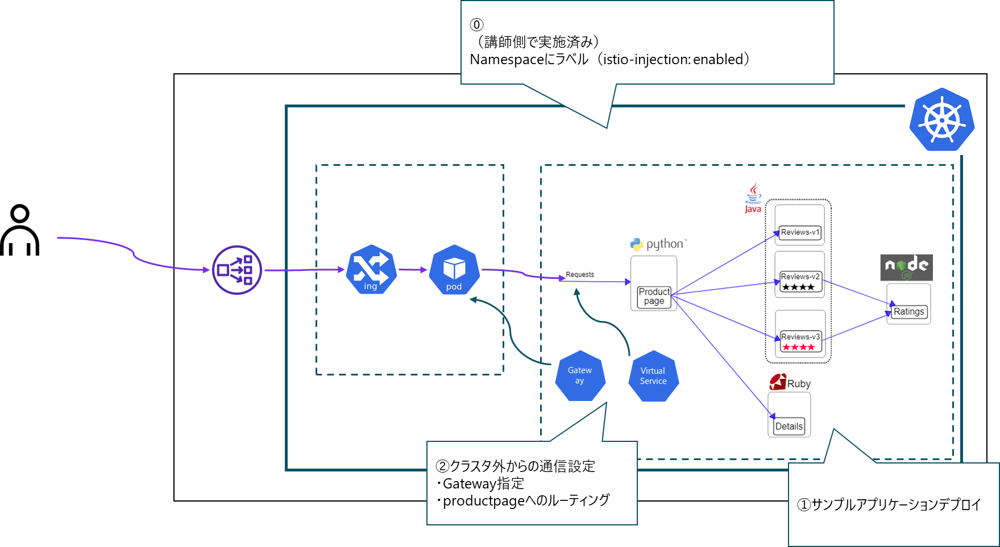

概要②（トラフィックシフティング）

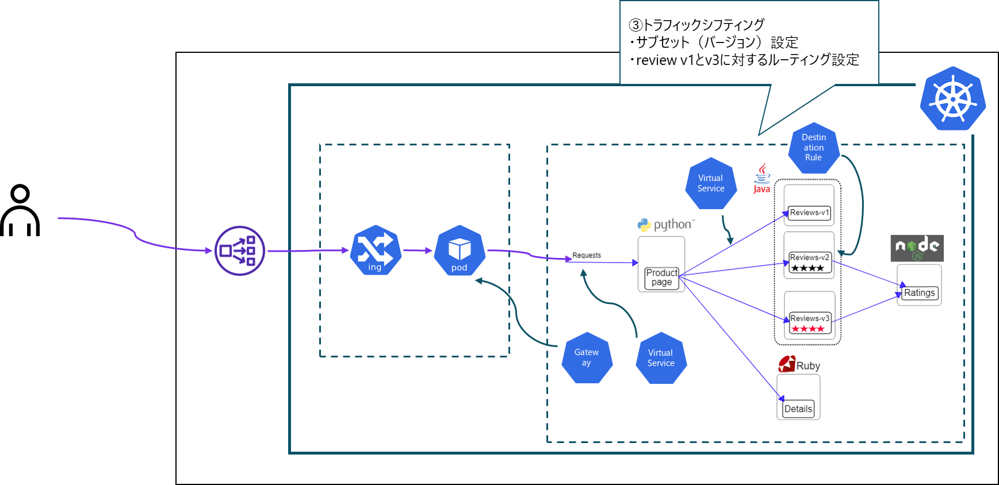

概要③（フォールトインジェクション）

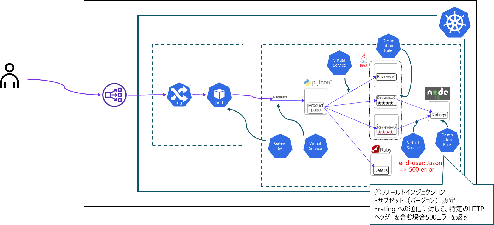

## Istio 概要

Istio は、Google、IBM、Lyftが開発したサービスメッシュのオープンソースソフトウェア（OSS）です。

https://istio.io/latest/

Istio は、Data Plane と、Control Plane で構成されるアーキテクチャです。


- Data Plane

  Podのサイドカーコンテナとしてプロキシを展開し、マイクロサービス間の通信を仲介・制御します。プロキシとしては、`Envoy`というC++で開発された高機能なソフトウェアを利用します。Envoyは各Podのすべての通信を仲介し、通信の制御や統計情報の収集を行います。

- Control Plane

  マイクロサービス間の通信の制御・情報集約を行うために、プロキシ（`Envoy`）を管理・設定します。`Istiod` というバイナリで提供されています。

  `Istiod`はさらに以下のコンポーネントから構成され、それぞれ各種機能を担当しています。

  - Pilot

    サービスディスカバリやルーティング設定をEnvoyに提供することでトラフィック制御を行います。

  - Galley

    Istioの構成検証、配布を行います。

  - Citadel

    認証局として、サービス間やエンドユーザ認証の機能を提供します。

### Istio の主な機能

- Traffic Management
  - サーキットブレーカー・タイムアウト・リトライなどのサービスレベルの属性設定の簡素化
  - A/Bテスト・カナリアリリース・パーセンテージベースのトラフィック分割を使用した段階的なリリースなどの多様なリリース方法の提供
- Security
  - マイクロサービス間通信の認証・認可・暗号化の管理
  - アプリケーションに変更無く、さまざまなプロトコル・ランタイムにわたって一貫したポリシー適用
- Observability
  - トラフィックのトレース・監視およびログ機能による問題の迅速かつ効果的な検出
  - カスタムダッシュボードによるサービスのパフォーマンスを可視化

### サイドカープロキシの展開について

Istio では、Data Planeの`Envoy`は、アプリケーションPodのサイドカーコンテナとして展開されます。以下の展開方法があります。

https://istio.io/latest/docs/setup/additional-setup/sidecar-injection/

- Auto-Injection

  ラベルによってPodにサイドカーを自動展開します。ラベルを付与するリソースは、NamespaceとPodが対象です。Namespaceに付与した場合、そのNamespace内のPodに`Envoy`が自動展開されます。

  本ハンズオンでは、あらかじめNamespaceに、`istio-injection: enabled`ラベルを付与しています。

  user20の場合

  ```yaml
  apiVersion: v1
  kind: Namespace
  metadata:
    labels:
      istio-injection: enabled
      kubernetes.io/metadata.name: user20
    name: user20
  spec:
    finalizers:
    - kubernetes
  status:
    phase: Active
  ```

- Manual-Injection

  `istioctl kube-inject`コマンドでサイドカーコンテナを展開します。

### サンプルアプリケーション

本ハンズオンでは、サンプルアプリケーションとして`bookinfo`を使用します。

https://github.com/istio/istio/tree/master/samples/bookinfo

`bookinfo`はマイクロサービスアーキテクチャで構成されたサンプルアプリケーションです。


- `productpage`：`details`マイクロサービスと`reviews`マイクロサービスを呼び出して、ページに情報を入力します。
- `details`：`details`マイクロサービスは、書籍情報を含みます。
- `reviews`：`reviews`マイクロサービスは、書籍のレビューが含まれています。また、`ratings`マイクロサービスを呼び出します。
- `ratings`：`ratings`マイクロサービスには、書評に付随する本のランキング情報が含まれています。

## ハンズオン

### bastionサーバ確認

ハンズオン実施前にbastionサーバへログインします。

1. ログインしたユーザ名を確認します。

   ```shell
   whoami
   ```

2. ハンズオン作業用ディレクトリを作成します。

   ```shell
   mkdir ws-8
   cd ws-8
   ```

### サンプルアプリケーションデプロイ

1. マニフェストファイルの作成

   `bookinfo`サンプルアプリケーション用のマニフェストファイルを作成します。

   `bookinfo.yaml`

   ```yaml
   ##################################################################################################
   # Details service
   ##################################################################################################
   apiVersion: v1
   kind: Service
   metadata:
     name: details
     labels:
       app: details
       service: details
   spec:
     ports:
     - port: 9080
       name: http
     selector:
       app: details
   ---
   apiVersion: v1
   kind: ServiceAccount
   metadata:
     name: bookinfo-details
     labels:
       account: details
   ---
   apiVersion: apps/v1
   kind: Deployment
   metadata:
     name: details-v1
     labels:
       app: details
       version: v1
   spec:
     replicas: 1
     selector:
       matchLabels:
         app: details
         version: v1
     template:
       metadata:
         labels:
           app: details
           version: v1
       spec:
         serviceAccountName: bookinfo-details
         containers:
         - name: details
           image: docker.io/istio/examples-bookinfo-details-v1:1.17.0
           imagePullPolicy: IfNotPresent
           ports:
           - containerPort: 9080
           securityContext:
             runAsUser: 1000
   ---
   ##################################################################################################
   # Ratings service
   ##################################################################################################
   apiVersion: v1
   kind: Service
   metadata:
     name: ratings
     labels:
       app: ratings
       service: ratings
   spec:
     ports:
     - port: 9080
       name: http
     selector:
       app: ratings
   ---
   apiVersion: v1
   kind: ServiceAccount
   metadata:
     name: bookinfo-ratings
     labels:
       account: ratings
   ---
   apiVersion: apps/v1
   kind: Deployment
   metadata:
     name: ratings-v1
     labels:
       app: ratings
       version: v1
   spec:
     replicas: 1
     selector:
       matchLabels:
         app: ratings
         version: v1
     template:
       metadata:
         labels:
           app: ratings
           version: v1
       spec:
         serviceAccountName: bookinfo-ratings
         containers:
         - name: ratings
           image: docker.io/istio/examples-bookinfo-ratings-v1:1.17.0
           imagePullPolicy: IfNotPresent
           ports:
           - containerPort: 9080
           securityContext:
             runAsUser: 1000
   ---
   ##################################################################################################
   # Reviews service
   ##################################################################################################
   apiVersion: v1
   kind: Service
   metadata:
     name: reviews
     labels:
       app: reviews
       service: reviews
   spec:
     ports:
     - port: 9080
       name: http
     selector:
       app: reviews
   ---
   apiVersion: v1
   kind: ServiceAccount
   metadata:
     name: bookinfo-reviews
     labels:
       account: reviews
   ---
   apiVersion: apps/v1
   kind: Deployment
   metadata:
     name: reviews-v1
     labels:
       app: reviews
       version: v1
   spec:
     replicas: 1
     selector:
       matchLabels:
         app: reviews
         version: v1
     template:
       metadata:
         labels:
           app: reviews
           version: v1
       spec:
         serviceAccountName: bookinfo-reviews
         containers:
         - name: reviews
           image: docker.io/istio/examples-bookinfo-reviews-v1:1.17.0
           imagePullPolicy: IfNotPresent
           env:
           - name: LOG_DIR
             value: "/tmp/logs"
           ports:
           - containerPort: 9080
           volumeMounts:
           - name: tmp
             mountPath: /tmp
           - name: wlp-output
             mountPath: /opt/ibm/wlp/output
           securityContext:
             runAsUser: 1000
         volumes:
         - name: wlp-output
           emptyDir: {}
         - name: tmp
           emptyDir: {}
   ---
   apiVersion: apps/v1
   kind: Deployment
   metadata:
     name: reviews-v2
     labels:
       app: reviews
       version: v2
   spec:
     replicas: 1
     selector:
       matchLabels:
         app: reviews
         version: v2
     template:
       metadata:
         labels:
           app: reviews
           version: v2
       spec:
         serviceAccountName: bookinfo-reviews
         containers:
         - name: reviews
           image: docker.io/istio/examples-bookinfo-reviews-v2:1.17.0
           imagePullPolicy: IfNotPresent
           env:
           - name: LOG_DIR
             value: "/tmp/logs"
           ports:
           - containerPort: 9080
           volumeMounts:
           - name: tmp
             mountPath: /tmp
           - name: wlp-output
             mountPath: /opt/ibm/wlp/output
           securityContext:
             runAsUser: 1000
         volumes:
         - name: wlp-output
           emptyDir: {}
         - name: tmp
           emptyDir: {}
   ---
   apiVersion: apps/v1
   kind: Deployment
   metadata:
     name: reviews-v3
     labels:
       app: reviews
       version: v3
   spec:
     replicas: 1
     selector:
       matchLabels:
         app: reviews
         version: v3
     template:
       metadata:
         labels:
           app: reviews
           version: v3
       spec:
         serviceAccountName: bookinfo-reviews
         containers:
         - name: reviews
           image: docker.io/istio/examples-bookinfo-reviews-v3:1.17.0
           imagePullPolicy: IfNotPresent
           env:
           - name: LOG_DIR
             value: "/tmp/logs"
           ports:
           - containerPort: 9080
           volumeMounts:
           - name: tmp
             mountPath: /tmp
           - name: wlp-output
             mountPath: /opt/ibm/wlp/output
           securityContext:
             runAsUser: 1000
         volumes:
         - name: wlp-output
           emptyDir: {}
         - name: tmp
           emptyDir: {}
   ---
   ##################################################################################################
   # Productpage services
   ##################################################################################################
   apiVersion: v1
   kind: Service
   metadata:
     name: productpage
     labels:
       app: productpage
       service: productpage
   spec:
     ports:
     - port: 9080
       name: http
     selector:
       app: productpage
   ---
   apiVersion: v1
   kind: ServiceAccount
   metadata:
     name: bookinfo-productpage
     labels:
       account: productpage
   ---
   apiVersion: apps/v1
   kind: Deployment
   metadata:
     name: productpage-v1
     labels:
       app: productpage
       version: v1
   spec:
     replicas: 1
     selector:
       matchLabels:
         app: productpage
         version: v1
     template:
       metadata:
         labels:
           app: productpage
           version: v1
       spec:
         serviceAccountName: bookinfo-productpage
         containers:
         - name: productpage
           image: docker.io/istio/examples-bookinfo-productpage-v1:1.17.0
           imagePullPolicy: IfNotPresent
           ports:
           - containerPort: 9080
           volumeMounts:
           - name: tmp
             mountPath: /tmp
           securityContext:
             runAsUser: 1000
         volumes:
         - name: tmp
           emptyDir: {}
   ---
   ```
   
2.  サンプルアプリケーションのデプロイ
    以下のコマンドでサンプルアプリケーションをデプロイします。

     ```shell
     kubectl apply -f bookinfo.yaml
     ```

3. デプロイの確認

   デプロイしたサンプルアプリケーションがRunning状態であることを確認します。

   ```shell
   kubectl get pods
   ```

   (実行例)

   ```shell
   NAME                             READY   STATUS    RESTARTS   AGE
   details-v1-6997d94bb9-pvjbn      2/2     Running   0          7h50m
   productpage-v1-d4f8dfd97-mlftd   2/2     Running   0          7h50m
   ratings-v1-b8f8fcf49-4cghr       2/2     Running   0          7h50m
   reviews-v1-5896f547f5-mf289      2/2     Running   0          7h50m
   reviews-v2-5d99885bc9-75hhp      2/2     Running   0          7h50m
   reviews-v3-589cb4d56c-hg24j      2/2     Running   0          7h50m
   ```

   `READY`列が、「2/2」と表示されています。分母の値がPodに含まれているコンテナ数で、分子がReady状態のコンテナ数です。（Readiness Probeのチェックが正常なコンテナ）

   Podには、アプリケーション本体に加えてサイドカーコンテナが含まれることがわかります。以下のコマンドで各Podに含まれているコンテナイメージを確認します。

   ```shell
   kubectl get pods -o jsonpath='{range .items[*]}{"\n"}{.metadata.name}{":\t"}{range .spec.containers[*]}{.image}{", "}{end}{end}{"\n"}'
   ```

   （実行例）

   ```shell
   kubectl get pods -o jsonpath='{range .items[*]}{"\n"}{.metadata.name}{":\t"}{range .spec.containers[*]}{.image}{", "}{end}{end}{"\n"}'
   
   details-v1-6997d94bb9-pvjbn:    docker.io/istio/examples-bookinfo-details-v1:1.17.0, docker.io/istio/proxyv2:1.17.1,
   productpage-v1-d4f8dfd97-mlftd: docker.io/istio/examples-bookinfo-productpage-v1:1.17.0, docker.io/istio/proxyv2:1.17.1,
   ratings-v1-b8f8fcf49-4cghr:     docker.io/istio/examples-bookinfo-ratings-v1:1.17.0, docker.io/istio/proxyv2:1.17.1,
   reviews-v1-5896f547f5-mf289:    docker.io/istio/examples-bookinfo-reviews-v1:1.17.0, docker.io/istio/proxyv2:1.17.1,
   reviews-v2-5d99885bc9-75hhp:    docker.io/istio/examples-bookinfo-reviews-v2:1.17.0, docker.io/istio/proxyv2:1.17.1,
   reviews-v3-589cb4d56c-hg24j:    docker.io/istio/examples-bookinfo-reviews-v3:1.17.0, docker.io/istio/proxyv2:1.17.1,
   ```

   各Podにアプリケーション本体のほか、`proxyv2`という名前の`Envoy`プロキシサイドカーコンテナが含まれていることがわかります。

   以上で`bookinfo`サンプルアプリケーションのデプロイが完了しましたが、クラスタ外からの通信はできません。次は、Istio-IngressGatewayを使用してクラスタ外からアクセスできるようにします。

### Istio カスタムリソースのデプロイ

本節では、`Istio Ingress Gateway`を使用したクラスタ外からのサンプルアプリケーションへのアクセスを設定します。

1. `Gateway`リソース用マニフェストファイルの作成

   以下のマニフェストファイルを作成します。

   `bookinfo-gateway.yaml`

   ```yaml
   apiVersion: networking.istio.io/v1beta1
   kind: Gateway
   metadata:
     name: [Your User Name]-gateway
   spec:
     selector:
       istio: ingressgateway
     servers:
     - port:
         number: 80
         name: http
         protocol: HTTP
       hosts:
       - "[Your User Name].istio.test.k8slabhpe.net"
   ```

   | フィールド             | 説明                                                         |
   | ---------------------- | ------------------------------------------------------------ |
   | spec.selector          | 実施に使用するIstio-IngressGatewayをラベルで指定する。ラベルは、`istio-ingressgateway`のDeploymentリソースに付与されているラベルを使用する |
   | spec.servers[].hosts[] | Gatewayが公開し、トラフィックを受け入れるホスト名。DNS名としてFQDN形式で指定する。 |
   | spec.servers[].port    | Gatewayで受け入れるトラフィックのポート番号やプロトコル      |

   ***!!Attention!!***

   - [Your User Name]は、割り当てられたbastionサーバのユーザ名に置き換えてください。

     実行例（user20の場合）

     ```yaml
     apiVersion: networking.istio.io/v1alpha3
     kind: Gateway
     metadata:
       name: user20-gateway
     spec:
       selector:
         istio: ingressgateway
       servers:
       - port:
           number: 80
           name: http
           protocol: HTTP
         hosts:
         - "user20.istio.test.k8slabhpe.net"
     ```

2. `Gateway`リソースの適用

   作成したマニフェストファイルを適用します。

   ```shell
   kubectl apply -f bookinfo-gateway.yaml
   ```

   クラスタへ適用されていることを確認します。

   ```shell
   kubectl get gateway
   ```

   `Gateway`リソースを適用することでサービスメッシュで使用するトラフィックの入り口として選択した`istio-ingressgateway`が使用されます。

3. `VirtualService`リソース用マニフェストファイルの作成

   以下のマニフェストファイルを作成します。

   `bookinfo-vs.yaml`

   ```yaml
   apiVersion: networking.istio.io/v1alpha3
   kind: VirtualService
   metadata:
     name: [Your User Name]-vs
   spec:
     hosts:
     - "[Your User Name].istio.test.k8slabhpe.net"
     gateways:
     - [Your User Name]-gateway
     http:
     - match:
       - uri:
           exact: /productpage
       - uri:
           prefix: /static
       - uri:
           exact: /login
       - uri:
           exact: /logout
       - uri:
           prefix: /api/v1/products
       route:
       - destination:
           host: productpage
           port:
             number: 9080
   ```

   | フィールド                      | 説明                                                         |
   | ------------------------------- | ------------------------------------------------------------ |
   | spec.hosts[]                    | トラフィックの宛先となるホスト名。DNS名またはIPアドレスで指定する。ルーティングルールを適用するホスト名 |
   | spec.gateways                   | 関連付ける`Gateway`リソース名                                |
   | spec.http[]                     | HTTPトラフィックに対するルーティングルール                   |
   | spec.http[].match[]             | HTTPトラフィックに対するルールの有効条件。HTTPトラフィックのURLパス、ヘッダー、クエリパラメータなどが条件とマッチするかチェックする |
   | spec.http[].route[]             | 条件にマッチするトラフィックをどう扱うかを決める。           |
   | spec.http[].route[].destination | 条件にマッチするトラフィックの送信先サービス                 |

   ***!!Attention!!***

   - [Your User Name]は、割り当てられたbastionサーバのユーザ名に置き換えてください。

     実行例（user20の場合）

     ```yaml
     apiVersion: networking.istio.io/v1alpha3
     kind: VirtualService
     metadata:
       name: user20-vs
     spec:
       hosts:
       - "user20.istio.test.k8slabhpe.net"
       gateways:
       - user20-gateway
       http:
       - match:
         - uri:
             exact: /productpage
         - uri:
             prefix: /static
         - uri:
             exact: /login
         - uri:
             exact: /logout
         - uri:
             prefix: /api/v1/products
         route:
         - destination:
             host: productpage
             port:
               number: 9080
     ```

4. `VirtualService`リソースの適用

   作成したマニフェストファイルを適用します。

   ```shell
   kubectl apply -f bookinfo-vs.yaml
   ```

   クラスタへ適用されていることを確認します。

   ```shell
   kubectl get virtualservice
   ```

   上記で定義した`VirtualService`を適用することで、宛先`[Your User Name].istio.test.k8slabhpe.net`へのHTTPリクエストが`[Your User Name]`Istio Ingress Gateway 経由で、`productpage`サービスへルーティングされます。

   ブラウザで`bookinfo`サービスへアクセスしてみましょう。

5. アクセス確認

   ブラウザを開き下記のURLへアクセスします。

   ```shell
   http://[Your User Name].istio.test.k8slabhpe.net/productpage
   ```

   （実行例）user20の場合、「http://user20.istio.test.k8slabhpe.net/productpage」へアクセスします。

   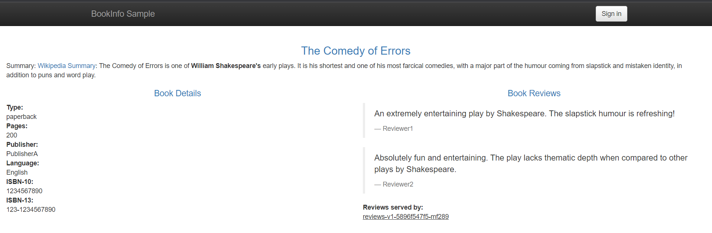

   何度かブラウザをリロードしてみましょう。Book Reviewsの表示が変化します。

   - review v1

     書評情報にランキング情報は含まれません。（`rating`サービスは呼び出されません）

     

   - review v2

     書評情報に黒色のスター表記でランキング情報が含まれます。

     

   - review v3

     書評情報に赤色のスター表記でランキング情報が含まれます。

     

     これらは`productpage`サービスからKuberneresのServiceリソース経由で`reviews`サービスを呼び出しています。

     

6. テスト用スクリプト作成

   `bookinfo`サービスへトラフィックを発生させる簡易的なスクリプトを作成します。

   `test.sh`

   ```shell
   #!/bin/sh
   
   while true
   do
     sleep 5
     curl http://[Your User Name].istio.test.k8slabhpe.net/productpage > /dev/null 2>&1
   done
   ```

   ***!!Attention!!***

   - [Your User Name]は、割り当てられたbastionサーバのユーザ名に置き換えてください。

     実行例（user20の場合）

     ```shell
     #!/bin/sh
     
     while true
     do
       sleep 5
       curl http://user20.istio.test.k8slabhpe.net/productpage > /dev/null 2>&1
     done
     ```

   パーミッションを設定し、バックグラウンドで実行します。

   ```shell
   chmod +x test.sh
   ./test.sh &
   ```

7. kialiへのアクセス・サービスメッシュの状態確認

   サービスメッシュの視覚化・状態確認を行うkialiにアクセスし、`bookinfo`アプリケーションのメッシュの状態確認を行います。

   kialiのアクセス情報はトレーニング中に講師よりお伝えします。

   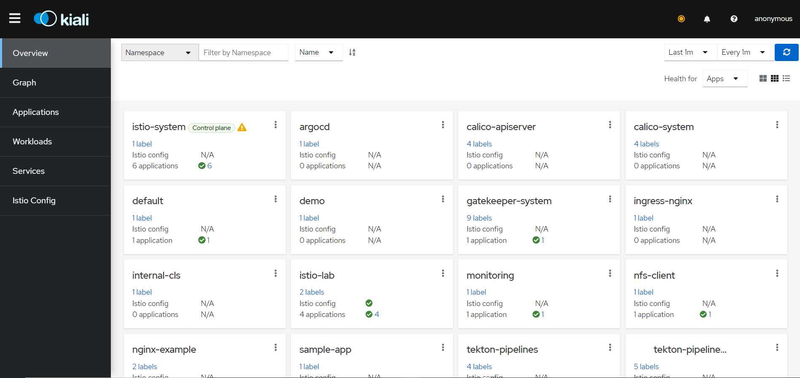

   メインメニュー左側の「Graph」メニューを選択します。

   「Select Namespaces」で「istio-system」と「Your User Name」（割り当てられたbastionサーバのユーザ名と同名）を選択します。

   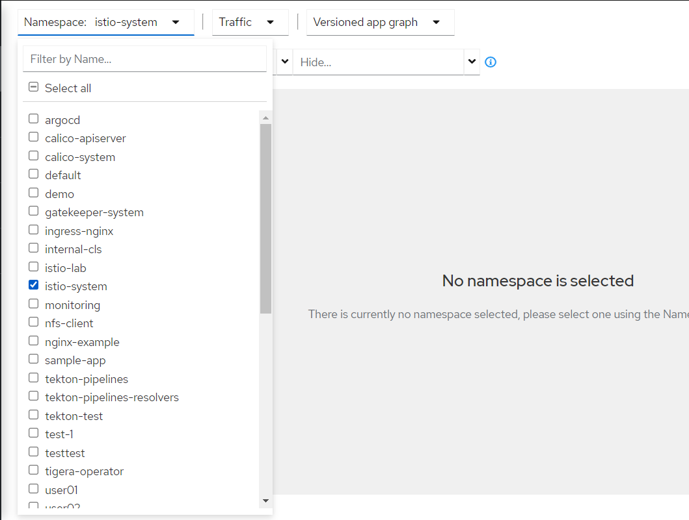

   user20の場合

   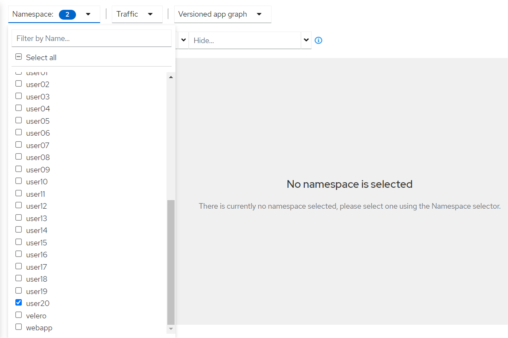

   トラフィックを流しているので、`bookinfo`のサービスメッシュが表示されます。

   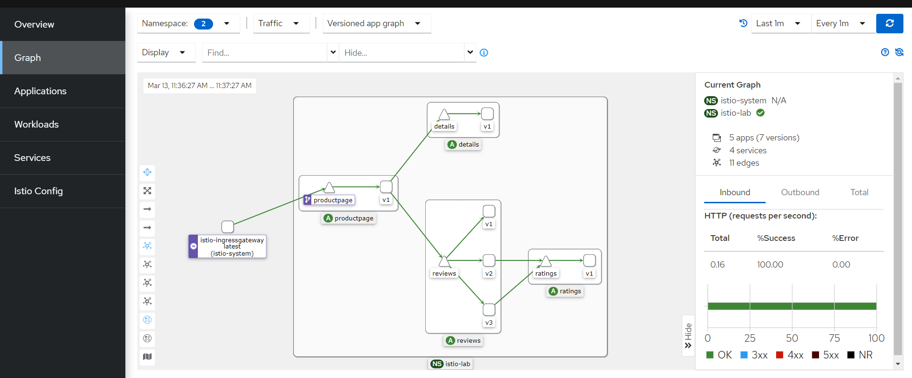

   画面左上の「Display」タブで「Traffic Animation」のチェックを入れます。

   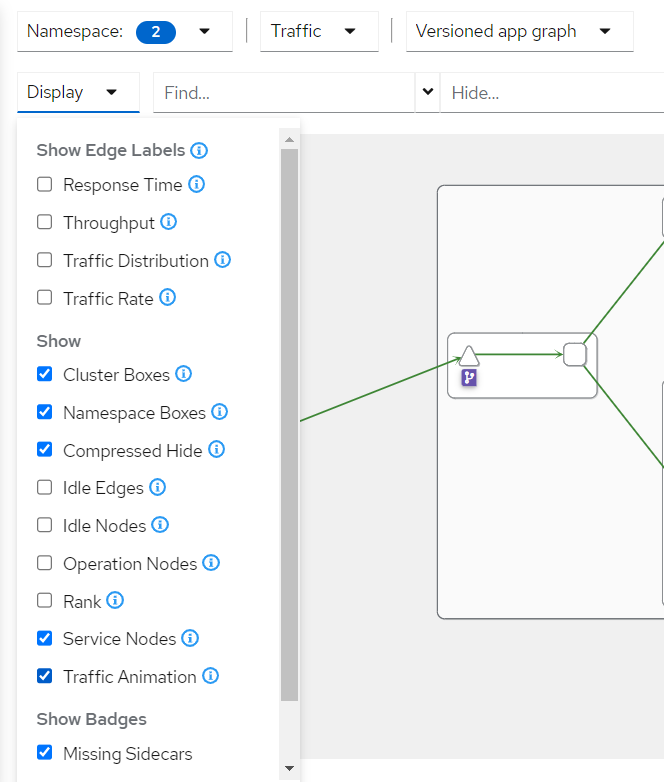

   トラフィックの流入状況をアニメーション表示で確認することができます。

   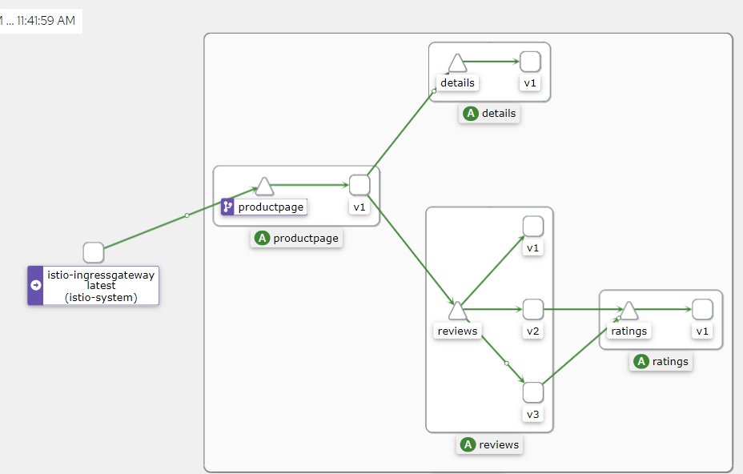

以上で、クラスタ外から`bookinfo`サンプルアプリケーションへアクセスすることができました。

これまで使用したIstioのカスタムリソース（`VirtualService`、`Gateway`）では、Istio Ingress Gateway経由で`productpage`サービスのトラフィックルーティングを定義しています。その他の通信（たとえば、`productpage`->`reviews`）は、Kubernetes Service リソース経由で通信を行っています。ただし、Istioではすべての通信がサイドカーの`Envoy`でインターセプトされています。kialiで`productpage`->`reviews`のトラフィック状況が確認できるのは、それぞれの`Envoy`経由で通信を行っているためです。

ハンズオンの次節では、更にIstioのカスタムリソース（`VirtualService`、`DestinationRule`）を使用し、トラフィック管理機能（トラフィック・シフティング、フォールト・インジェクション）を設定します。

### トラフィック・シフティング（重みづけ）

これまでのハンズオンでは、`productpage`->`reviews`サービス間の通信はServiceリソースで実現し、ランダムにトラフィックが振り分けられていました。

https://kubernetes.io/ja/docs/concepts/services-networking/service/#proxy-mode-iptables

本ハンズオンでは、`productpage`->`reviews`間に`VirtualService`を適用し、v1～v3間で重み付けを行います。

1. `DestinationRule`リソース用マニフェストファイルの作成

   以下のマニフェストファイルを作成します。

   `reviews-dr.yaml`

   ```yaml
   apiVersion: networking.istio.io/v1beta1
   kind: DestinationRule
   metadata:
     name: reviews
   spec:
     host: reviews
     trafficPolicy:
       loadBalancer:
         simple: RANDOM
     subsets:
     - name: v1
       labels:
         version: v1
     - name: v2
       labels:
         version: v2
     - name: v3
       labels:
         version: v3
   ```

   | フィールド                      | 説明                                                         |
   | ------------------------------- | ------------------------------------------------------------ |
   | spec.host                       | トラフィックを受け付けるサービス名。プラットフォームのサービスレジストリか`ServiceEntry`で定義されたホスト名が使用される。（Kubernetesの場合、`Service`リソース） |
   | spec.trafficPolicy.loadBalancer | トラフィックのロードバランシングポリシー                     |
   | spec.subsets[]                  | トラフィックを受信するサービスのバージョン定義。Podに付与したラベルでフィルタリング |

2. `DestinationRule`リソースの適用

   上記マニフェストファイルをクラスタへ適用します。

   ```shell
   kubectl apply -f reviews-dr.yaml
   ```

   クラスタへ適用されていることを確認します。

   ```shell
   kubectl get destinationrule
   ```

3. `VirtualService`リソース用マニフェストファイルの作成

   以下のマニフェストファイルを作成します。

   `reviews-vs.yaml`

   ```yaml
   apiVersion: networking.istio.io/v1beta1
   kind: VirtualService
   metadata:
     name: reviews
   spec:
     hosts:
       - reviews
     http:
     - route:
       - destination:
           host: reviews
           subset: v1
         weight: 50
       - destination:
           host: reviews
           subset: v3
         weight: 50
   ```

   | フィールド                           | 説明                                                         |
   | ------------------------------------ | ------------------------------------------------------------ |
   | spec.hosts[]                         | トラフィックの宛先となるホスト名。DNS名またはIPアドレスで指定する。ルーティングルールを適用するホスト名<br />本例では、`reviews`Serviceへ送信するトラフィックを指定 |
   | spec.http[].route.destination        | トラフィックを送信する宛先サービスの定義                     |
   | spec.http[].route.destination.host   | トラフィックを送信するサービス名。プラットフォームのサービスレジストリか`ServiceEntry`で定義されたホスト名が使用される。（Kubernetesの場合、`Service`リソース） |
   | spec.http[].route.destination.subset | トラフィックを送信するサービスのサブセット。`DestinationRule`で定義したサブセットを使用 |
   | spec.http[].route.weight             | 宛先サービスにトラフィックを送信する際の重み付け             |

   `productpage`から`reviews`サービスのv1とv3バージョンに対して、50:50の割合でトラフィックを送信するポリシーを定義します。

4. `VirtualService`リソースの適用

   上記マニフェストファイルをクラスタへ適用します。

   ```shell
   kubectl apply -f reviews-vs.yaml
   ```

   クラスタへ適用されていることを確認します。

   ```shell
   kubectl get virtualservice
   ```

5. トラフィック確認

   kialiへアクセスし、先ほど確認したGraphへアクセスします。

   しばらくすると、`productpage`から`reviews`サービスへのアクセスがv1とv3のみになることが確認できます。（v2が表示されなくなります）

   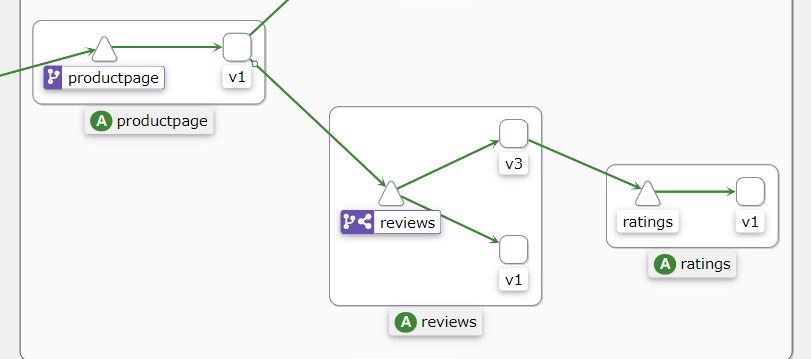

   画面左上の「Display」の「Traffic Distribution」をチェックします。

   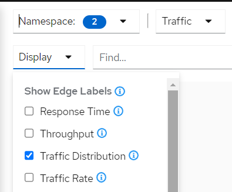

   サービス間通信の割合が表示されます。`reviews`サービスの割合が大体同程度になることが確認できます。

   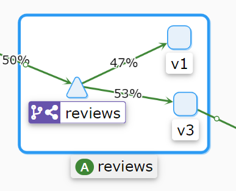

以上で`VirtualService`と`DestinationRule`でv1とv3に対するトラフィック振り分けを設定しました。次にフォールトインジェクション機能を設定します。

### フォールト・インジェクション

マイクロ・サービス間で通信の障害・異常系試験を実施する際、アプリケーションコードの修正やモックサーバの準備などでコストが高くなる可能性があります。Istioでは、特定の条件に合致するリクエストに対して、遅延やエラーを発生させることが可能です。本節ではHTTPヘッダーに特定文字列を含む場合に500エラーを発生させるルールを用意し、kialiで確認するハンズオンを行います。

1. `DestinationRule`リソース用マニフェストファイルの作成

   以下のマニフェストファイルを作成します。

   `rating-dr.yaml`

   ```yaml
   apiVersion: networking.istio.io/v1beta1
   kind: DestinationRule
   metadata:
     name: ratings
   spec:
     host: ratings
     trafficPolicy:
       loadBalancer:
         simple: RANDOM
     subsets:
     - name: v1
       labels:
         version: v1
   ```

   後程作成する`VirtualService`で使用するために、`rating`サービスに対する`DestinationRule`を定義します。

2. `DestinationRule`リソースの適用

   上記マニフェストファイルをクラスタへ適用します。

   ```shell
   kubectl apply -f rating-dr.yaml
   ```

   クラスタへ適用されていることを確認します。

   ```shell
   kubectl get destinationrule
   ```

3. `VirtualService`リソース用マニフェストファイルの作成

   以下のマニフェストファイルを作成します。

   `rating-vs.yaml`

   ```yaml
   apiVersion: networking.istio.io/v1beta1
   kind: VirtualService
   metadata:
     name: ratings
   spec:
     hosts:
     - ratings
     http:
     - match:
       - headers:
           end-user:
             exact: jason
       fault:
         abort:
           percentage:
             value: 100.0
           httpStatus: 500
       route:
       - destination:
           host: ratings
           subset: v1
     - route:
       - destination:
           host: ratings
           subset: v1
   ```

   | フィールド                    | 説明                                                         |
   | ----------------------------- | ------------------------------------------------------------ |
   | spec.hosts[]                  | トラフィックの宛先となるホスト名。DNS名またはIPアドレスで指定する。ルーティングルールを適用するホスト名<br />本例では、`ratings`Serviceへ送信するトラフィックを指定 |
   | spec.http[0].match[0].headers | HTTPヘッダーが特定の条件に合致する場合にルールを適用する。<br />本例では、`end-user`HTTPヘッダーが`jason`という文字列に合致する場合にルールを適用 |
   | spec.http[0].fault            | フォールトインジェクションの設定<br />本例では、条件に合致するリクエストの場合は、100%の割合で500エラーを発生させる |
   | spec.http[0].route            | リクエストが条件に合致する（HTTPヘッダー`end-user`が`jason`）際の送信先 |
   | spec.http[1].route            | 条件に合致しない（HTTPヘッダー`end-user`が`jason`以外、HTTPヘッダー`end-user`がない）場合のリクエスト送信先 |

   HTTPヘッダーに`end-user`を含み、その値が`jason`の場合に、500エラーを返すフォールトインジェクションの設定を行います。

4. `VirtualService`リソースの適用

   上記マニフェストファイルをクラスタへ適用します。

   ```shell
   kubectl apply -f rating-vs.yaml
   ```

   クラスタへ適用されていることを確認します。

   ```shell
   kubectl get virtualservice
   ```

5. アクセス確認

   ブラウザで、`bookinfo`サンプルアプリケーションのトップ画面に移ります。

   HTTPヘッダー`end-user`に`jason`を含むリクエストを送信します。

   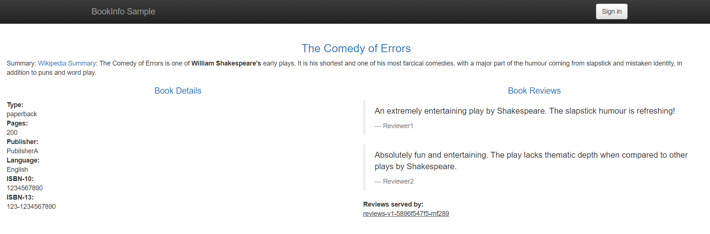

   画面右上の「Sign in」をクリックします。

   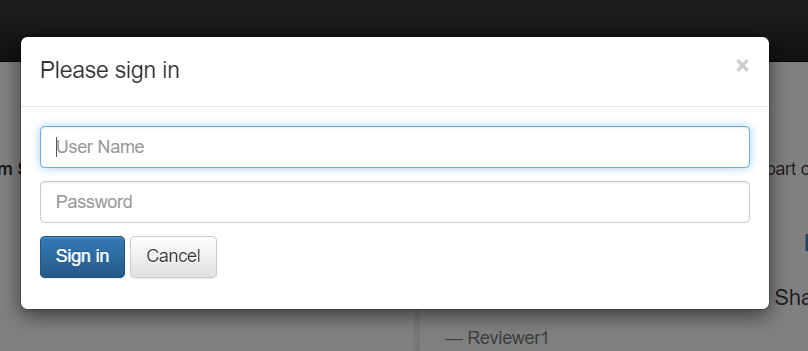

   「User Name」に`jason`と入力し、「Sign in」ボタンをクリックします。「Password」は未入力のままです。

   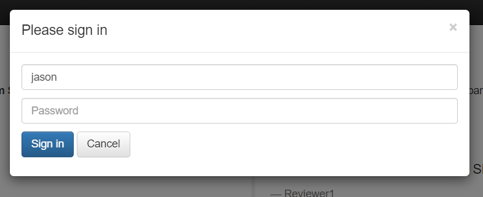

   `jason`ユーザでログインしました。`bookinfo`はこの状態でリクエストを送ると、HTTPヘッダー`end-user`に`jason`が設定されたHTTPリクエストを送信します。

   

6. トラフィック確認

   `bookinfo`に`jason`ユーザでログインした状態で何回かブラウザをリロードします。その後、kialiのGraph画面に移動します。

   `reviews`v3サービスから`ratings`サービスへのトラフィックの一部が通常の`ratings`サービスではなく赤線で表示されています。

   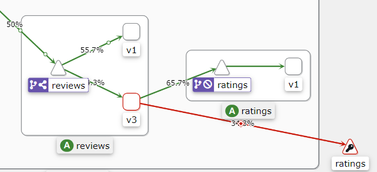

   `reviews`サービスのv3を選択します。

   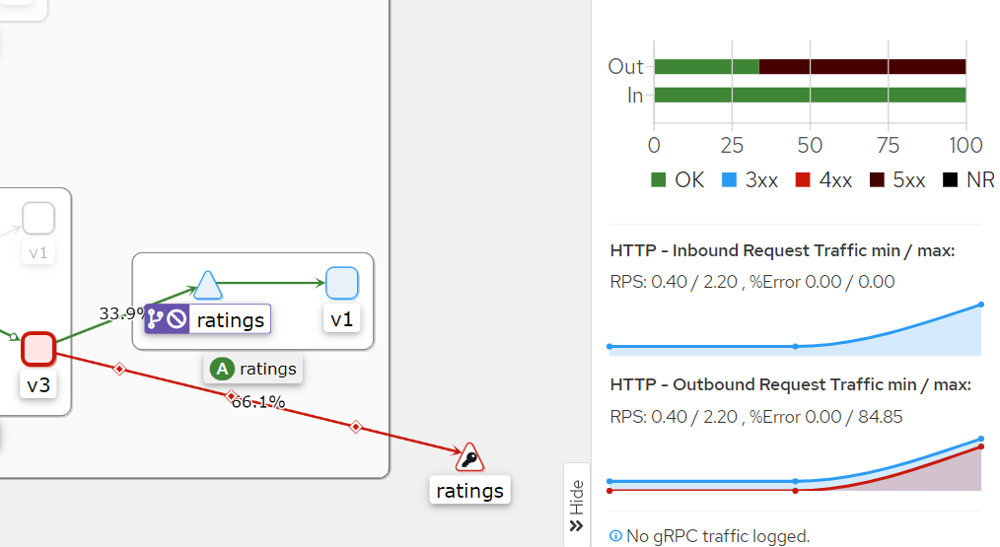

   `reviews`v3サービスが受け取るトラフィックのうち一部が5xxエラーで返ってきていることがわかります。

   また、`jason`ユーザでログインした状態の`bookinfo`アプリケーションに戻りましょう。`reviews`v3サービスにアクセスしている時は、「Ratings service is currently unavailable」と表示されていて、`ratings`サービスへのアクセスが失敗していることがわかります。

   

以上で、Istioのフォールトインジェクション機能で特定条件の際にリクエストが失敗することを確認しました。

### リソース削除

テスト用スクリプトを停止します。

```shell
# ジョブ番号確認
jobs

# 他にスクリプトを実行していないので、ジョブ番号は「1」のはずですが、jobsコマンドの出力が異なる場合は、jobsコマンドで出力されたジョブ番号を指定してkillコマンド実行
kill %1
```

最後にハンズオンで使用したリソースを削除します。

```shell
kubectl delete -f rating-dr.yaml -f rating-vs.yaml
kubectl delete -f reviews-dr.yaml -f reviews-vs.yaml
kubectl delete -f bookinfo-gateway.yaml -f bookinfo-vs.yaml
kubectl delete -f bookinfo.yaml
```

以上で、本ハンズオンは終了です。

